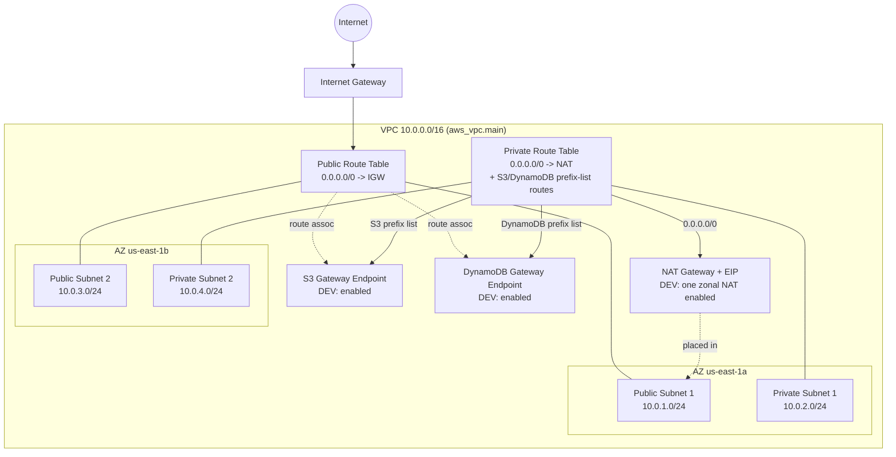
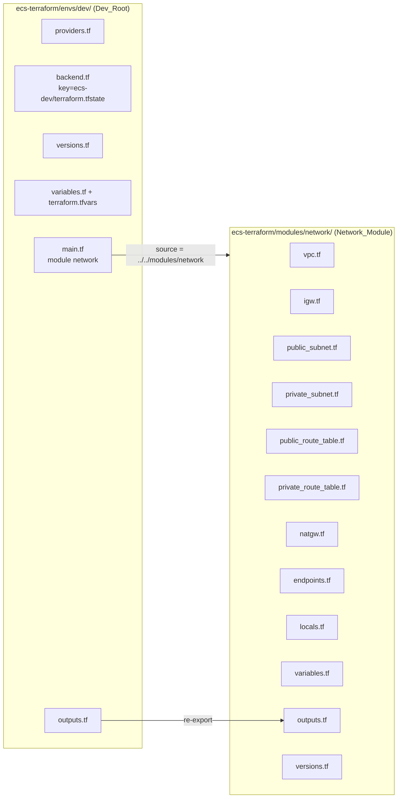

# Design Document

## Overview

This design describes a clean-slate deployment of a new reusable network module at
`ecs-terraform/modules/network/`, consumed by the Terraform root module at
`ecs-terraform/envs/dev/`.

The previous development infrastructure has been intentionally deleted. There is **no existing
state and no resources to preserve**. `envs/dev` is the Terraform root module and the single source
of truth for the development environment. Running `terraform plan` against a clean state represents
the **creation of new development infrastructure** — it shows only creations, with zero resources
to destroy and zero to change.

This module owns **only VPC-layer infrastructure**: the VPC, public and private subnets, the
Internet Gateway, the public and private route tables, an optional NAT Gateway, optional S3/DynamoDB
Gateway endpoints, and the networking outputs downstream modules consume.

The ALB and ECS security groups and the CloudFront → ALB → ECS traffic relationship are **not** part
of this module — they are owned by the future `03-backend` module, which attaches its own security
groups to this VPC. Because the S3 and DynamoDB endpoints created here are Gateway endpoints (which
do not use security groups), the network module creates **no security groups at all**.

The dev-environment egress model is called out explicitly (module defaults vs DEV configuration are
distinct — see below):

1. **NAT Gateway and gateway endpoints are ENABLED for DEV.** The module keeps both toggles optional
   with `default = false` so it stays reusable across environments, but the DEV configuration sets
   `enable_nat_gateway = true` and `enable_vpc_endpoints = true`. Private ECS Fargate tasks run with
   `assign_public_ip = false` and reach S3 and DynamoDB through the Gateway endpoints, while all other
   required IPv4 outbound traffic egresses through a single public NAT Gateway to the Internet Gateway.
   The private route table therefore carries a `0.0.0.0/0 -> NAT` route in DEV
   (see [Requirement 6](#requirement-references), [Requirement 7](#requirement-references),
   [Requirement 8](#requirement-references)).
2. **One NAT Gateway is a deliberate DEV cost/availability tradeoff.** DEV uses exactly one zonal NAT
   Gateway rather than one per Availability Zone — lower cost and simpler, at the price of NAT egress
   that is not AZ-redundant. A production high-availability topology would use one NAT Gateway per AZ,
   with each private subnet routing `0.0.0.0/0` to the NAT Gateway in its own AZ; that is context only
   and remains out of the current DEV scope.
3. **This DEV egress capability satisfies the 03-backend private-egress dependency** (currently
   documented as OPEN/BLOCKING by 03-backend) and must be in place before ECS tasks are deployed:
   ECR/API and general AWS/public outbound traffic and CloudWatch Logs use NAT; ECR image-layer S3
   traffic uses the S3 Gateway endpoint; application DynamoDB traffic uses the DynamoDB Gateway
   endpoint. No interface (PrivateLink) endpoints and no endpoint security group are introduced, so the
   network module still requires no `03-backend` output and no circular dependency arises.

The module is written to be environment-independent: it declares typed, validated inputs and
exposes only the outputs downstream modules need. No dev-specific values, account IDs, ARNs, or
resource IDs are baked into the module — those live in `envs/dev/terraform.tfvars` and are passed
in at call time.

### Requirements addressed

This design maps to all 13 requirements in `requirements.md`. Requirement numbers are referenced
inline throughout, e.g. `(R6.2)` means Requirement 6, acceptance criterion 2.

---

## Architecture

### Network architecture (runtime view)



The network module's job is to provide the VPC, subnets, routing, egress (NAT — enabled in DEV), and
private service access (S3/DynamoDB gateway endpoints — enabled in DEV). The intended DEV routing is:
the private route table sends `0.0.0.0/0` to the NAT Gateway, while the more-specific S3 and DynamoDB
prefix-list routes installed by the gateway endpoints take precedence, so that same-Region S3 and
DynamoDB traffic uses the endpoints instead of NAT. It does not create security groups: downstream
modules (notably `03-backend`) attach their own security groups to this VPC and own the
CloudFront → ALB → ECS traffic relationship.

### Module / dev-root dependency structure



The Dev_Root owns provider configuration and backend/state. The module owns the resource
definitions.

---

## Components and Interfaces

### Module file layout — `ecs-terraform/modules/network/`

Terraform loads every `.tf` file in a directory as one module; file separation is for readability
only (per project conventions). All of the following are new files created for the new module:

| File | Contents |
| --- | --- |
| `vpc.tf` | `aws_vpc.main` with DNS support/hostnames |
| `igw.tf` | `aws_internet_gateway.main` |
| `public_subnet.tf` | `aws_subnet.public1/public2` + route table associations |
| `private_subnet.tf` | `aws_subnet.private1/private2` + route table associations |
| `public_route_table.tf` | `aws_route_table.public_route_table` (default route to IGW) |
| `private_route_table.tf` | `aws_route_table.private_route_table` (no inline default route) |
| `natgw.tf` | conditional `aws_eip.eip`, `aws_nat_gateway.natgw`, `aws_route.private_nat` |
| `endpoints.tf` | conditional S3 + DynamoDB gateway endpoints |
| `locals.tf` | `local.name_prefix`, merged tag helper |
| `variables.tf` | all typed/validated inputs |
| `outputs.tf` | exported IDs |
| `versions.tf` | `required_version` + `required_providers` pins |

These are all new resource definitions authored for the new module. Resource logical names
(`main`, `public1`, `natgw`, ...) are chosen for clarity within the module.

### Conditional resource pattern

NAT and VPC endpoints are gated with `count`:

```hcl
# natgw.tf
resource "aws_eip" "eip" {
  count  = var.enable_nat_gateway ? 1 : 0
  domain = "vpc"
  tags   = merge(var.tags, { Name = "${local.name_prefix}-nat-eip" })
}

resource "aws_nat_gateway" "natgw" {
  count         = var.enable_nat_gateway ? 1 : 0
  allocation_id = aws_eip.eip[0].id
  subnet_id     = aws_subnet.public1.id
  depends_on    = [aws_internet_gateway.main]
  tags          = merge(var.tags, { Name = "${local.name_prefix}-natgw" })
}

# The private default route only exists when NAT is on (R6.2, R6.3, R7.4, R7.5). Module default is off
# for reusability; the DEV configuration sets enable_nat_gateway = true, so this route is present in DEV.
resource "aws_route" "private_nat" {
  count                  = var.enable_nat_gateway ? 1 : 0
  route_table_id         = aws_route_table.private_route_table.id
  destination_cidr_block = "0.0.0.0/0"
  nat_gateway_id         = aws_nat_gateway.natgw[0].id
}
```

The private route table itself (`private_route_table.tf`) is created unconditionally with **no
inline route block**, so that when NAT is off the plan shows zero `aws_route` resources for it
(R6.1, R6.3). The default route is a separate `aws_route.private_nat` resource, present only when
NAT is enabled.

Endpoints follow the same pattern:

```hcl
# endpoints.tf
resource "aws_vpc_endpoint" "s3" {
  count             = var.enable_vpc_endpoints ? 1 : 0
  vpc_id            = aws_vpc.main.id
  service_name      = "com.amazonaws.${var.aws_region}.s3"
  vpc_endpoint_type = "Gateway"
  route_table_ids   = [aws_route_table.public_route_table.id, aws_route_table.private_route_table.id]
  tags              = merge(var.tags, { Name = "${local.name_prefix}-s3-endpoint" })
}

resource "aws_vpc_endpoint" "dynamodb" {
  count             = var.enable_vpc_endpoints ? 1 : 0
  vpc_id            = aws_vpc.main.id
  service_name      = "com.amazonaws.${var.aws_region}.dynamodb"
  vpc_endpoint_type = "Gateway"
  route_table_ids   = [aws_route_table.public_route_table.id, aws_route_table.private_route_table.id]
  tags              = merge(var.tags, { Name = "${local.name_prefix}-dynamodb-endpoint" })
}
```

When `enable_vpc_endpoints = false`, zero endpoint resources exist (R8.4).

Count-indexed resources are dereferenced with `[0]`, and outputs guard against the disabled case:

```hcl
# outputs.tf
output "nat_gateway_id" {
  description = "ID of the NAT Gateway when enabled, otherwise null"
  value       = var.enable_nat_gateway ? aws_nat_gateway.natgw[0].id : null
}
```

This satisfies R10.4 (non-null string when NAT enabled) and R10.5 (null when disabled).

> **Security groups are out of scope.** Because S3 and DynamoDB endpoints are Gateway endpoints,
> they attach to route tables and use no security group. The ALB and ECS security groups — and the
> CloudFront → ALB → ECS traffic relationship — belong to the future `03-backend` module, which
> attaches them to the VPC exported by this module. The network module therefore creates no
> `aws_security_group` resources and no CloudFront prefix-list data source.

### Locals and tagging — R12

```hcl
# locals.tf (module)
locals {
  name_prefix = "${var.app_name}-${var.environment}"
}
```

Every resource builds its `Name` tag from `local.name_prefix` plus a unique resource suffix and
merges the caller's `var.tags`:

```hcl
tags = merge(var.tags, { Name = "${local.name_prefix}-vpc" })
```

`merge(var.tags, { Name = ... })` ensures the common tag set (Project, Environment, ManagedBy,
Owner) supplied by the Dev_Root is applied uniformly (R12.2) while each resource keeps a unique
`Name` (R12.5). Name derivation is never duplicated inline — it always references
`local.name_prefix` (R12.1, R12.3).

> **Tagging approach note:** the Dev_Root provider also sets `default_tags`. `default_tags` and the
> explicit `merge(var.tags, ...)` are complementary — the explicit `Name` per resource is required
> for the unique-name criterion, and passing `var.tags` keeps the module self-contained and testable
> independent of provider defaults. The design passes the common tags through `var.tags` from the
> Dev_Root (R11.3) rather than relying solely on `default_tags`, so the module remains reusable in
> callers that don't configure `default_tags`.

---

## Data Models

### Module input variables — `variables.tf` (R9)

| Variable | Type | Default | Validation |
| --- | --- | --- | --- |
| `app_name` | `string` | — | rejects empty string (R9.1, R12.4) |
| `environment` | `string` | — | rejects empty string (R9.2, R12.4) |
| `aws_region` | `string` | — | non-empty description (R9.3) |
| `vpc_cidr` | `string` | — | `can(cidrhost(var.vpc_cidr, 0))` (R9.4, R1.5) |
| `public_subnet_cidr1` | `string` | — | valid IPv4 CIDR via `can(cidrhost(...))` (R9.5) |
| `public_subnet_cidr2` | `string` | — | valid IPv4 CIDR (R9.5) |
| `private_subnet_cidr1` | `string` | — | valid IPv4 CIDR (R9.5) |
| `private_subnet_cidr2` | `string` | — | valid IPv4 CIDR (R9.5) |
| `enable_nat_gateway` | `bool` | `false` | — (R9.6, R7.1) |
| `enable_vpc_endpoints` | `bool` | `false` | — (R9.7, R8.1) |
| `tags` | `map(string)` | `{}` | — (R9.8) |

Example validation block:

```hcl
variable "vpc_cidr" {
  description = "IPv4 CIDR block for the VPC (/16 to /28)"
  type        = string

  validation {
    condition     = can(cidrhost(var.vpc_cidr, 0))
    error_message = "vpc_cidr must be a valid IPv4 CIDR block."
  }
}
```

Subnet CIDR non-overlap and within-VPC constraints (R2.1, R3.1, etc.) are validated at apply time by
AWS (subnet creation fails on overlap/out-of-range CIDRs). The module enforces the *format* via
`can(cidrhost(...))`; cross-variable overlap checks are impractical to express reliably in a single
variable validation block and are left to AWS-side enforcement plus the dev CIDR values being
correct by construction.

### Module outputs — `outputs.tf` (R10)

| Output | Value | Notes |
| --- | --- | --- |
| `vpc_id` | `aws_vpc.main.id` | R10.1 |
| `public_subnet_ids` | `[aws_subnet.public1.id, aws_subnet.public2.id]` | R10.2 |
| `private_subnet_ids` | `[aws_subnet.private1.id, aws_subnet.private2.id]` | R10.3 |
| `nat_gateway_id` | `var.enable_nat_gateway ? aws_nat_gateway.natgw[0].id : null` | R10.4, R10.5 |

All outputs carry non-empty descriptions.

### Versions pin — `versions.tf` (both module and dev root)

Using compatible pinned versions (Terraform `~> 1.16.0`, AWS provider `~> 6.62`):

```hcl
terraform {
  required_version = "~> 1.16.0"

  required_providers {
    aws = {
      source  = "hashicorp/aws"
      version = "~> 6.62"
    }
  }
}
```

No major version upgrades are performed. The `.terraform.lock.hcl` for the Dev_Root resolves to the
locked AWS provider version.

---

## Dev Root Integration — `ecs-terraform/envs/dev/`

### File responsibilities (R11)

| File | Responsibility |
| --- | --- |
| `providers.tf` | AWS provider `region = var.aws_region` + `default_tags`. The `aws.us_east_1` alias exists in the root for ACM/CloudFront; the **network module needs only the default-region provider**, so the alias is not required for this spec (it will be added when the edge module is integrated). |
| `backend.tf` | S3 backend block (`backend "s3" {}`), configured at init via `-backend-config`. |
| `versions.tf` | Terraform + AWS provider pins (as above). |
| `variables.tf` | Mirror of module inputs with explicit types, descriptions, and correctly-typed defaults (R11.4). |
| `terraform.tfvars` | Dev values incl. `enable_nat_gateway = true`, `enable_vpc_endpoints = true` (R11.5). |
| `main.tf` | `module "network"` call, `source = "../../modules/network"`, passing every input + `tags` map (R11.1, R11.2, R11.3). |
| `outputs.tf` | Re-export module outputs (e.g. `module.network.vpc_id`) (R11.6). |

`main.tf` module call:

```hcl
module "network" {
  source = "../../modules/network"

  app_name             = var.app_name
  environment          = var.environment
  aws_region           = var.aws_region
  vpc_cidr             = var.vpc_cidr
  public_subnet_cidr1  = var.public_subnet_cidr1
  public_subnet_cidr2  = var.public_subnet_cidr2
  private_subnet_cidr1 = var.private_subnet_cidr1
  private_subnet_cidr2 = var.private_subnet_cidr2
  enable_nat_gateway   = var.enable_nat_gateway
  enable_vpc_endpoints = var.enable_vpc_endpoints

  tags = {
    Project     = var.app_name
    Environment = var.environment
    ManagedBy   = "Terraform"
    Owner       = var.owner
  }
}
```

`outputs.tf` re-export:

```hcl
output "vpc_id" {
  description = "ID of the development VPC"
  value       = module.network.vpc_id
}

output "public_subnet_ids" {
  description = "IDs of the public subnets"
  value       = module.network.public_subnet_ids
}

output "private_subnet_ids" {
  description = "IDs of the private subnets"
  value       = module.network.private_subnet_ids
}

output "nat_gateway_id" {
  description = "ID of the NAT Gateway when enabled, otherwise null"
  value       = module.network.nat_gateway_id
}
```

### Backend and state

This is a clean-slate deployment against a fresh state:

1. The **bootstrap** configuration (separate, out of scope here) creates the remote-state
   infrastructure: the S3 state bucket and the DynamoDB lock table. Bootstrap uses its own separate
   state.
2. `envs/dev/backend.tf` declares the S3 backend for the Dev_Root's state, using the dev state key
   (`ecs-dev/terraform.tfstate`). This is the key for the new dev root's own state — there are no
   pre-existing resources tracked under it.
3. On first `terraform init` in `envs/dev/`, the backend is configured via `-backend-config`
   (bucket/key/region/lock table produced by bootstrap). The Dev_Root starts from a **fresh, empty
   state**.
4. The first `terraform plan`/`terraform apply` therefore **creates all network resources from
   scratch** — the VPC, subnets, IGW, route tables, and (when enabled) NAT and endpoints. There is
   no migration and there are no `moved` blocks: everything is a new creation (R11.7).

---

## Error Handling

- **Invalid CIDR input:** `vpc_cidr` and the four subnet CIDR variables use
  `can(cidrhost(var.x, 0))` validation, so a malformed CIDR fails at `terraform plan`/`validate`
  with a clear message before any resource is touched (R1.5, R9.4, R9.5).
- **Empty `app_name`/`environment`:** validation blocks reject empty strings, preventing malformed
  resource names (R12.4).
- **Count-indexed dereference when disabled:** outputs guard with the `enable_*` boolean before
  indexing (`... ? resource[0].id : null`) so no "index out of range" error occurs when NAT is off
  (R10.5).

---

## Testing Strategy

### Why property-based testing does not apply

This feature is **Infrastructure as Code** (Terraform HCL). Terraform configuration is declarative
and has no pure input/output function to quantify a "for all inputs" property over. Per the
project's testing guidance, PBT is explicitly not appropriate for IaC — snapshot/plan analysis and
policy checks are the right tools. Accordingly, the Correctness Properties for this design are
expressed as testable infrastructure invariants (see the Correctness Properties section below),
verified through plan-based analysis and static checks rather than property-based tests.

### Verification workflow

Run against `ecs-terraform/envs/dev/` (and `ecs-terraform/modules/network/` for fmt):

1. **Format check** — `terraform fmt -check -recursive` over both the module and dev root; must exit
   0 with zero diff (R13.1–R13.4).
2. **Init** — `terraform init -backend-config=backend.config` against the fresh dev state.
3. **Validate** — `terraform validate`; must report no errors (R13.5).
4. **Plan** — `terraform plan -out=tfplan`; review, then
   `terraform show -json tfplan > plan.json` for automated assertions.

## Correctness Properties

The following testable invariants define the correctness properties of the 01-network design. Each is
an assertion over the `terraform plan -json` output (parsed manually, or with a policy tool such as
`conftest`/OPA or `terraform-compliance` if the project adopts one — not required by this spec):

### Property 1: Fresh-plan all-create invariant

Against a clean state, every resource in `resource_changes[].change.actions` is `["create"]` only — 0 destroy, 0 update, 0 replace.

**Validates: Requirements 11.7**

### Property 2: DEV NAT enabled, exactly one

With the DEV configuration (`enable_nat_gateway = true`), the plan contains exactly one `aws_nat_gateway` and one `aws_eip` in `module.network` (one zonal NAT, not per-AZ).

**Validates: Requirements 7.8**

### Property 3: DEV gateway endpoints enabled

With `enable_vpc_endpoints = true`, the plan contains exactly two `aws_vpc_endpoint` resources — S3 and DynamoDB, both `vpc_endpoint_type = "Gateway"` — associated with the private route table.

**Validates: Requirements 8.6**

### Property 4: Private default route targets NAT; public targets IGW

The private route table has a `0.0.0.0/0` route to the NAT Gateway (`aws_route.private_nat` present) and the public route table has `0.0.0.0/0` to the IGW; the S3/DynamoDB gateway-endpoint prefix routes are more specific and take precedence for those services.

**Validates: Requirements 7.8, 8.7**

### Property 5: Outputs resolve

`vpc_id`, `public_subnet_ids`, and `private_subnet_ids` are non-null; `nat_gateway_id` is a non-null NAT id in DEV (NAT enabled).

**Validates: Requirements 10.1, 10.2, 10.3, 10.4**

### Property 6: No interface endpoints, no endpoint SG

The plan contains zero interface `aws_vpc_endpoint` resources (no `ecr.api`/`ecr.dkr`/`logs`/`ecs`/`sts`/`secretsmanager`/`ssm`) and zero `aws_security_group` resources in `module.network`.

**Validates: Requirements 8.6, 7.9**

### Property 7: No network to backend dependency

The network module and its variables reference no `03-backend` output (no ECS/ALB security-group id, cluster id, or service id); dependency direction stays network to backend.

**Validates: Requirements 11.1**

### Property 8: Private workloads stay private

The design keeps `assign_public_ip = false` on ECS tasks (owned by 03-backend) and the private subnets have no direct IGW route; NAT is outbound-only.

**Validates: Requirements 7.9**

### Property 9: Module defaults vs DEV config

The module retains `default = false` for `enable_nat_gateway` and `enable_vpc_endpoints` (reusable/disableable elsewhere) while the DEV configuration sets both to `true`.

**Validates: Requirements 7.1, 8.1, 7.8, 8.6**

These properties are checked against the DEV configuration (both toggles `true`). Because DEV enables
NAT and the gateway endpoints, the enabled-path resources are part of the normal DEV plan rather than a
scratch run.

### CI integration

The Jenkins Terraform stage runs `terraform fmt -check -recursive`, `terraform init`,
`terraform validate`, and `terraform plan`. Any non-zero exit fails the pipeline (R13.3, R13.4).
Automatic `apply` is not performed by CI; infrastructure changes go through an intentional
deployment control, and the operator reviews the plan against invariants A–F before applying.

---

## Requirement References

Design decisions map to requirements as follows:

- **R1** (VPC): [Module file layout](#module-file-layout--ecs-terraformmodulesnetwork), [Data Models](#data-models).
- **R2** (public subnets): [Module file layout](#module-file-layout--ecs-terraformmodulesnetwork).
- **R3** (private subnets): [Module file layout](#module-file-layout--ecs-terraformmodulesnetwork).
- **R4** (Internet Gateway): [Module file layout](#module-file-layout--ecs-terraformmodulesnetwork).
- **R5** (public route table): [Module file layout](#module-file-layout--ecs-terraformmodulesnetwork).
- **R6** (private route table): [Conditional resource pattern](#conditional-resource-pattern).
- **R7** (NAT Gateway): [Conditional resource pattern](#conditional-resource-pattern).
- **R8** (VPC gateway endpoints): [Conditional resource pattern](#conditional-resource-pattern).
- **R9** (module variables): [Data Models](#data-models).
- **R10** (module outputs): [Data Models](#data-models).
- **R11** (dev root integration): [Dev Root Integration](#dev-root-integration--ecs-terraformenvsdev).
- **R12** (naming/tagging): [Locals and tagging](#locals-and-tagging--r12).
- **R13** (fmt compliance): [Testing Strategy](#testing-strategy).
