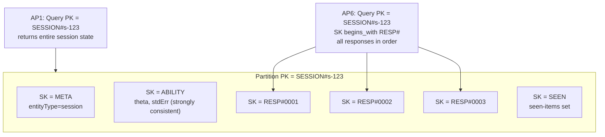
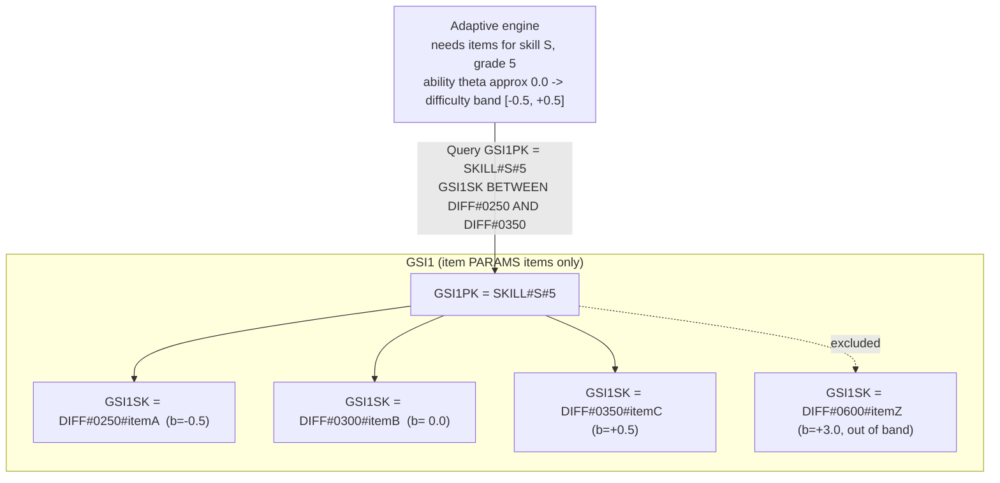
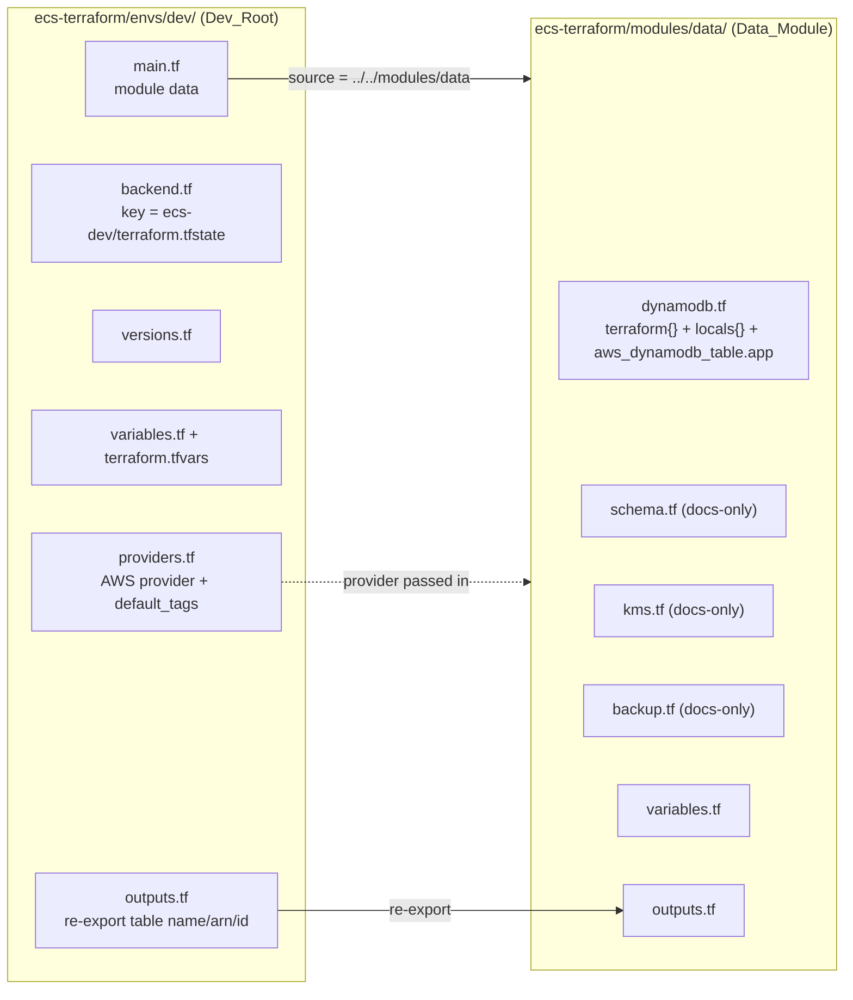
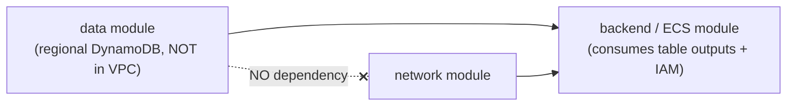

# Design Document

## Overview

This design describes a clean-slate deployment of a new reusable data module at
`ecs-terraform/modules/data/`, consumed by the Terraform root module at
`ecs-terraform/envs/dev/`.

The data module owns a **single DynamoDB table** that stores every entity in the Erudition Solution
platform under a **single-table design**. Rather than mapping one entity to one table, every entity —
students, teachers, classes, enrollments, assignments, adaptive sessions, responses, ability
estimates, mastery records, results, item content, item parameters, and audit records — lives in one
table (the App_Table). Item types are distinguished by their `PK`/`SK` key patterns and an
`entityType` application attribute. The key structure is driven by the 16 developer-defined access
patterns (AP1–AP16), not by an entity-to-table mapping, so every read is served by a `Query` or
`GetItem` against the primary key or a secondary index — with **zero table scans and zero hot-path
filter expressions** (R11).

This design **supersedes and replaces the withdrawn `userId` partition-key / `EmailIndex` model
entirely**. That design is gone; nothing from it is carried forward. This is a brand-new deployment:
the previous development infrastructure was intentionally deleted, so there is **no existing state
and no resources to migrate**. Running `terraform plan` against a clean state represents the
**creation of new development infrastructure** — only creations, 0 to change, 0 to destroy, and no
`moved` blocks (R20.6, R20.7).

Several dev-environment design choices are called out explicitly:

1. **On-demand billing** (`billing_mode = "PAY_PER_REQUEST"`) — the environment pays only for actual
   request volume, with no provisioned throughput on the table or either GSI (R6, R18.1).
2. **AWS-owned encryption** — server-side encryption is enabled with an AWS-owned key. No
   customer-managed KMS key (CMK) is created; `kms.tf` stays documentation-only (R7, R18.2).
3. **PITR as the only recovery mechanism** — point-in-time recovery is the baseline backup. No AWS
   Backup vault/plan/selection is created; `backup.tf` stays documentation-only (R8, R18.3).
4. **Data module is network-independent** — DynamoDB is a regional, fully-managed service that does
   not run inside the VPC, so this module has zero dependency on the network module. The dependency
   direction is data → backend (R16).

The module is environment-independent: typed, validated inputs, no hardcoded account IDs, ARNs,
region strings, or resource names. Dev-specific values live in `envs/dev/terraform.tfvars` and are
passed in at call time (R12.6, R15.8).

### Requirements addressed

This design maps to all 20 requirements in `requirements.md`. Requirement numbers are referenced
inline throughout, e.g. `(R11.1)` means Requirement 11, acceptance criterion 1.

---

## Architecture

### Single-table partition view (session state — AP1, AP6)

A single partition (`PK = SESSION#<sessId>`) holds every item for one adaptive session. One `Query`
on that partition returns the whole session state; a `begins_with(SK, "RESP#")` range read returns
all responses in sequence order.



### Item-bank GSI1 range query (candidate selection — AP4)

GSI1 keys exist only on item `PARAMS` items. The partition is `SKILL#<skillId>#<gradeLevel>`; the
sort key is `DIFF#<zero-padded-difficulty>#<itemId>`. Because difficulty is zero-padded, lexical
string order equals numeric order, so a `BETWEEN` on the sort key selects a difficulty band directly
— no filter expression.



### Module / dev-root dependency structure

The data module declares **no `backend` block and no `provider` block**; it receives provider
configuration from the calling root (R12.1).



### Dependency direction



DynamoDB is regional and fully managed, so the data module has **no dependency on the network
module** (R16.4). It exposes table identifiers that the backend module consumes; the IAM permissions
that grant ECS tasks access to the table belong to the backend/IAM design, not here (R16.2). The
dependency direction is strictly data → backend, with zero references back to any consumer module,
so no circular dependency is possible (R16.7).

---

## Components and Interfaces

### Module file layout — `ecs-terraform/modules/data/`

Terraform loads every `.tf` file in a directory as one module; file separation is for readability.
The module contains **exactly six** `.tf` files — no `locals.tf` and no `versions.tf` (R12.2):

| File | Contents |
| --- | --- |
| `dynamodb.tf` | The `terraform {}` version-constraint block, the `locals { name_prefix }` block, and the single `aws_dynamodb_table.app` resource |
| `schema.tf` | Documentation-only (comments): the full single-table entity/key model. No resources. |
| `kms.tf` | Documentation-only (comments): why dev uses AWS-owned encryption, when a CMK would apply. No resources. |
| `backup.tf` | Documentation-only (comments): PITR as baseline, why no AWS Backup. No resources. |
| `variables.tf` | Typed, described, validated inputs |
| `outputs.tf` | Table name / ARN / ID outputs |

**Why `terraform {}` and `locals {}` live inside `dynamodb.tf`:** the project standard forbids
adding `.tf` files purely for organization. A version-constraint block is technically necessary, so
it is permitted, and it is placed in `dynamodb.tf` rather than creating a `versions.tf` (R12.3). The
`name_prefix` derivation is likewise placed in `dynamodb.tf` rather than creating a `locals.tf`
(R12.4). No extra `.tf` file is added unless technically necessary (R12.5).

### The App_Table — `dynamodb.tf`

The full resource (single table, on-demand, composite key, two GSIs, SSE, PITR, deletion
protection):

```hcl
# dynamodb.tf

# A version-constraint block is technically necessary, so it is permitted here rather
# than creating a separate versions.tf (project standard: no organizational-only files).
terraform {
  required_version = "~> 1.16.0"

  required_providers {
    aws = {
      source  = "hashicorp/aws"
      version = "~> 6.62"
    }
  }
}

# name_prefix lives here rather than in a separate locals.tf (project standard).
locals {
  name_prefix = "${var.app_name}-${var.environment}"
}

# Single-table design: every application entity is stored in this one table.
# Item types are distinguished by PK/SK patterns and an application-level entityType
# attribute. See schema.tf for the full entity/key model and access-pattern mapping.
resource "aws_dynamodb_table" "app" {
  name = "${local.name_prefix}-app"

  # On-demand billing: pay only for actual request volume. No provisioned throughput
  # anywhere on the table or its GSIs, so no read_capacity/write_capacity is declared. (cost note)
  billing_mode = "PAY_PER_REQUEST"

  hash_key  = "PK"
  range_key = "SK"

  # AWS provider v6.x: key attributes are declared with the top-level hash_key/range_key
  # arguments plus these attribute blocks. There is NO key_schema nested block.
  # Only the six key attributes are declared; every non-key field is schemaless and
  # written by the application at runtime (see schema.tf).
  attribute {
    name = "PK"
    type = "S"
  }
  attribute {
    name = "SK"
    type = "S"
  }
  attribute {
    name = "GSI1PK"
    type = "S"
  }
  attribute {
    name = "GSI1SK"
    type = "S"
  }
  attribute {
    name = "GSI2PK"
    type = "S"
  }
  attribute {
    name = "GSI2SK"
    type = "S"
  }

  # GSI1 — item-bank index. Keys populated only on item PARAMS items:
  #   GSI1PK = "SKILL#<skillId>#<gradeLevel>"
  #   GSI1SK = "DIFF#<zero-padded-difficulty>#<itemId>"
  # Serves AP4 (candidate items by skill+grade, difficulty BETWEEN band) and
  # AP15 (item-bank admin over the full difficulty range). Projection ALL so the
  # adaptive engine gets full item parameters without a follow-up read.
  global_secondary_index {
    name            = "GSI1"
    hash_key        = "GSI1PK"
    range_key       = "GSI1SK"
    projection_type = "ALL"
    # No non_key_attributes with projection_type ALL.
    # No read_capacity/write_capacity: table is PAY_PER_REQUEST.
  }

  # GSI2 — teacher-reporting index. Keys populated only on Result items:
  #   GSI2PK = "ASSIGN#<assignmentId>"
  #   GSI2SK = "RESULT#<studentId>"
  # Serves AP10 (all results for one assignment). INCLUDE projection limits index
  # storage and write amplification to exactly the reporting fields. (cost note)
  global_secondary_index {
    name               = "GSI2"
    hash_key           = "GSI2PK"
    range_key          = "GSI2SK"
    projection_type    = "INCLUDE"
    non_key_attributes = ["studentId", "score", "completedAt", "masteryBySkill"]
  }

  # Point-in-time recovery is the baseline recovery mechanism. PITR is cost-bearing. (cost note)
  point_in_time_recovery {
    enabled = var.enable_point_in_time_recovery
  }

  # AWS-owned encryption: enabled, no kms_key_arn. Lowest-cost secure option for dev.
  server_side_encryption {
    enabled = true
  }

  # Off by default in dev so the table can be torn down freely; the same variable can
  # protect a table in another environment later with no module source change.
  deletion_protection_enabled = var.deletion_protection_enabled

  tags = merge(var.tags, { Name = "${local.name_prefix}-app" })
}
```

Key points enforced by this resource:

- **No `read_capacity`/`write_capacity`** anywhere — the table is `PAY_PER_REQUEST`, and GSIs inherit
  the table-level on-demand mode (R6.2, R6.3, R6.4, R3.7, R4.8).
- **Exactly six `attribute` blocks**, all type `"S"` — the key attributes only. No application field
  (`studentId`, `score`, `theta`, `completedAt`, `masteryBySkill`, `entityType`, …) is declared as an
  `attribute`, because DynamoDB is schemaless for non-key fields (R2.7, R2.8).
- **GSI keys are runtime data, not Terraform config.** Terraform declares the six key attributes and
  the two indexes. The application decides which items carry GSI keys: `PARAMS` items populate
  `GSI1PK`/`GSI1SK`; `Result` items populate `GSI2PK`/`GSI2SK`. Items without those attributes simply
  don't appear in the corresponding index. Terraform never writes item data.
- **AWS provider v6.x note:** the top-level `hash_key`/`range_key` arguments define the primary key
  together with the `attribute` blocks. A `key_schema` nested block is **not** supported in this
  provider version and is not used.

### Access-pattern traceability (the heart of this design)

Every one of the 16 developer-defined access patterns is served by exactly one construct — the base
table primary key, GSI1, or GSI2 — using exactly one of `Query`, `GetItem`, `PutItem`, or
`UpdateItem`. **No access pattern uses a table `Scan` or a read-path filter expression.** Range reads
within a partition use a sort-key range condition (`begins_with` or `BETWEEN`), never a filter
(R11.1, R11.2, R11.4, R11.5).

| AP | Description | Serving construct | Operation & key condition |
| --- | --- | --- | --- |
| AP1 | Session state | Base table | `Query PK = SESSION#<id>` |
| AP2 | Write response | Base table | `PutItem PK = SESSION#<id>, SK = RESP#<seq>` |
| AP3 | Read/update ability | Base table | `GetItem`/`UpdateItem PK = SESSION#<id>, SK = ABILITY` (strongly consistent) |
| AP4 | Candidate items | **GSI1** | `Query GSI1PK = SKILL#<s>#<g>, GSI1SK BETWEEN` difficulty band |
| AP5 | One item (CONTENT + PARAMS) | Base table | `Query PK = ITEM#<id>` |
| AP6 | All responses in order | Base table | `Query PK = SESSION#<id>, SK begins_with RESP#` |
| AP7 | Student profile | Base table | `GetItem PK = STUDENT#<id>, SK = PROFILE` |
| AP8 | Student's assignments (newest first) | Base table | `Query PK = STUDENT#<id>, SK begins_with ASSIGN#, ScanIndexForward = false` |
| AP9 | Students in a class | Base table | `Query PK = CLASS#<id>, SK begins_with STUDENT#` |
| AP10 | Class results for an assignment | **GSI2** | `Query GSI2PK = ASSIGN#<id>` |
| AP11 | Student's results over time | Base table | `Query PK = STUDENT#<id>, SK begins_with RESULT#` |
| AP12 | Mastery by skill | Base table | `Query PK = STUDENT#<id>, SK begins_with MASTERY#` |
| AP13 | Teacher's classes | Base table | `Query PK = TEACHER#<id>, SK begins_with CLASS#` |
| AP14 | Class's assignments | Base table | `Query PK = CLASS#<id>, SK begins_with ASSIGN#` |
| AP15 | Item-bank admin | **GSI1** | `Query GSI1` over the full difficulty range (min→max `GSI1SK`) |
| AP16 | Audit trail | Base table | `Query PK = AUDIT#<studentId>` |

All 16 are mapped, none left unmapped, each to exactly one serving construct (R11.2). The range reads
AP4, AP6, AP8, AP11, AP12, AP14, and AP15 all use `begins_with`/`BETWEEN` on the sort key (R11.5). No
key or index exists whose sole purpose is an access pattern outside AP1–AP16 (R11.3).

### `schema.tf` documentation content

`schema.tf` declares **no resources** (R10.1). It documents the single-table model in comments. The
content covers:

**(a) Terraform-declared Key_Attributes:** `PK`, `SK`, `GSI1PK`, `GSI1SK`, `GSI2PK`, `GSI2SK` (all
String). **(b) Terraform-managed indexes:** `GSI1`, `GSI2`. **(c) Schemaless Application_Item_Fields**
written at runtime: e.g. `entityType`, `studentId`, `score`, `theta`, `stdErr`, `completedAt`,
`masteryBySkill`, `gradeLevel`, `dueDate` (R10.7).

The full entity/key chart (all 17 patterns, R10.2):

```
# ── Single-table entity / key model ───────────────────────────────────────────
# Entity                    PK                     SK
# Student profile           STUDENT#<sid>          PROFILE
# Enrollment                STUDENT#<sid>          ENROLL#<classId>
# Assignment (student view) STUDENT#<sid>          ASSIGN#<due>#<assignId>
# Mastery per skill         STUDENT#<sid>          MASTERY#<skillId>
# Result (student)          STUDENT#<sid>          RESULT#<completedAt>#<assignId>
# Session meta              SESSION#<sessId>       META
# Ability estimate          SESSION#<sessId>       ABILITY
# Response                  SESSION#<sessId>       RESP#<seq>
# Seen-items set            SESSION#<sessId>       SEEN
# Item content              ITEM#<itemId>          CONTENT
# Item parameters           ITEM#<itemId>          PARAMS      (carries GSI1 keys)
# Class meta                CLASS#<cid>            META
# Class roster entry        CLASS#<cid>            STUDENT#<sid>
# Class assignment          CLASS#<cid>            ASSIGN#<assignId>
# Teacher profile           TEACHER#<tid>          PROFILE
# Teacher's classes         TEACHER#<tid>          CLASS#<cid>
# Audit record              AUDIT#<sid>            <timestamp>#<actorId>
```

**GSI1 encoding (item PARAMS items only)** (R10.3):

```
# GSI1PK = "SKILL#<skillId>#<gradeLevel>"
# GSI1SK = "DIFF#<zero-padded-difficulty>#<itemId>"
```

**GSI2 encoding (Result items only)** (R10.4):

```
# GSI2PK = "ASSIGN#<assignmentId>"
# GSI2SK = "RESULT#<studentId>"
# Projection INCLUDE: studentId, score, completedAt, masteryBySkill
```

**Difficulty encoding rule** (R10.5):

```
# GSI1SK difficulty segment = "DIFF#" + zero-pad( (b + 3.0) * 100 , width 4 )
#   b = -3.0  ->  DIFF#0000
#   b =  0.0  ->  DIFF#0300
#   b = +3.0  ->  DIFF#0600
# Zero-padding to a fixed width makes lexical (string) sort order equal numeric
# difficulty order, so a BETWEEN on GSI1SK selects a difficulty band directly.
```

**Key-construction conventions** (R10.6): the `#` character separates key segments; sortable numeric
values are zero-padded to a fixed width; timestamps use ISO-8601 so they sort correctly as strings;
every item carries an `entityType` attribute as an **application convention** that is NOT a
Terraform-declared key attribute.

### `kms.tf` documentation content

`kms.tf` declares **no resources** (R7.4). Comment content:

```hcl
# kms.tf — documentation only. No aws_kms_key or aws_kms_alias resources are created.
#
# The development App_Table uses DynamoDB AWS-owned encryption (server_side_encryption
# enabled = true, no kms_key_arn). AWS-owned encryption is the lowest-cost secure option
# and requires no key management, so it is the right choice for development.
#
# A customer-managed KMS key (CMK) would only be introduced under a concrete security or
# compliance requirement (e.g. a mandate for a customer-controlled key, key rotation
# policy, or cross-account grants). A CMK incurs a recurring per-key charge, so none is
# created for development. When such a requirement is defined, a CMK plus alias would be
# added and referenced from the table's server_side_encryption block via kms_key_arn.
```

### `backup.tf` documentation content

`backup.tf` declares **no resources** (R8.5). Comment content:

```hcl
# backup.tf — documentation only. No aws_backup_vault, aws_backup_plan, or
# aws_backup_selection resources are created.
#
# Point-in-time recovery (PITR) is the baseline recovery mechanism for the development
# App_Table (see the point_in_time_recovery block in dynamodb.tf). PITR provides
# continuous backups and restore to any second in the retention window, which satisfies
# the development recovery requirement at lower cost and complexity than AWS Backup.
#
# AWS Backup infrastructure is intentionally not introduced for development to avoid the
# added cost and operational overhead. If a formal backup schedule/retention policy is
# required later, AWS Backup resources would be added at that time.
```

---

## Data Models

### Module input variables — `variables.tf` (R13)

| Variable | Type | Default | Validation |
| --- | --- | --- | --- |
| `app_name` | `string` | — | rejects empty/whitespace-only (R13.1, R19.4) |
| `environment` | `string` | — | rejects empty/whitespace-only (R13.2, R19.5) |
| `tags` | `map(string)` | `{}` | non-empty description (R13.3) |
| `enable_point_in_time_recovery` | `bool` | `true` | bool type rejects non-bool at validate (R13.4, R8.1) |
| `deletion_protection_enabled` | `bool` | `false` | bool type rejects non-bool at validate (R13.5, R9.1) |

No speculative variables are declared (R13.7). The module declares **no** `aws_region` variable and
configures no provider of its own: region selection is the responsibility of the AWS provider in
`envs/dev/providers.tf`, which the module inherits from the Dev_Root (R13.8).
Secrets are not accepted; any secret-bearing variable would be `sensitive = true` with no default —
none exists here (R17.2, R17.3).

Example validation block (whitespace rejection via `trimspace`):

```hcl
variable "app_name" {
  description = "Application name used as the first segment of the resource name prefix."
  type        = string

  validation {
    condition     = length(trimspace(var.app_name)) > 0
    error_message = "app_name must be a non-empty, non-whitespace string."
  }
}

variable "enable_point_in_time_recovery" {
  description = "Enable DynamoDB point-in-time recovery on the App_Table (cost-bearing)."
  type        = bool
  default     = true
}
```

The `bool` type declaration is itself the validation for `enable_point_in_time_recovery` and
`deletion_protection_enabled`: Terraform rejects any value that is not `true`/`false` (or coercible to
bool) at `terraform validate`/plan time, before any resource is created or modified (R8.6, R9.4).

### Module outputs — `outputs.tf` (R14)

| Output | Value | `sensitive` | Notes |
| --- | --- | --- | --- |
| `dynamodb_table_name` | `aws_dynamodb_table.app.name` | `false` | R14.1 |
| `dynamodb_table_arn` | `aws_dynamodb_table.app.arn` | `false` | R14.2 |
| `dynamodb_table_id` | `aws_dynamodb_table.app.id` | `false` | R14.3 |

All outputs carry a non-empty description and expose only non-secret identifiers (R14.6, R14.7).
**GSI name outputs are omitted:** no downstream component in the current scope needs a GSI name to
build an IAM ARN or query, so per R14.5 no GSI-name output is declared. If the backend/IAM design
later needs `GSI1`/`GSI2` names for index ARNs, they would be added then (R14.4).

### Versions pin (inside `dynamodb.tf`)

Compatible pinned versions matching the rest of the project — Terraform `~> 1.16.0`, AWS provider
`~> 6.62`. No major-version increment relative to the existing project pins (R20.5). The
`terraform {}` block shown in the App_Table section carries these constraints.

---

## Dev Root Integration — `ecs-terraform/envs/dev/`

### `module "data"` call — `main.tf` (R15)

Exactly one `module "data"` block, `source = "../../modules/data"`, with each argument referencing a
Dev_Root variable rather than a literal (R15.1, R15.2). `aws_region` is **not passed** — the module
consumes no region and inherits the AWS provider from the Dev_Root. `deletion_protection_enabled` is
passed **explicitly** as `var.deletion_protection_enabled` rather than left to the module default,
because deletion protection is an environment-level choice that must be visible in the dev root; for the
development environment it resolves to `false` (R9.2, R15.9). The `tags` map carries the four common
keys, with `Owner` sourced from `var.owner` (R15.3):

```hcl
module "data" {
  source = "../../modules/data"

  app_name                      = var.app_name
  environment                   = var.environment
  enable_point_in_time_recovery = var.enable_point_in_time_recovery
  deletion_protection_enabled   = var.deletion_protection_enabled

  tags = {
    Project     = var.app_name
    Environment = var.environment
    ManagedBy   = "Terraform"
    Owner       = var.owner
  }
}
```

### Supporting files

| File | Responsibility |
| --- | --- |
| `variables.tf` | Declares `app_name`, `environment`, `aws_region`, `owner`, `enable_point_in_time_recovery`, and `deletion_protection_enabled` with explicit `type`, a 1–512-char `description`, and a correctly-typed default (R15.4, R15.9). `aws_region` stays at the Dev_Root level for the provider, but is not passed to `module "data"`. |
| `terraform.tfvars` | Supplies `app_name = "eruditiontx-app"`, `environment = "ecs-dev"`, `aws_region = "us-east-1"`, and `deletion_protection_enabled = false` (R15.5). |
| `outputs.tf` | Re-exports `module.data.dynamodb_table_name`, `...arn`, `...id` (R15.6). |
| `providers.tf` | AWS default-region provider + `default_tags`. The module receives this provider; it declares none of its own. |

With `app_name = "eruditiontx-app"` and `environment = "ecs-dev"`, `local.name_prefix` resolves to
`eruditiontx-app-ecs-dev` and the table name to `eruditiontx-app-ecs-dev-app` — **derived, never
hardcoded**. No file under `modules/data` contains the literals `eruditiontx-app`, `ecs-dev`, or
`us-east-1` (R15.8, R12.6).

**Tagging note:** the Dev_Root provider sets `default_tags`, and the module additionally merges
`var.tags` with a per-resource `Name`. These are complementary — passing `var.tags` keeps the module
self-contained and testable independent of provider defaults, while the explicit `Name` gives the
table a unique identifier (R19.1, R19.2).

### Backend and state (clean slate)

The bootstrap configuration (separate, out of scope) creates the remote-state S3 bucket and lock
table using its own state. `envs/dev/backend.tf` declares the S3 backend for the Dev_Root using the
dev state key `ecs-dev/terraform.tfstate`. On first `terraform init`, the backend is configured and the
Dev_Root starts from a **fresh, empty state**. The first `plan`/`apply` therefore **creates** the
table from scratch — no migration, no `moved` blocks, all-create (R20.6, R20.7).

---

## Error Handling

- **Non-bool PITR / deletion protection:** `enable_point_in_time_recovery` and
  `deletion_protection_enabled` are typed `bool`. A value that is not `true`/`false` fails at
  `terraform validate`/plan with an error stating a boolean is required, before any resource is
  touched (R8.6, R9.4).
- **Empty / whitespace `app_name`, `environment`:** `trimspace`-based validation blocks reject empty
  or whitespace-only values with an informative error, preventing malformed resource names (R19.4,
  R19.5).
- **Region:** the data module declares no `aws_region` variable and validates none; region is supplied
  by the AWS provider in `envs/dev/providers.tf`, so there is no module-level region failure mode.
- **No count-gated resources to dereference:** unlike the network module, this module creates no
  conditional (`count`) resources — there is no CMK, no backup resource, and no NAT-style toggle
  producing a `[0]` reference. PITR and deletion protection are plain boolean **arguments** on the
  single table, so there is no index-out-of-range failure mode to guard against.

---

## Testing Strategy

### Why property-based testing does not apply

This feature is **Infrastructure as Code** (declarative Terraform HCL). There is no pure
input/output function to quantify a "for all inputs" property over. Per the project's testing
guidance, PBT is explicitly not appropriate for IaC — plan analysis and policy checks are the right
tools. Accordingly, this design has **no Correctness Properties section**, and verification is done
against the `terraform plan -json` output and static checks. The infrastructure invariants below
correspond to the invariants listed in `requirements.md`.

### Verification workflow

Run against `ecs-terraform/envs/dev/` (and `ecs-terraform/modules/data/` for fmt):

1. **Format check** — `terraform fmt -check -recursive` over the module and dev root; exit 0, zero
   diff (R20.1, R20.2, R20.3).
2. **Init** — `terraform init` against the fresh dev state.
3. **Validate** — `terraform validate`; no errors (R20.4). Also validates that a config containing
   only the data module plans without the network module present (R16.6).
4. **Plan** — `terraform plan -out=tfplan`, then `terraform show -json tfplan > plan.json` for
   automated assertions.

### Testable invariants (checked against `terraform plan -json` output)

| Invariant | Assertion | Requirement |
| --- | --- | --- |
| A. Single table only | Exactly one `aws_dynamodb_table` in the plan; no per-entity table | R1.1, R1.5 |
| B. On-demand billing | `billing_mode == "PAY_PER_REQUEST"`; no `read_capacity`/`write_capacity` on table, GSI1, or GSI2 | R6.1–R6.4 |
| C. Composite key | `hash_key == "PK"`, `range_key == "SK"` | R1.3, R1.4 |
| D. Six attributes | Exactly six `attribute` blocks (`PK`, `SK`, `GSI1PK`, `GSI1SK`, `GSI2PK`, `GSI2SK`), each type `"S"` | R2.1–R2.7 |
| E. No app fields as attributes | No `attribute` block for `studentId`, `score`, `theta`, `completedAt`, `masteryBySkill`, `entityType`, etc. | R2.8, R2.9 |
| F. Exactly two GSIs | Exactly `GSI1` and `GSI2`; no local secondary index; no third GSI | R5.1–R5.3 |
| G. GSI1 projection | GSI1 keys `GSI1PK`/`GSI1SK`, `projection_type == "ALL"`, no `non_key_attributes` | R3.1–R3.5 |
| H. GSI2 projection | GSI2 keys `GSI2PK`/`GSI2SK`, `projection_type == "INCLUDE"`, `non_key_attributes` exactly `studentId`/`score`/`completedAt`/`masteryBySkill` | R4.1–R4.5 |
| I. PITR matches var | table PITR enabled flag `== var.enable_point_in_time_recovery` | R8.2, R8.3 |
| J. SSE enabled | `server_side_encryption.enabled == true`; no `kms_key_arn` | R7.1, R7.2 |
| K. Zero CMK | Zero `aws_kms_key` and zero `aws_kms_alias` in the plan | R7.3 |
| L. Zero AWS Backup | Zero `aws_backup_vault`/`aws_backup_plan`/`aws_backup_selection` | R8.4 |
| M. Zero network resources | No `aws_vpc`/`aws_subnet`/`aws_route_table`/`aws_route`/`aws_security_group`/`aws_vpc_endpoint` | R16.5 |
| N. Required tags | Table carries `Project`, `Environment`, `ManagedBy`, `Owner` (non-empty) plus `Name` | R1.7, R1.8, R19.2 |
| O. Naming prefix | Table `name` and every `Name` tag begin with `"${var.app_name}-${var.environment}"` | R19.1, R19.3 |
| P. Deletion protection matches var | `deletion_protection_enabled == var.deletion_protection_enabled`; the Dev_Root passes this explicitly and sets it to `false` in `terraform.tfvars`, so the planned value is `false` | R9.2, R9.3, R15.9 |
| Q. Clean-slate all-create | Against a fresh state: N>0 to add, 0 to change, 0 to destroy; no `moved` blocks | R20.6, R20.7 |
| R. Module file set | `modules/data` contains exactly `dynamodb.tf`, `schema.tf`, `kms.tf`, `backup.tf`, `variables.tf`, `outputs.tf`; no `locals.tf`/`versions.tf` | R12.2 |

Static/source checks complementing the plan assertions: no literal `eruditiontx-app`/`ecs-dev`/
`us-east-1` under `modules/data` (R15.8); no hardcoded account IDs, ARNs, or KMS key IDs (R12.6);
`schema.tf`/`kms.tf`/`backup.tf` contain zero resource blocks (R10.1, R7.4, R8.5).

### CI integration

The Jenkins Terraform stage runs `terraform fmt -check -recursive`, `terraform init`,
`terraform validate`, and `terraform plan`. Any non-zero exit fails the pipeline. Automatic `apply`
is **not** performed by CI; the operator reviews the plan against invariants A–R before applying.

---

## Requirement References

Design decisions map to requirements as follows:

- **R1–R6** (single table, composite key, GSIs, two-index limit, billing): [The App_Table](#the-app_table--dynamodbtf), [Access-pattern traceability](#access-pattern-traceability-the-heart-of-this-design).
- **R7–R9** (encryption, PITR/backup, deletion protection): [The App_Table](#the-app_table--dynamodbtf), [`kms.tf`](#kmstf-documentation-content), [`backup.tf`](#backuptf-documentation-content).
- **R10–R11** (schema docs, access-pattern traceability): [`schema.tf` documentation content](#schematf-documentation-content), [Access-pattern traceability](#access-pattern-traceability-the-heart-of-this-design).
- **R12** (module structure): [Module file layout](#module-file-layout--ecs-terraformmodulesdata).
- **R13–R14** (variables, outputs): [Data Models](#data-models).
- **R15** (dev root integration): [Dev Root Integration](#dev-root-integration--ecs-terraformenvsdev).
- **R16–R17** (boundary/dependency direction, security): [Dependency direction](#dependency-direction), [Module file layout](#module-file-layout--ecs-terraformmodulesdata).
- **R18** (cost consciousness): [Overview](#overview), [The App_Table](#the-app_table--dynamodbtf).
- **R19** (naming/tagging): [Dev Root Integration](#dev-root-integration--ecs-terraformenvsdev), [The App_Table](#the-app_table--dynamodbtf).
- **R20** (Terraform quality, clean-slate plan): [Testing Strategy](#testing-strategy).
