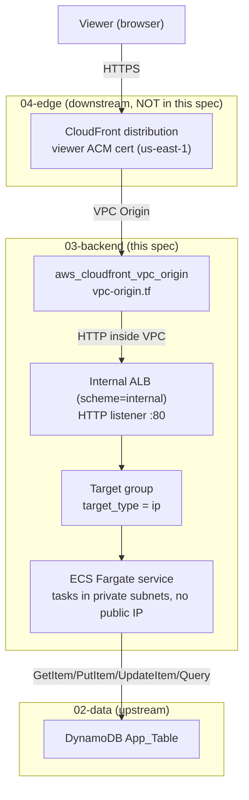
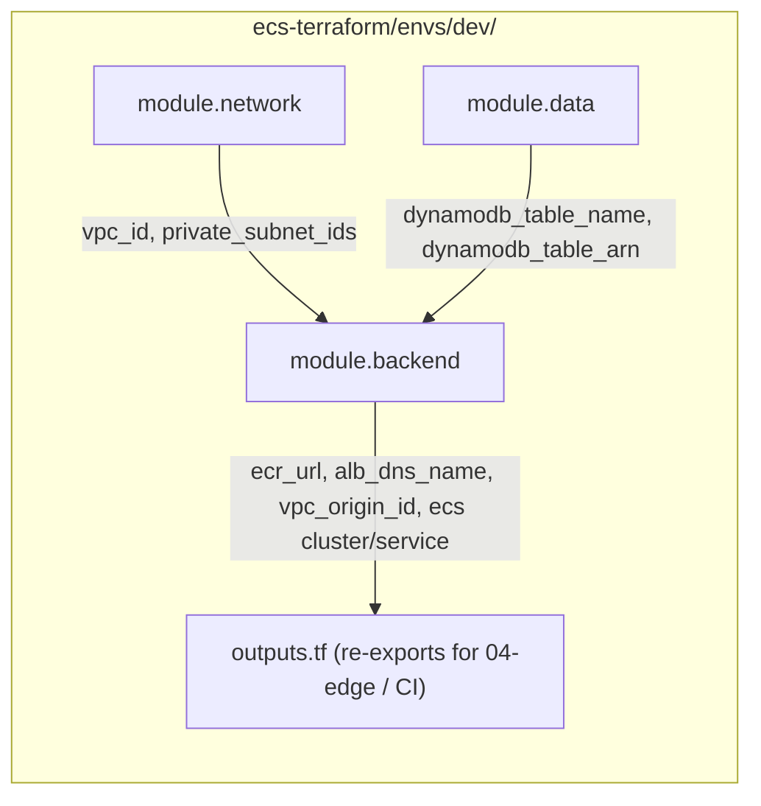
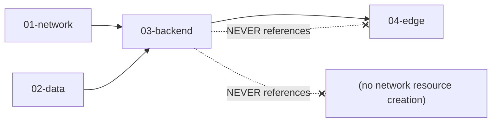
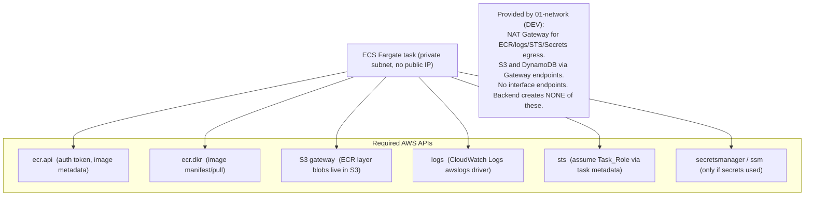

# Design Document

## Overview

This design describes a clean-slate deployment of a new reusable backend module at
`ecs-terraform/modules/backend/`, consumed by the Terraform root module at `ecs-terraform/envs/dev/`.

The Backend_Module owns the application runtime and its edge entry point: one ECR repository, an internal
Application Load Balancer with an IP target group, the CloudFront VPC Origin that fronts that ALB, an ECS
Fargate cluster/task/service, two IAM roles (execution and task), a CloudWatch application log group,
minimal target-tracking autoscaling, backend-owned ALB and ECS security groups, and optional (default-off)
secrets wiring. It creates no VPC, no DynamoDB table, and no CloudFront distribution.

The module composes two upstream modules and feeds one downstream module:

- **01-network** provides `vpc_id` and `private_subnet_ids`. It exposes **no security groups**, so the
  backend creates the ALB_SG and ECS_SG itself (R2.3, R10.2).
- **02-data** provides `dynamodb_table_name` and `dynamodb_table_arn`. The backend grants the Task_Role
  least-privilege access to that table and its indexes and creates no table (R5).
- **04-edge** consumes the backend's VPC Origin id/ARN and ALB DNS name to attach a CloudFront
  distribution. The backend never references edge, so the dependency is strictly backend → edge (R4.5,
  R12.4).

Two connectivity boundaries are pinned before implementation:

1. **Private egress is an integration requirement on 01-network** (R11) — RESOLVED at the
   configuration/design level. The 01-network DEV configuration enables `enable_nat_gateway = true` and
   `enable_vpc_endpoints = true`, providing one NAT Gateway (general outbound to ECR `ecr.api`/`ecr.dkr`,
   CloudWatch Logs, STS, and Secrets Manager/SSM when secrets are used) plus S3 and DynamoDB Gateway
   endpoints. No VPC interface endpoints and no endpoint security group are used. The backend adds no VPC
   endpoints, no NAT, and no other network resources. Actual AWS runtime connectivity is NOT yet verified
   and will be confirmed only when the infrastructure is planned/applied/tested.
2. **Edge TLS ownership** (R12). The internal ALB listener is HTTP and the CloudFront VPC Origin → ALB
   connection is HTTP over the private VPC Origin path, on `var.alb_listener_port` (default 80); DEV uses no
   ACM certificate for the ALB and no `alb_listener_certificate_arn`, and the backend creates no ACM or
   Route 53 resources. Viewer TLS is independent: CloudFront continues to use its default viewer certificate
   and default `*.cloudfront.net` domain in DEV.

### Requirements addressed

This design maps to all 15 requirements in `requirements.md`, referenced inline as `(R<n>.<m>)`.

---

## Architecture

### End-to-end request flow



### Module / dev-root composition



### Dependency direction (no cycles)



The backend depends on network and data (reads their outputs) and is depended upon by edge. It holds zero
references back to edge and creates zero network/data resources, so the graph is acyclic (R4.5, R12.4).

### Private egress analysis (integration requirement on 01-network — RESOLVED at config/design level)

ECS Fargate tasks in private subnets with `assign_public_ip = false` reach AWS control/data planes via the
egress 01-network provides. In the DEV configuration that is one NAT Gateway (outbound to public AWS
endpoints) for general traffic plus S3 and DynamoDB Gateway endpoints for that same-Region traffic. The
diagram below lists what a task needs and how each is satisfied. The backend creates none of these; it
consumes the Private_Egress that 01-network provides (R11).



The DEV connectivity model is now established: ECR (`ecr.api`/`ecr.dkr`), CloudWatch Logs (`logs`), STS,
and Secrets Manager/SSM (if secrets are used) egress via the NAT Gateway; S3 (ECR image layers) via the S3
Gateway endpoint; DynamoDB application traffic via the DynamoDB Gateway endpoint. This resolves the
cross-module dependency (R11.5) at the configuration/design level; the backend module implements no network
resources to satisfy it. Actual AWS runtime connectivity (image pull, log delivery) is NOT yet verified and
will be confirmed only when the infrastructure is eventually planned/applied/tested.

---

## Components and Interfaces

### Module file layout — `ecs-terraform/modules/backend/`

Terraform loads every `.tf` file in the directory as one module; separation is for readability
(conventions steering). The `terraform {}` version block and the `locals { name_prefix }` block live at the
top of `ecs.tf` (no separate `versions.tf`/`locals.tf`, consistent with the 02-data pattern).

| File | Responsibility |
| --- | --- |
| `ecr.tf` | `aws_ecr_repository` + `aws_ecr_lifecycle_policy` (R1) |
| `alb.tf` | Internal `aws_lb`, `aws_lb_target_group` (`target_type = ip`), `aws_lb_listener`, ALB_SG + ECS_SG and their rules (R2, R10) |
| `vpc-origin.tf` | `aws_cloudfront_vpc_origin` targeting the ALB (R4) |
| `ecs.tf` | `terraform {}`, `locals {}`, `aws_ecs_cluster`, `aws_ecs_task_definition`, `aws_ecs_service` (R3) |
| `iam.tf` | Execution_Role, Task_Role, trust + scoped policies (R5, R6) |
| `secrets.tf` | Documentation + conditional secret wiring gated on `var.app_secret_arn` (R7) |
| `autoscaling.tf` | `aws_appautoscaling_target` + target-tracking policy (R9) |
| `logs.tf` | `aws_cloudwatch_log_group` App_Log_Group (R8) |
| `variables.tf` | Typed, validated inputs (R14) |
| `outputs.tf` | Minimal output surface for Dev_Root / 04-edge / CI (R14.4) |

### ECR — `ecr.tf`

One `aws_ecr_repository` named `${local.name_prefix}-app`, `scan_on_push = true`, mutability configurable
via `var.image_tag_mutability` (default `MUTABLE` for DEV, tunable to `IMMUTABLE`). An
`aws_ecr_lifecycle_policy` expires untagged images after a small count and caps retained tagged images to
control DEV storage cost (R1.1–R1.3, R1.5). The repository URL is exposed as an output; no account ID or
ARN is hardcoded (R1.4).

### Internal ALB, target group, listener, and security groups — `alb.tf`

- `aws_lb` `application`, `internal = true`, in `var.private_subnet_ids`, attached to ALB_SG (R2.1, R2.2).
- `aws_lb_target_group` `target_type = "ip"` (required for Fargate awsvpc), health check on
  `var.health_check_path` and the traffic port; stickiness disabled — the app is stateless (R2.4, R2.6,
  R2.7).
- `aws_lb_listener` on `var.alb_listener_port` (default 80), `protocol = "HTTP"`, default action
  forwarding to the existing target group. DEV terminates viewer TLS at CloudFront and reaches the internal
  ALB over the private VPC Origin path, so the listener uses no `ssl_policy`, no `certificate_arn`, and no
  ACM certificate; the module creates no ACM, hosted zone, or DNS record (R2.5, R2.8, R12.1, R12.2). The
  ALB-to-ECS hop stays plain HTTP on the container port.
- **ALB_SG** ingress is restricted to the AWS-managed CloudFront origin-facing prefix list on the ALB
  listener port (`var.alb_listener_port`, default 80), never `0.0.0.0/0`; egress allows reaching ECS tasks
  (R2.3, R10.2). The ECS_SG relationship below is unchanged.
- **ECS_SG** ingress is SG-to-SG from ALB_SG on `var.container_port` only; egress open so tasks reach the
  Private_Egress path (R3.3, R10.3).

Security-group rules are declared as standalone `aws_vpc_security_group_ingress_rule` /
`aws_vpc_security_group_egress_rule` resources, matching the AWS provider v6.x pattern used elsewhere in
this project.

### CloudFront VPC Origin — `vpc-origin.tf`

`aws_cloudfront_vpc_origin` targets the Internal_ALB (by ARN), with its `vpc_origin_endpoint_config` set
to `origin_protocol_policy = "http-only"` and `http_port = var.alb_listener_port` (default 80), matching
the HTTP ALB listener (R4.1, R4.4, R12.2). It sets no `https-only`, no `https_port` requirement, and no
`origin_ssl_protocols`. No distribution/cache/origin-request policy is created (R4.2). The VPC Origin id and
the ALB DNS name are exposed for 04-edge (R4.3, R12.4).

**Certificate / DNS boundary.** DEV requires no origin certificate: the CloudFront VPC Origin reaches the
ALB over HTTP on the private path. 03-backend declares no `alb_listener_certificate_arn`, mints no
`origin_domain_name`, and creates **no** `aws_acm_certificate`, `aws_acm_certificate_validation`,
`aws_route53_zone`, or `aws_route53_record`. The backend module contains no reference to 04-edge (R2.8,
R12.1).

### ECS cluster, task definition, and service — `ecs.tf`

```hcl
# ecs.tf (illustrative structure — not final code)

terraform {
  required_version = "~> 1.16.0"
  required_providers {
    aws = { source = "hashicorp/aws", version = "~> 6.62" }
  }
}

locals {
  name_prefix = "${var.app_name}-${var.environment}"
}

resource "aws_ecs_cluster" "this" {
  name = "${local.name_prefix}-cluster"
  tags = merge(var.tags, { Name = "${local.name_prefix}-cluster" })
}

resource "aws_ecs_task_definition" "app" {
  family                   = "${local.name_prefix}-app"
  requires_compatibilities = ["FARGATE"]
  network_mode             = "awsvpc"
  cpu                      = var.task_cpu    # cost-conscious DEV default
  memory                   = var.task_memory # cost-conscious DEV default
  execution_role_arn       = aws_iam_role.execution.arn
  task_role_arn            = aws_iam_role.task.arn
  # container_definitions: image = "${ecr_url}:${var.image_tag}", portMappings container_port,
  # logConfiguration awslogs -> App_Log_Group, optional secrets from var.app_secret_arn.
}

resource "aws_ecs_service" "app" {
  name            = "${local.name_prefix}-svc"
  cluster         = aws_ecs_cluster.this.id
  task_definition = aws_ecs_task_definition.app.arn
  desired_count   = var.desired_count
  launch_type     = "FARGATE"

  network_configuration {
    subnets          = var.private_subnet_ids
    security_groups  = [aws_security_group.ecs_sg.id]
    assign_public_ip = false
  }

  load_balancer {
    target_group_arn = aws_lb_target_group.app.arn
    container_name   = "${local.name_prefix}-app"
    container_port   = var.container_port
  }
}
```

Tasks run in private subnets, no public IP, stateless (no volumes), image referenced by immutable
`var.image_tag` (R3.1–R3.8). `container_port` flows consistently into the port mapping, target group, and
ECS_SG ingress (R3.5).

### IAM — `iam.tf`

Two roles with distinct trust and permissions (R6.1):

- **Execution_Role** — trust `ecs-tasks.amazonaws.com`; attach `AmazonECSTaskExecutionRolePolicy` (ECR pull
  + log writes) and, only when `var.app_secret_arn != null`, a scoped `secretsmanager:GetSecretValue` /
  `ssm:GetParameters` on exactly that ARN. No `AdministratorAccess` (R6.2).
- **Task_Role** — trust `ecs-tasks.amazonaws.com`; a scoped inline/managed policy granting exactly the
  five actions `dynamodb:GetItem`, `dynamodb:PutItem`, `dynamodb:UpdateItem`, `dynamodb:Query`, and
  `dynamodb:TransactWriteItems` on `${var.dynamodb_table_arn}` and `${var.dynamodb_table_arn}/index/*`.
  `dynamodb:TransactWriteItems` is required by the approved answer-submission hot path, which atomically
  performs the response write, the conditional ability-estimate update, and the seen-set update in a single
  transaction (a distinct IAM action that `PutItem`/`UpdateItem` do not imply). The table ARN supports the
  base-table reads/writes and `TransactWriteItems` (the transaction writes base-table items — RESP,
  ABILITY, SEEN), while `${var.dynamodb_table_arn}/index/*` is required for the `Query` operations against
  GSI1 and GSI2. No `Scan`/`DeleteItem`/`BatchGetItem`/`BatchWriteItem`/`dynamodb:*` and no
  table-management/admin action; no `Resource: "*"` (R5.2, R5.3, R6.3).

The DynamoDB action set is derived directly from the approved adaptive-testing access patterns: AP1–AP16
read and write with `Query`, `GetItem`, `PutItem`, and `UpdateItem`, and the answer-submission hot path
performs its response/ability/seen-set writes atomically via `TransactWriteItems`. `Query` hits the base
table, GSI1, and GSI2 — hence the `/index/*` resource — while the transaction operates only on base-table
items. No long-lived credentials or IAM users are created (R6.4, R6.5).

### Secrets — `secrets.tf`

Documentation-first. In DEV `var.app_secret_arn` defaults to `null`, so no secret resource and no secrets
wiring is planned (R7.3). When a concrete secret ARN is supplied, the task definition `secrets` block
references it and the Execution_Role gains scoped read access to exactly that ARN (R7.2). No secret value
appears in Terraform, tfvars, Dockerfile, Jenkinsfile, or any committed file; secret-bearing variables are
`sensitive = true` with no default (R7.1, R7.4).

### Logging — `logs.tf`

`aws_cloudwatch_log_group` `${local.name_prefix}-app` with `retention_in_days = var.log_retention_days`
(DEV default 14), tagged with the common set. The task definition `awslogs` driver ships to it. No S3
ALB access-log bucket is created; ALB access logging is disabled in DEV, and if required later the bucket
belongs to a logging/observability module (R8).

### Autoscaling — `autoscaling.tf`

`aws_appautoscaling_target` on the ECS service `dimension ecs:service:DesiredCount` with
`min_capacity = var.min_capacity` (default 1) and `max_capacity = var.max_capacity` (default 2). One
target-tracking `aws_appautoscaling_policy` on average CPU at `var.cpu_target` (for example 60%). Nothing
more — cost-conscious, no over-provisioning (R9).

---

## Data Models

### Module input variables — `variables.tf` (R14)

| Variable | Type | Default | Notes |
| --- | --- | --- | --- |
| `app_name` | `string` | — | non-empty; naming base |
| `environment` | `string` | — | non-empty; naming base |
| `tags` | `map(string)` | `{}` | common tag set |
| `vpc_id` | `string` | — | from `module.network.vpc_id` (R10.1) |
| `private_subnet_ids` | `list(string)` | — | from `module.network.private_subnet_ids`; validate length ≥ 2 (R14.3) |
| `dynamodb_table_name` | `string` | — | from `module.data.dynamodb_table_name` |
| `dynamodb_table_arn` | `string` | — | from `module.data.dynamodb_table_arn`; index ARNs derived as `${arn}/index/*` |
| `container_port` | `number` | `3000` | validate 1–65535 (R14.3) |
| `health_check_path` | `string` | `/` | ALB health check path (R2.6) |
| `image_tag` | `string` | — | immutable deploy tag, e.g. Git SHA (R3.6) |
| `task_cpu` | `number` | `256` | cost-conscious DEV default |
| `task_memory` | `number` | `512` | cost-conscious DEV default |
| `desired_count` | `number` | `1` | DEV default |
| `min_capacity` | `number` | `1` | autoscaling floor |
| `max_capacity` | `number` | `2` | autoscaling ceiling |
| `cpu_target` | `number` | `60` | target-tracking CPU % |
| `log_retention_days` | `number` | `14` | explicit retention (R8.2) |
| `image_tag_mutability` | `string` | `MUTABLE` | ECR mutability (R1.5) |
| `alb_listener_port` | `number` | `80` | internal ALB HTTP listener port / VPC Origin http_port (R2.5, R4.4) |
| `app_secret_arn` | `string` | `null` | `sensitive = true`; gates secrets wiring (R7.3, R14.2) |

No `aws_region` variable — region comes from the Dev_Root provider (R13.3).

### Module outputs — `outputs.tf` (R14.4)

| Output | Value | Consumer |
| --- | --- | --- |
| `ecr_repository_url` | `aws_ecr_repository.app.repository_url` | CI/CD image push |
| `alb_dns_name` | `aws_lb.app.dns_name` | 04-edge: origin `domain_name` on the distribution origin block |
| `vpc_origin_id` | `aws_cloudfront_vpc_origin.app.id` | 04-edge: `vpc_origin_config.vpc_origin_id` on the distribution origin |
| `ecs_cluster_name` | `aws_ecs_cluster.this.name` | CI/CD deploy target |
| `ecs_service_name` | `aws_ecs_service.app.name` | CI/CD deploy (`aws ecs update-service --force-new-deployment`) |

No output exposes a secret value (R14.4).

The output surface is deliberately minimal, per the `terraform.md` steering that modules expose only
values a concrete downstream consumer needs. Outputs that were considered and **deliberately not exposed**:

- `alb_arn` — consumed only internally by `vpc-origin.tf` (the `aws_cloudfront_vpc_origin` references
  `aws_lb.app.arn` directly within the module), so it needs no output.
- `vpc_origin_arn` — 04-edge attaches the origin via `vpc_origin_config.vpc_origin_id`, not by ARN, so the
  id alone is sufficient.
- `alb_security_group_id`, `ecs_security_group_id` — diagnostics only; no downstream module consumes them.
  The ALB and ECS security groups are fully owned and referenced inside the backend module.

`alb_dns_name` is retained because it has a concrete consumer: a CloudFront distribution origin block
requires a `domain_name`, and for a VPC-origin-backed internal ALB that `domain_name` is the ALB DNS name
(paired with `vpc_origin_config.vpc_origin_id`). 04-edge therefore needs both `alb_dns_name` and
`vpc_origin_id`.

### Versions pin

Terraform `~> 1.16.0`, AWS provider `~> 6.62`, matching the network and data modules; no major-version
increment (R15.3). The `terraform {}` block lives at the top of `ecs.tf`.

---

## Dev Root Integration — `ecs-terraform/envs/dev/`

The Dev_Root adds a `module "backend"` block wired from upstream outputs and passes `image_tag`,
`container_port`, `health_check_path`, and sizing from `terraform.tfvars`:

```hcl
module "backend" {
  source = "../../modules/backend"

  app_name            = var.app_name
  environment         = var.environment
  tags                = { Project = var.app_name, Environment = var.environment, ManagedBy = "Terraform", Owner = var.owner }

  vpc_id              = module.network.vpc_id
  private_subnet_ids  = module.network.private_subnet_ids
  dynamodb_table_name = module.data.dynamodb_table_name
  dynamodb_table_arn  = module.data.dynamodb_table_arn

  container_port      = var.container_port
  health_check_path   = var.health_check_path
  image_tag           = var.image_tag
  # sizing / autoscaling / retention use module defaults unless overridden
}
```

`vpc_id`, `private_subnet_ids`, `dynamodb_table_name`, and `dynamodb_table_arn` come from module outputs,
never literals (R14.5). The Dev_Root re-exports `ecr_repository_url`, `alb_dns_name`, `vpc_origin_id`,
and the ECS cluster/service names for CI/CD and 04-edge.

### Edge connections: viewer HTTPS, HTTP origin

The design carries three connections, two of which are independent:

- **Viewer → CloudFront:** HTTPS on the default `*.cloudfront.net` DEV distribution domain, using the
  CloudFront default certificate. No custom viewer alias and no viewer ACM certificate exist in DEV
  (R12.2, R12.3).
- **CloudFront VPC Origin → internal ALB:** HTTP on `var.alb_listener_port` (default 80) over the private
  VPC Origin path. DEV uses no ACM certificate for the ALB and no origin TLS (R2.5, R4.4, R12.2).
- **ALB → ECS:** plain HTTP on the application/container port.

**No origin certificate/DNS contract in DEV.** There is no origin ACM certificate, no
`alb_listener_certificate_arn`, no `origin_domain_name`, and no DNS/certificate foundation. 03-backend
creates no ACM or Route 53 resources and holds no reference to 04-edge. 04-edge consumes
`module.backend.vpc_origin_id` to attach the VPC Origin and sets the distribution origin domain to the ALB
DNS name exposed by 03-backend; no origin hostname is minted or passed. The dependency direction
network/data → backend → edge is preserved.

### Backend and state (clean slate)

The Dev_Root S3 backend (dev state key `ecs-dev/terraform.tfstate`) is created by bootstrap and configured
at init. The backend module declares no provider/backend block. The first plan is all-create; no `moved`
blocks, no migration (R13.3, R15.4, R15.5).

---

## Error Handling

- **Missing/invalid subnets:** `private_subnet_ids` is validated to contain at least two IDs; fewer fails
  at validate before any resource is created (R14.3).
- **Invalid container port:** `container_port` validated to 1–65535 (R14.3).
- **Private egress (runtime, cross-module):** the 01-network DEV configuration now provides the required
  egress (NAT Gateway + S3/DynamoDB Gateway endpoints), so the dependency is resolved at the
  configuration/design level. `terraform plan`/`validate` do not test connectivity, so actual image pull
  and log delivery remain NOT yet verified and will be confirmed only when the infrastructure is
  planned/applied/tested; this is a cross-module integration to verify at deploy time, not a code fault the
  backend can guard against (R11.5).
- **No count-index hazards:** the secrets wiring is gated on a `null` input and produces zero resources in
  DEV, so there is no `[0]`-index dereference risk. The ALB listener is HTTP and consumes no certificate;
  the module creates no certificate/DNS resource and adds no count-gated TLS resource.

---

## Testing Strategy

### Why property-based testing does not apply

This feature is declarative Terraform IaC. There is no pure input/output function to quantify a "for all
inputs" property over. Per project guidance, PBT is not appropriate for IaC; verification uses
`terraform fmt`/`validate`/`plan` and `terraform plan -json` invariant assertions. This design therefore
uses infrastructure invariants (below) in place of property-based tests.

### Verification workflow

Run against `ecs-terraform/envs/dev/` (and `modules/backend/` for fmt): `terraform fmt -check -recursive`
→ `terraform init` → `terraform validate` → `terraform plan -out=tfplan` →
`terraform show -json tfplan > plan.json` for automated assertions. No `terraform apply` (R15).

## Correctness Properties

These are testable infrastructure invariants for the backend module, verified against `terraform plan -json`
or static analysis — not property-based application tests.

### Property 1: Single-ECR invariant

the plan contains exactly one `aws_ecr_repository` and zero additional container registries.

**Validates: Requirements 1.1, 1.6**

### Property 2: Internal-ALB invariant

the `aws_lb` has `internal = true` and resides only in `var.private_subnet_ids`; no public-subnet placement.

**Validates: Requirements 2.1, 2.2, 10.4**

### Property 3: IP-target-type invariant

the `aws_lb_target_group` has `target_type == "ip"`.

**Validates: Requirements 2.4**

### Property 4: No-stickiness invariant

the target group has stickiness disabled (no enabled `stickiness` block).

**Validates: Requirements 2.7**

### Property 5: HTTP-listener invariant

the ALB listener `protocol == "HTTP"`; its `port == var.alb_listener_port` with the default
`alb_listener_port == 80`; the listener declares no `ssl_policy`, no `certificate_arn`, and requires no ACM
certificate; and the VPC Origin `origin_protocol_policy == "http-only"` with
`http_port == var.alb_listener_port` and no `origin_ssl_protocols`. Viewer → CloudFront HTTPS is
independent and unchanged.

**Validates: Requirements 2.5, 2.8, 4.4, 12.1, 12.2**

### Property 6: Private-task invariant

the ECS service `network_configuration.assign_public_ip == false` and its subnets equal `var.private_subnet_ids`.

**Validates: Requirements 3.2, 10.4**

### Property 7: SG-to-SG ingress invariant

the ECS_SG has exactly one ingress rule referencing ALB_SG on `var.container_port`, and no ingress rule with a public CIDR.

**Validates: Requirements 3.3, 10.3**

### Property 8: ALB-not-public invariant

the ALB_SG has no ingress rule with `0.0.0.0/0`.

**Validates: Requirements 2.3, 10.2**

### Property 9: Port-consistency invariant

the task-definition container port, the target-group port, and the ECS_SG ingress port all equal `var.container_port`.

**Validates: Requirements 3.5**

### Property 10: Two-roles invariant

exactly two IAM roles (Execution_Role, Task_Role) with distinct trust to the ECS service principals; neither attaches `AdministratorAccess`.

**Validates: Requirements 6.1, 6.2, 6.3, 6.5**

### Property 11: DynamoDB-least-privilege invariant

the Task_Role policy grants exactly the five actions `{GetItem, PutItem, UpdateItem, Query, TransactWriteItems}` on `${dynamodb_table_arn}` and `${dynamodb_table_arn}/index/*`, with no `Scan`, no `DeleteItem`, no `BatchGetItem`, no `BatchWriteItem`, no `dynamodb:*`, and no `Resource: "*"`.

**Validates: Requirements 5.2, 5.3**

### Property 12: No-second-table invariant

the plan contains zero `aws_dynamodb_table` resources.

**Validates: Requirements 5.1**

### Property 13: No-network-creation invariant

the plan contains zero `aws_vpc`, `aws_subnet`, `aws_route_table`, `aws_route`, `aws_nat_gateway`, and `aws_vpc_endpoint` resources.

**Validates: Requirements 10.1, 11.2**

### Property 14: VPC-Origin-only invariant

the plan contains exactly one `aws_cloudfront_vpc_origin` and zero `aws_cloudfront_distribution` resources.

**Validates: Requirements 4.1, 4.2**

### Property 15: Log-retention invariant

the App_Log_Group sets `retention_in_days == var.log_retention_days` (a finite value), and the plan contains no S3 ALB access-log bucket.

**Validates: Requirements 8.2, 8.3**

### Property 16: No-secret-by-default invariant

with `var.app_secret_arn == null` the plan contains zero secret resources and the task definition declares no `secrets` entry; no secret value appears in any input default.

**Validates: Requirements 7.1, 7.3, 7.4**

### Property 17: Autoscaling-bounds invariant

exactly one `aws_appautoscaling_target` with `min_capacity <= max_capacity` and small DEV defaults, and at least one target-tracking policy.

**Validates: Requirements 9.1, 9.2, 9.3**

### Property 18: Naming-prefix invariant

every resource `Name` tag and resource name begins with `"${var.app_name}-${var.environment}"`, computed from `local.name_prefix`.

**Validates: Requirements 13.1**

### Property 19: No-hardcoded-identifiers invariant

the module source contains no literal AWS account ID, ARN, region string, subnet ID, security-group ID, or ECR URL; all derive from variables, locals, references, or module outputs.

**Validates: Requirements 13.5**

### Property 20: Acyclic-dependency invariant

the backend module source contains zero references to any 04-edge resource or output.

**Validates: Requirements 4.5, 12.4**

### Property 21: Clean-slate invariant

`terraform plan` against a fresh state shows N>0 to add, 0 to change, 0 to destroy, with no `moved` blocks.

**Validates: Requirements 15.4, 15.5**

### Property 22: Version-pin invariant

the module pins Terraform `~> 1.16.0` and AWS provider `~> 6.62` with no major-version increment.

**Validates: Requirements 15.3**

### Property 23: External-certificate / no-DNS invariant

the backend module source contains no `aws_acm_certificate`, `aws_acm_certificate_validation`,
`aws_route53_zone`, or `aws_route53_record` resource; it declares no `alb_listener_certificate_arn` and no
`origin_domain_name` and requires no externally supplied origin certificate; and the backend module
contains zero references to any 04-edge resource or output.

**Validates: Requirements 2.8, 12.1, 12.3, 12.5**
