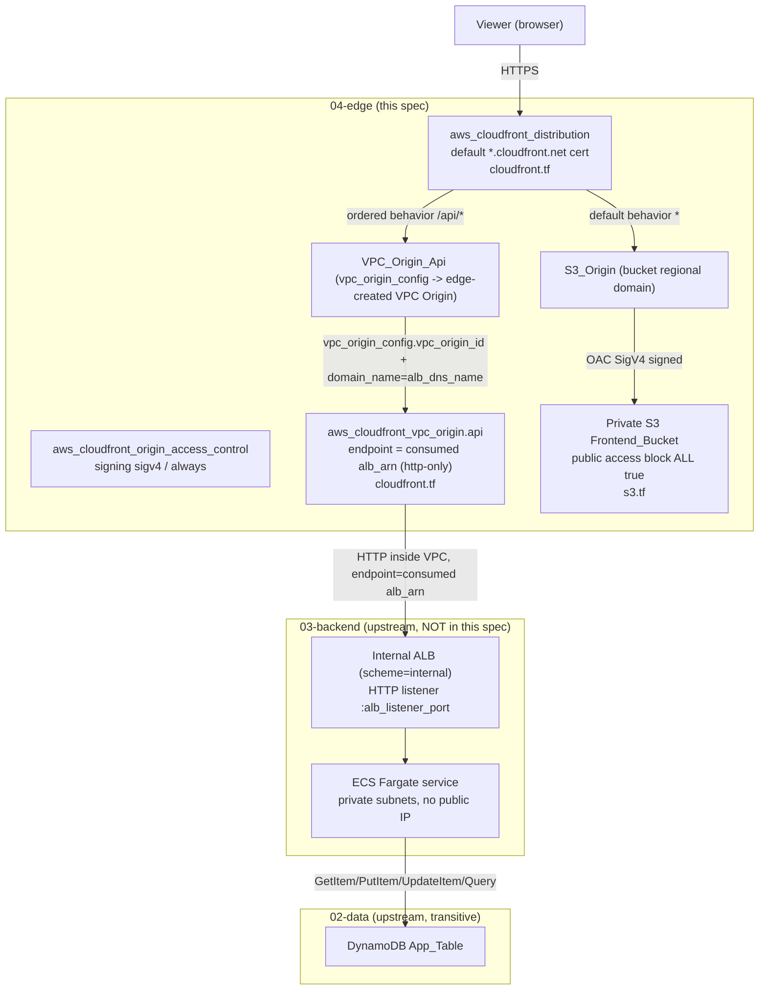
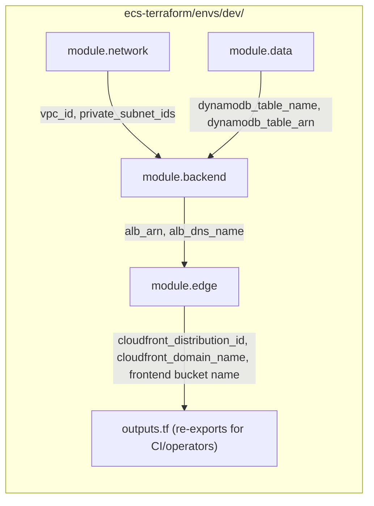
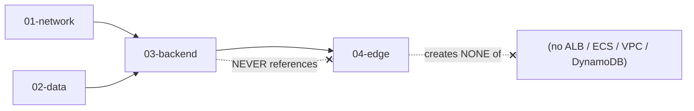

# Design Document

## Overview

This design describes a clean-slate deployment of a new reusable edge module at
`ecs-terraform/modules/edge/`, consumed by the Terraform root module at `ecs-terraform/envs/dev/`.

The Edge_Module owns the platform's single public entry point and the static frontend origin: one private
S3 frontend bucket (with its public-access block and OAC-scoped bucket policy), one
`aws_cloudfront_origin_access_control`, and one `aws_cloudfront_distribution` with two origins (a
private-S3 origin reached through OAC and a VPC-origin API path) and two cache behaviors (a default
behavior to S3 and an ordered `/api/*` behavior to the VPC origin). It is the ONLY internet-facing
component in the architecture. It creates no VPC, no subnet, no DynamoDB table, no ALB, and no ECS resource.
It DOES create exactly one `aws_cloudfront_vpc_origin` (for example `aws_cloudfront_vpc_origin.api`) from
the consumed internal ALB ARN — that CloudFront-specific integration resource belongs with the edge
infrastructure and is owned here, not by 03-backend.

The module consumes only two upstream values, both from 03-backend:

- **03-backend** provides `alb_arn` (the internal ALB ARN, used as the edge-created VPC Origin's
  endpoint/target) and `alb_dns_name` (used as the API origin's `domain_name`). The Edge_Module holds no
  reference to 01-network or 02-data resources; those are transitive concerns satisfied inside 03-backend
  (R14.1).
- The dependency direction is strictly **network/data → backend → edge**. 03-backend never references edge,
  so the graph is acyclic; edge creates no circular dependency and modifies no upstream resource (R14.2,
  R14.3).

Two connectivity boundaries are pinned before implementation:

1. **Viewer TLS (default domain).** Viewer → CloudFront is HTTPS on the default `*.cloudfront.net`
   distribution domain using the CloudFront default viewer certificate (`cloudfront_default_certificate =
   true`). DEV creates no custom viewer alias, no Route 53 record, and no custom ACM certificate; viewer
   HTTP is redirected to HTTPS at CloudFront (R2, R3, R4, R10.1, R18.3).
2. **Origin hop (private path).** CloudFront reaches the private S3 bucket through OAC (SigV4-signed,
   private) and reaches the internal ALB over HTTP through the edge-created VPC Origin path. The internal
   ALB stays private; HTTP on the private VPC Origin path is acceptable for DEV because viewer TLS
   terminates at CloudFront and the origin hop never traverses the public internet (R8, R10.2, R10.3).

This is a clean-slate, brand-new deployment. There is no existing state to preserve and nothing to migrate.
`terraform plan` against a fresh state represents the CREATION of new development infrastructure. This spec
introduces no `moved` blocks and no state-migration logic; it is DEV only, and no `terraform apply` is
performed as part of this spec (R19.4, R19.5).

### Requirements addressed

This design maps to all 19 requirements in `requirements.md`, referenced inline as `(R<n>.<m>)`.

---

## Architecture

### End-to-end request flow

The request flow is `Internet → CloudFront → {Private S3 frontend via OAC | /api/* → CloudFront VPC Origin
→ Internal ALB → ECS Fargate → DynamoDB}`. CloudFront is the only internet-facing surface; both origins are
private.



Viewer HTTP is redirected to HTTPS on every behavior. AWS Shield Standard automatically protects CloudFront
and requires **no** Terraform resource; it must not be confused with CloudFront Origin Shield, which is a
distinct optional caching layer and is disabled for DEV (R12.1, R12.2).

### Module / dev-root composition



### Dependency direction (no cycles)



The edge depends only on backend (reads two of its outputs — `alb_arn` and `alb_dns_name`) and is depended
upon by nothing. It holds zero references back to backend/network/data resources and creates no ALB, ECS,
VPC, or DynamoDB resource, so the graph is acyclic (R14.1, R14.2, R14.3). Edge does create its own
`aws_cloudfront_vpc_origin` from the consumed ALB ARN, which introduces no dependency from backend back to
edge.

---

## Components and Interfaces

### Module file layout — `ecs-terraform/modules/edge/`

Terraform loads every `.tf` file in the directory as one module; separation is for readability
(conventions steering). The `terraform {}` version block and the `locals { name_prefix }` block live at the
top of the main file (`cloudfront.tf`), with no separate `versions.tf`/`locals.tf`, consistent with the
02-data and 03-backend pattern.

| File | Responsibility |
| --- | --- |
| `cloudfront.tf` | `terraform {}`, `locals {}`, `aws_cloudfront_distribution` (origins + default and `/api/*` behaviors), `aws_cloudfront_origin_access_control`, the edge-owned `aws_cloudfront_vpc_origin` (targeting the internal ALB via `var.alb_arn`), managed cache/origin-request policy data sources (R1, R6, R7, R8, R9, R10) |
| `s3.tf` | Private `aws_s3_bucket`, `aws_s3_bucket_public_access_block`, `aws_s3_bucket_server_side_encryption_configuration`, OAC-scoped `aws_s3_bucket_policy` (R5, R18) |
| `variables.tf` | Typed, validated, described inputs (R16, R17.1, R17.2) |
| `outputs.tf` | Minimal output surface for operators / CI/CD (R17.3, R17.4) |

No `provider` block and no `backend` block: the module inherits the AWS provider (and the `aws.us_east_1`
alias when later required) from the Dev_Root (R16.3).

### Component responsibilities

Each component below is either **owned** (created by edge) or **consumed** (created upstream, referenced by
id/name here). Edge owns the distribution, OAC, bucket, behaviors, and the `aws_cloudfront_vpc_origin`; it
consumes the internal ALB ARN and ALB DNS name from 03-backend.

| Component | Owned/Consumed | Responsibility |
| --- | --- | --- |
| **Frontend_Bucket** | Owned | Private `aws_s3_bucket` storing compiled static assets; never public; SSE at rest; public-access block all-true (R5, R18.1) |
| **OAC** | Owned | `aws_cloudfront_origin_access_control`, type `s3`, `signing_behavior = always`, `signing_protocol = sigv4`; lets CloudFront read the private bucket without OAI (R6) |
| **CloudFront_Distribution** | Owned | The single `aws_cloudfront_distribution`; the only internet-facing resource; enabled; serves both S3 static content and the API path (R1.1, R1.3) |
| **S3_Origin** | Owned | Distribution origin block pointing at the bucket **regional** domain, secured by `origin_access_control_id` (R6.2, R5.4) |
| **VPC_Origin_Api** | Owned | Distribution origin block whose `vpc_origin_config.vpc_origin_id = aws_cloudfront_vpc_origin.api.id` (the edge-created VPC Origin) and whose `domain_name = var.alb_dns_name` (R8.3, R13.2) |
| **Default_Behavior** | Owned | Default cache behavior (path `*`) targeting S3_Origin; read methods; may cache normally; `redirect-to-https` (R7) |
| **Api_Behavior** | Owned | Ordered cache behavior (path `/api/*`) targeting VPC_Origin_Api; caching disabled; API methods; `redirect-to-https`; evaluated before the default (R8, R9, R10.1) |
| **Viewer_Certificate** | Owned | `viewer_certificate { cloudfront_default_certificate = true }`; no custom alias, no ACM (R4.1, R2.2) |
| **aws_cloudfront_vpc_origin** | Owned | The single edge-created `aws_cloudfront_vpc_origin` (for example `aws_cloudfront_vpc_origin.api`); its endpoint config targets the internal ALB via the consumed `var.alb_arn`, http-only, http port matching the ALB HTTP listener; the internal ALB stays private (R8.2, R10.2) |
| **ALB / ECS / DynamoDB / VPC** | Consumed transitively | Owned by 01-network/02-data/03-backend; edge creates and modifies none of them (R1.4, R11.1, R14.3) |

---

## Request Flows

### (a) Static asset request

1. A viewer makes an HTTPS request to the default `*.cloudfront.net` domain (viewer HTTP is redirected to
   HTTPS by the `redirect-to-https` policy). CloudFront terminates viewer TLS with its default certificate
   (R10.1, R18.3, R4.1).
2. The path does not match `/api/*`, so the **Default_Behavior** (path `*`) applies and routes to
   **S3_Origin** (R7.1).
3. CloudFront reaches the private bucket via the **OAC**: it signs the origin request with SigV4 as the
   CloudFront service principal, and the bucket policy authorizes exactly that principal scoped to this
   distribution's ARN (R6.1, R5.3).
4. The object is served from the **private** bucket (public access blocked, no website endpoint, bucket
   regional domain used as origin) and cached per the default behavior's caching policy (R5.2, R5.4, R7.3).

### (b) API request

1. A viewer makes an HTTPS request whose path matches `/api/*` (viewer HTTP is redirected to HTTPS)
   (R10.1).
2. The ordered **Api_Behavior** (`/api/*`) is evaluated before the default and routes to
   **VPC_Origin_Api** (R8.1).
3. The API origin attaches the **edge-created** `aws_cloudfront_vpc_origin` via
   `vpc_origin_config { vpc_origin_id = aws_cloudfront_vpc_origin.api.id }` and uses `alb_dns_name` as its
   `domain_name`. That VPC Origin's endpoint targets the internal ALB via the consumed `var.alb_arn`,
   sending the request over HTTP on the **private VPC Origin path** (R8.2, R8.3, R10.2).
4. The request reaches the **internal ALB** (HTTP listener on `:alb_listener_port`, matching the edge VPC
   Origin's http-only endpoint), then the **ECS Fargate** service (tasks in **private subnets**, no public
   IP), which reads/writes **DynamoDB** (R10.2, R11.2, R11.3).
5. Caching is disabled for this behavior, so responses are always served fresh (R9.1).

The only path from the internet to the application is Internet → CloudFront → VPC_Origin_Api → internal ALB
→ ECS; edge introduces no other public path to the tasks (R11.3).

---

## CloudFront Behaviors

### Default behavior (path `*`) → S3_Origin

- **Target origin:** S3_Origin (the private bucket via OAC) (R7.1).
- **Caching:** may cache normally using the AWS-managed **CachingOptimized** cache policy (or an equivalent
  TTL configuration); it is NOT forced to CachingDisabled (R7.3, R9.3).
- **Viewer protocol:** `viewer_protocol_policy = "redirect-to-https"` (R7.4, R10.1).
- **Methods:** read methods appropriate for static content — `GET`, `HEAD`, and optionally `OPTIONS`
  (R7.2).

### Api behavior (ordered, path `/api/*`) → VPC_Origin_Api

- **Target origin:** VPC_Origin_Api (the internal ALB via the edge-created VPC Origin) (R8.1).
- **Caching:** DISABLED using the AWS-managed **CachingDisabled** cache policy (equivalently min/max/default
  TTL all `0`), so dynamic API responses are always fresh (R9.1).
- **Origin request:** forwards the request data a dynamic API needs — the AWS-managed
  **AllViewerExceptHostHeader** origin request policy (or an equivalent policy forwarding the required
  headers, query strings, and cookies). `AllViewerExceptHostHeader` is chosen deliberately: a VPC-origin /
  custom-origin does not expect the viewer `Host` header, so forwarding everything **except** Host avoids a
  Host-header mismatch at the origin while still forwarding the query strings, cookies, and remaining
  headers the API requires (R8.4, R9.2).
- **Viewer protocol:** `viewer_protocol_policy = "redirect-to-https"` (R8.5, R10.1).
- **Methods:** the HTTP methods a dynamic API requires — `GET`, `HEAD`, `OPTIONS`, `PUT`, `POST`, `PATCH`,
  `DELETE` (R8.4).

### Ordering

The `/api/*` behavior is declared as an `ordered_cache_behavior` and is evaluated **before** the
`default_cache_behavior`. CloudFront matches ordered behaviors by path pattern first and falls through to
the default only when no ordered pattern matches; so `/api/...` requests always reach the VPC origin and
everything else reaches S3 (R8.1, R7.1).

### Managed policy lookup (no hardcoded IDs)

The design references AWS-managed policies **by name** and resolves their ids through data sources
(`aws_cloudfront_cache_policy` for CachingOptimized and CachingDisabled;
`aws_cloudfront_origin_request_policy` for AllViewerExceptHostHeader). No managed-policy IDs are invented or
hardcoded; the ids come from the data-source lookups (R13.1, R13.3).

---

## S3 / OAC Design

- **Private bucket.** One `aws_s3_bucket` named from `local.name_prefix` (for example
  `${var.app_name}-${var.environment}-frontend`). It is never public (R5.1, R5.5).
- **Public access block.** An `aws_s3_bucket_public_access_block` sets `block_public_acls`,
  `block_public_policy`, `ignore_public_acls`, and `restrict_public_buckets` all to `true` (R5.2).
- **Encryption at rest.** `aws_s3_bucket_server_side_encryption_configuration` enables AWS-managed SSE
  (SSE-S3, `sse_algorithm = "AES256"`). No customer-managed KMS key is required for DEV (R18.1, R18.2).
- **Bucket policy (OAC pattern).** The `aws_s3_bucket_policy` grants `s3:GetObject` **only** to the
  CloudFront service principal (`cloudfront.amazonaws.com`), scoped by the distribution ARN via the
  `AWS:SourceArn` condition. It grants no public read, no `Principal: "*"`, and no `0.0.0.0/0` access
  outside that OAC condition (R5.3, R5.5).
- **No OAI.** Access uses `aws_cloudfront_origin_access_control` only; no legacy
  `aws_cloudfront_origin_access_identity` is created or used (R6.3).
- **No website hosting.** S3 static website hosting is not enabled and the S3 website endpoint is not used
  as an origin; the S3_Origin uses the bucket **regional** domain reached through the OAC (R5.4).

### Reference ordering (no cycle)

The three references form a chain, not a cycle:

- The **distribution** references the **OAC** (via `origin_access_control_id`) and the **bucket** (via the
  S3_Origin `domain_name`, the bucket regional domain).
- The **bucket policy** references the **distribution ARN** (in the `AWS:SourceArn` condition).

Terraform resolves this with ordinary resource references: it creates the OAC and bucket, then the
distribution, then the bucket policy (which depends on the distribution's ARN). There is no circular
dependency because the distribution does not depend on the bucket **policy** — only on the bucket and OAC.
The create-order nuance is simply that the bucket policy is applied after the distribution exists; Terraform
sequences this automatically from the ARN reference, so no explicit `depends_on` gymnastics are required
(R5.3, R13.1).

---

## VPC Origin Integration

- Edge consumes `alb_arn` and `alb_dns_name` from `module.backend` as typed inputs (R14.1, R13.2).
- Edge CREATES exactly one `aws_cloudfront_vpc_origin` (for example `aws_cloudfront_vpc_origin.api`) whose
  endpoint config targets the internal ALB via the consumed `var.alb_arn` (R8.2).
- The origin protocol from the edge-created VPC Origin to the ALB is **HTTP** (`http-only`), with the http
  port matching the internal ALB's HTTP listener. `https_port` and the `origin_ssl_protocols` block are
  REQUIRED by the installed AWS provider schema (`~> 6.62`) even when `origin_protocol_policy = "http-only"`,
  so both are always set (`https_port = 443`, `origin_ssl_protocols` = `["TLSv1.2"]`); they do not carry
  traffic while HTTP-only is selected. The private path never leaves the AWS network (R10.2).
- The API origin block attaches the edge-created VPC Origin via
  `vpc_origin_config { vpc_origin_id = aws_cloudfront_vpc_origin.api.id }` and sets the origin
  `domain_name = var.alb_dns_name` (R8.3).
- The internal ALB stays **private**; edge does not make it public. Edge creates the VPC Origin but still
  creates **no** ALB and **no** ECS resource (R8.2, R10.2, R11.1).
- The dependency stays **backend → edge**: edge reads backend outputs (`alb_arn`, `alb_dns_name`) and
  backend never references edge, so building the VPC Origin here introduces no cycle (R14.2).

Illustrative structure (not final code):

```hcl
# cloudfront.tf (illustrative — not final code)

terraform {
  required_version = "~> 1.16.0"
  required_providers {
    aws = { source = "hashicorp/aws", version = "~> 6.62" }
  }
}

locals {
  name_prefix = "${var.app_name}-${var.environment}"
}

# Edge-owned VPC Origin fronting the internal ALB (endpoint = consumed ALB ARN, http-only)
resource "aws_cloudfront_vpc_origin" "api" {
  vpc_origin_endpoint_config {
    name                   = "${local.name_prefix}-api"
    arn                    = var.alb_arn # consumed from module.backend; the internal ALB ARN
    http_port              = var.alb_http_port
    https_port             = 443 # required by schema even under http-only; carries no traffic
    origin_protocol_policy = "http-only"

    origin_ssl_protocols {
      items    = ["TLSv1.2"] # origin_ssl_protocols required by schema even under http-only; unused
      quantity = 1
    }
  }
}

resource "aws_cloudfront_distribution" "this" {
  enabled = true

  # Static frontend origin (private S3 via OAC)
  origin {
    origin_id                = "s3-frontend"
    domain_name              = aws_s3_bucket.frontend.bucket_regional_domain_name
    origin_access_control_id = aws_cloudfront_origin_access_control.frontend.id
  }

  # API origin (internal ALB via the edge-created VPC Origin)
  origin {
    origin_id   = "api-vpc-origin"
    domain_name = var.alb_dns_name # consumed from module.backend

    vpc_origin_config {
      vpc_origin_id = aws_cloudfront_vpc_origin.api.id # edge-created VPC Origin
    }
  }

  default_cache_behavior {
    target_origin_id       = "s3-frontend"
    viewer_protocol_policy = "redirect-to-https"
    cache_policy_id        = data.aws_cloudfront_cache_policy.optimized.id
    # read methods for static content
  }

  ordered_cache_behavior {
    path_pattern             = "/api/*"
    target_origin_id         = "api-vpc-origin"
    viewer_protocol_policy   = "redirect-to-https"
    cache_policy_id          = data.aws_cloudfront_cache_policy.disabled.id
    origin_request_policy_id = data.aws_cloudfront_origin_request_policy.all_viewer_except_host.id
    # GET/HEAD/OPTIONS/PUT/POST/PATCH/DELETE
  }

  viewer_certificate {
    cloudfront_default_certificate = true
  }

  # no aliases, no web_acl_id (DEV), Origin Shield disabled
}
```

---

## Security Design

- **Single public surface.** CloudFront is the only internet-facing resource; edge creates no public load
  balancer, no public IP, no S3 website endpoint, and no other internet-facing resource (R1.1, R1.2).
- **Viewer HTTPS enforced.** Every behavior sets `viewer_protocol_policy = "redirect-to-https"`, so viewer
  HTTP is redirected to HTTPS (R10.1, R18.3).
- **Default certificate.** `cloudfront_default_certificate = true` on the default `*.cloudfront.net`
  domain; no custom ACM certificate and no Route 53 resources for DEV (R2.1, R4.1, R3.1, R3.2).
- **Private S3.** The bucket is private via OAC + public-access block (all-true) + SSE at rest; the bucket
  policy grants read only to the CloudFront service principal scoped to the distribution ARN — least
  privilege, no public read (R5, R6, R18.1).
- **Private origin hop.** The ALB stays private; the CloudFront → ALB hop is HTTP, which is acceptable
  because TLS terminates at CloudFront and the hop travels the private VPC Origin path inside the AWS
  network, never the public internet (R10.2, R10.3).
- **ECS isolation invariant.** ECS tasks remain in private subnets with no public IP. Edge creates no
  compute and cannot violate that invariant because it creates no ECS/EC2/Lambda and no VPC workload
  (R11.1, R11.2, R11.3).
- **Shield Standard.** Automatic for CloudFront; no Terraform resource is created, and Origin Shield stays
  disabled and is not conflated with Shield Standard (R12.1, R12.2).
- **No hardcoded identifiers.** No account IDs, ARNs (including the ALB ARN), VPC/subnet/security-group IDs,
  ECR URLs, distribution IDs, or bucket identifiers are hardcoded; `alb_arn` and `alb_dns_name` come from
  module outputs, and managed-policy ids come from data sources (R13.1, R13.2, R13.3).
- **WAF (future).** WAF is out of scope for DEV (owned by 06-observability). The distribution is structured
  so a `web_acl_id` can be attached later without redesigning the module; no WAF resource is created for DEV
  (R15.1, R15.2).

---

## Data Models

### Module input variables — `variables.tf` (R16, R17.1, R17.2)

| Variable | Type | Default | Notes |
| --- | --- | --- | --- |
| `app_name` | `string` | — | non-empty; naming base for `local.name_prefix` (R16.1) |
| `environment` | `string` | — | non-empty; naming base for `local.name_prefix` (R16.1) |
| `tags` | `map(string)` | `{}` | common tag set (Project, Environment, ManagedBy, Owner) merged into every taggable resource (R16.2) |
| `alb_arn` | `string` | — | from `module.backend.alb_arn` (the internal ALB ARN); validated non-empty; used as the edge-created `aws_cloudfront_vpc_origin` endpoint/target (R8.2, R13.2, R17.2) |
| `alb_dns_name` | `string` | — | from `module.backend.alb_dns_name`; validated non-empty; API origin `domain_name` (R8.3, R13.2, R17.2) |
| `alb_http_port` | `number` | `80` | http port for the edge-created VPC Origin, matching the internal ALB's HTTP listener; not required from backend (R8.2) |

No `aws_region` variable and no `acm_certificate_arn` / hosted-zone inputs — region comes from the Dev_Root
provider and DEV requires no ACM/DNS input (R3.3, R4.4, R16.3). The two consumed upstream inputs are
`alb_arn` and `alb_dns_name`; `alb_http_port` is a defaulted local knob, not a value passed from backend.

### Module outputs — `outputs.tf` (R17.3, R17.4)

| Output | Value | Consumer |
| --- | --- | --- |
| `cloudfront_distribution_id` | `aws_cloudfront_distribution.this.id` | operators / CI/CD (cache invalidations, diagnostics) |
| `cloudfront_domain_name` | `aws_cloudfront_distribution.this.domain_name` | operators / CI/CD — the default `*.cloudfront.net` domain to reach the environment (R2.4) |
| `frontend_bucket_name` | `aws_s3_bucket.frontend.bucket` | CI/CD to upload compiled frontend assets |

Outputs that were considered and **deliberately not exposed** (per the `terraform.md` steering that modules
expose only what a concrete downstream consumer needs): the OAC id, the bucket ARN, and the distribution ARN
— nothing downstream consumes them (R17.4). No output exposes a secret value (R17.4).

---

## Module Dependencies and Provider Wiring

### Provider, backend, and pins

The module declares **no** `provider` block and **no** `backend` block; it inherits the AWS provider (and
the `aws.us_east_1` alias, available for future ACM) from the Dev_Root (R16.3). It pins Terraform `~> 1.16.0`
and AWS provider `~> 6.62`, matching the network/data/backend modules, with no major-version increment
(R19.3). All Terraform identifiers use snake_case, and all derived names come from `local.name_prefix`
(R16.4, R16.1).

### Dev Root wiring — `ecs-terraform/envs/dev/`

The Dev_Root adds a `module "edge"` block wired from backend outputs, never from literals (R17.5):

```hcl
module "edge" {
  source = "../../modules/edge"

  app_name    = var.app_name
  environment = var.environment
  tags        = { Project = var.app_name, Environment = var.environment, ManagedBy = "Terraform", Owner = var.owner }

  alb_arn      = module.backend.alb_arn
  alb_dns_name = module.backend.alb_dns_name
}
```

The Dev_Root re-exports `cloudfront_domain_name` (and, as useful, the distribution id and frontend bucket
name) for operators and CI/CD. The Dev_Root S3 backend (dev state key `dev/terraform.tfstate`) is created by
bootstrap and configured at init; the edge module declares no provider/backend block. The first plan is
all-create; no `moved` blocks, no migration (R19.4, R19.5).

### Upstream integration requirement (03-backend output change)

The edge-owned VPC Origin model depends on a matching 03-backend change that this spec does NOT implement:
03-backend MUST STOP creating the `aws_cloudfront_vpc_origin` resource, STOP outputting `vpc_origin_id`, and
START outputting `alb_arn` (the internal ALB ARN) alongside its existing `alb_dns_name`. The Edge_Module
then consumes `module.backend.alb_arn` and `module.backend.alb_dns_name` to build and attach its own VPC
Origin. This integration requirement introduces no dependency from 03-backend back to edge; the dependency
direction remains network/data → backend → edge and stays acyclic (R14.1, R14.2).

---

## Error Handling

- **Empty consumed inputs.** `alb_arn` and `alb_dns_name` are validated non-empty; a null/empty value fails
  at `terraform validate`/`plan` time, before any resource is created — surfacing a broken 03-backend wiring
  early rather than producing a misconfigured VPC Origin or origin (R17.2).
- **No count-index hazards.** The module creates a fixed set of resources (one bucket, one public-access
  block, one SSE config, one bucket policy, one OAC, one `aws_cloudfront_vpc_origin`, one distribution) with
  no `count`/`for_each` gating, so there is no `[0]`-index dereference risk. The forward-compatibility
  structure introduces no speculative or empty resources into the DEV plan (R15.3).
- **Bucket-policy / distribution ordering.** The bucket policy references the distribution ARN; Terraform
  sequences creation from that reference (OAC + bucket → distribution → bucket policy) with no cycle, as
  described in S3 / OAC Design. This is a resolved configuration ordering, not a runtime fault (R5.3).
- **Runtime not verified by plan.** `terraform fmt`/`validate`/`plan` do not test end-to-end HTTPS delivery,
  actual private-S3 asset serving, or `/api/*` reaching ECS. Those are cross-module runtime behaviors
  confirmed only at apply/test time, which this spec does not perform. The design distinguishes
  configuration/design resolution (verified statically here) from actual AWS runtime verification (deferred)
  (R19.5).
- **CloudFront availability dependency.** CloudFront is the application's sole public ingress. A CloudFront service outage affecting this distribution may make both the frontend and API unavailable even when the private S3 origin, internal ALB, ECS service, and DynamoDB remain healthy. The private origins are intentionally not exposed as alternate public endpoints. Alternate public ingress, multi-CDN failover, and CloudFront service-outage failover are outside the DEV scope.

---

## Correctness Properties

These are testable infrastructure invariants for the edge module, verified against `terraform plan -json`
or static analysis — not property-based application tests.

### Property 1: Single-distribution / only-public-surface invariant

the plan contains exactly one `aws_cloudfront_distribution`, it is `enabled = true`, and the plan contains
no other internet-facing resource (no public load balancer, no public IP, no S3 website endpoint).

**Validates: Requirements 1.1, 1.2, 1.3**

### Property 2: Default-behavior-to-S3 invariant

the `default_cache_behavior.target_origin_id` equals the S3_Origin id, and that origin references the bucket
regional domain via `origin_access_control_id` (not a website endpoint).

**Validates: Requirements 7.1, 5.4, 6.2**

### Property 3: Api-behavior-to-VPC-origin / caching-disabled invariant

exactly one `ordered_cache_behavior` with `path_pattern == "/api/*"` targets the VPC_Origin_Api, and its
caching is disabled (the AWS-managed CachingDisabled cache policy or min/max/default TTL all 0).

**Validates: Requirements 8.1, 9.1**

### Property 4: Redirect-to-HTTPS invariant

every cache behavior (the default and the `/api/*` ordered behavior) sets
`viewer_protocol_policy == "redirect-to-https"`.

**Validates: Requirements 7.4, 8.5, 10.1, 18.3**

### Property 5: Default-certificate / no-ACM invariant

the distribution `viewer_certificate.cloudfront_default_certificate == true`, no `aliases` are set, and the
plan contains zero `aws_acm_certificate` and zero `aws_acm_certificate_validation` resources.

**Validates: Requirements 2.1, 2.2, 4.1, 4.2, 4.3**

### Property 6: No-Route53 invariant

the plan contains zero `aws_route53_zone` and zero `aws_route53_record` resources, and the module declares
no hosted-zone or DNS-name input.

**Validates: Requirements 3.1, 3.2, 3.3**

### Property 7: Private-bucket / public-access-block invariant

the `aws_s3_bucket_public_access_block` sets `block_public_acls`, `block_public_policy`,
`ignore_public_acls`, and `restrict_public_buckets` all `true`, and the bucket enables no static website
hosting.

**Validates: Requirements 5.2, 5.4, 5.5**

### Property 8: Bucket-policy-CloudFront-only invariant

the Frontend_Bucket policy grants read (`s3:GetObject`) only to the CloudFront service principal scoped by
the distribution ARN (`AWS:SourceArn`), with no `Principal: "*"`, no `0.0.0.0/0`, and no public read.

**Validates: Requirements 5.3, 5.5**

### Property 9: OAC-not-OAI invariant

the plan contains exactly one `aws_cloudfront_origin_access_control` (type `s3`, `signing_behavior =
always`, `signing_protocol = sigv4`) and zero `aws_cloudfront_origin_access_identity` resources.

**Validates: Requirements 6.1, 6.3**

### Property 10: No-upstream-resource-creation invariant

the plan contains zero `aws_lb`, `aws_ecs_cluster`, `aws_ecs_service`, `aws_ecs_task_definition`,
`aws_vpc`, `aws_subnet`, and `aws_dynamodb_table` resources.

**Validates: Requirements 1.4, 11.1, 14.3**

### Property 11: VPC-origin-created-and-associated invariant

the plan contains exactly one `aws_cloudfront_vpc_origin`, it is edge-owned, and its endpoint config
targets the internal ALB via `var.alb_arn` with `origin_protocol_policy == "http-only"`; the API origin's
`vpc_origin_config.vpc_origin_id` references the edge-created VPC Origin (for example
`aws_cloudfront_vpc_origin.api.id`) and its `domain_name` equals `var.alb_dns_name`, both sourced from
references/variables rather than literals.

**Validates: Requirements 8.2, 8.3, 13.2**

### Property 12: ECS-isolation invariant

the module creates no compute resource and no VPC workload, so ECS placement is unchanged and the only
internet path to the application is Internet → CloudFront → VPC_Origin_Api → internal ALB → ECS.

**Validates: Requirements 11.1, 11.2, 11.3**

### Property 13: No-Shield / Origin-Shield-disabled invariant

the plan contains no Terraform resource for AWS Shield Standard, and CloudFront Origin Shield is not enabled
on any origin.

**Validates: Requirements 12.1, 12.2**

### Property 14: No-hardcoded-identifiers invariant

the module source contains no literal AWS account ID, ARN (including the ALB ARN), VPC/subnet/security-group
ID, ECR URL, distribution ID, or bucket identifier; `var.alb_arn`/`var.alb_dns_name` come from variables and
managed-policy ids come from `aws_cloudfront_cache_policy`/`aws_cloudfront_origin_request_policy` data
sources.

**Validates: Requirements 13.1, 13.2, 13.3**

### Property 15: Acyclic-dependency invariant

the edge module source references only `var.alb_arn` and `var.alb_dns_name` from upstream and contains no
direct reference to any 01-network, 02-data, or 03-backend resource; the Dev_Root passes both from
`module.backend` outputs.

**Validates: Requirements 14.1, 14.2, 17.5**

### Property 16: Naming-prefix invariant

every resource name and `Name` tag begins with `"${var.app_name}-${var.environment}"`, computed once from
`local.name_prefix`, and `var.tags` is merged into every taggable resource.

**Validates: Requirements 16.1, 16.2**

### Property 17: Minimal-output invariant

the module exposes exactly `cloudfront_distribution_id`, `cloudfront_domain_name`, and the frontend bucket
name, exposes no OAC id or bucket ARN, and exposes no secret value.

**Validates: Requirements 2.4, 17.3, 17.4**

### Property 18: S3-encryption invariant

the Frontend_Bucket enables server-side encryption at rest (AWS-managed SSE-S3) and the plan contains no
customer-managed KMS key for the bucket.

**Validates: Requirements 18.1, 18.2**

### Property 19: Forward-compatibility / no-speculative-resource invariant

the DEV plan contains no Route 53 resource, no custom viewer alias, and no custom ACM certificate, and
introduces no speculative or empty forward-compatibility resource.

**Validates: Requirements 15.1, 15.2, 15.3**

### Property 20: Version-pin invariant

the module pins Terraform `~> 1.16.0` and AWS provider `~> 6.62` with no major-version increment, and
declares no `provider` or `backend` block.

**Validates: Requirements 16.3, 19.3**

### Property 21: Clean-slate invariant

`terraform plan` against a fresh state shows N>0 to add, 0 to change, 0 to destroy, with no `moved` blocks.

**Validates: Requirements 19.4, 19.5**

These invariants are verified statically and via `terraform fmt`/`validate`/`plan` and `terraform plan
-json` assertions. This feature is declarative Terraform IaC, so there are no executable property-based
tests; the invariants above stand in for them, consistent with the sibling 02-data and 03-backend specs.

---

## Testing Strategy

### Why property-based testing does not apply

This feature is declarative Terraform IaC. There is no pure input/output function to quantify a "for all
inputs" property over. Per project guidance, PBT is not appropriate for IaC; verification uses
`terraform fmt`/`validate`/`plan` and `terraform plan -json` invariant assertions. This design therefore
uses the infrastructure invariants in the Correctness Properties section in place of property-based tests.

### Verification workflow

Run against `ecs-terraform/envs/dev/` (and `modules/edge/` for fmt):

1. `terraform fmt -check -recursive` — zero formatting diff, exit 0 (R19.1).
2. `terraform init` — against a fresh state (bootstrap-created S3 backend) or `-backend=false` for
   module-local validation.
3. `terraform validate` — exit 0 with no edge-related errors (R19.2).
4. `terraform plan -out=tfplan` — N>0 to add, exactly 0 to change, exactly 0 to destroy on a clean state
   (R19.5).
5. `terraform show -json tfplan > plan.json` — automated assertions mapping each Correctness Property to the
   plan JSON (distribution count and origins/behaviors, public-access block flags, bucket policy principal
   and SourceArn, OAC vs OAI, exactly one edge-owned `aws_cloudfront_vpc_origin` correctly associated with
   the internal ALB via `var.alb_arn`, absence of ACM/Route53/Shield/ALB/ECS resources, redirect-to-https
   on every behavior, `/api/*` caching disabled, version pins).

### Runtime verification (deferred)

Runtime connectivity — actual HTTPS delivery on the default domain, private-S3 asset serving through OAC,
and `/api/*` reaching ECS through the VPC Origin — is verified only at apply/test time, not by
`plan`/`validate`. No `terraform apply` is performed as part of this spec (R19.5).

---

## Future Custom-Domain Considerations

DEV runs on the default `*.cloudfront.net` domain. A later environment can add a custom domain WITHOUT
redesigning the module (R15.1):

- **Route 53.** Add an `aws_route53_zone` (or reference an existing hosted zone) and `aws_route53_record`
  alias records pointing at the distribution. None are created for DEV (R3.1, R3.2, R15.2).
- **CloudFront alias.** Add `aliases = [var.custom_domain]` to the distribution for the custom viewer
  domain. No alias is set for DEV (R2.2, R15.2).
- **Custom ACM certificate.** Create an `aws_acm_certificate` (and validation) in **us-east-1** using the
  `aws.us_east_1` provider alias already defined in `envs/dev/providers.tf`, and switch the
  `viewer_certificate` from `cloudfront_default_certificate = true` to `acm_certificate_arn`. None is
  created for DEV (R4.1, R4.2, R15.1).
- **WAF.** Attach a `web_acl_id` (owned by 06-observability) to the distribution. None is attached for DEV
  (R15.1).

These additions are guarded behind future inputs and introduce no speculative resources or empty
configuration into the DEV plan; the module structure remains forward-compatible (R15.3).
