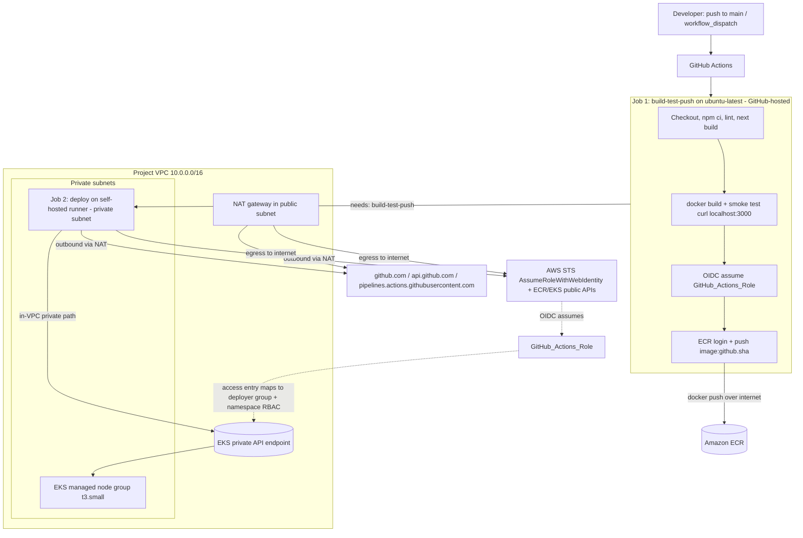

# Design Document

## Overview

This design extends the existing Erudition landing-page CI/CD so the GitHub
Actions workflow continues past the ECR push and automatically deploys the
freshly built, commit-SHA-tagged image to the development EKS cluster, then
verifies the rollout.

Today `.github/workflows/build-and-push.yml` runs a single job
(`build-test-push`) on `ubuntu-latest`: it builds the Next.js standalone image,
smoke-tests it, authenticates to AWS via GitHub OIDC, and pushes a
`github.sha`-tagged image to Amazon ECR — then stops, because the EKS public API
endpoint is restricted to the operator's `/32` and a GitHub-hosted runner cannot
reach it (`endpoint_public_access = true`, `public_access_cidrs =
[admin_public_cidr]`).

The chosen approach (fixed) is **Option A — a self-hosted GitHub Actions runner
inside the VPC** that reaches the cluster over the already-enabled **private**
endpoint path (`endpoint_private_access = true`). The design does **not** widen
the public endpoint, does **not** open `0.0.0.0/0`, and does **not** change
`admin_public_cidr`.

Two layers of change are involved:

1. **Workflow** (`.github/workflows/build-and-push.yml`): split into two jobs —
   the existing build/smoke-test/push preserved exactly on `ubuntu-latest`, and
   a new `deploy` job on the self-hosted runner that applies the manifests and
   waits for the rollout. (R2, R3, R6, R7, R8, R9)
2. **`cicd` Terraform module**: add a Terraform-managed EKS access entry that
   maps the existing GitHub Actions IAM role to a dedicated Kubernetes group,
   paired with a namespace-scoped Kubernetes RBAC Role/RoleBinding (an operator
   bootstrap step) so the role can deploy only within the `erudition`
   namespace. (R5)

The runner itself is treated as an **operator bootstrap step** (consistent with
the requirements, which already treat namespace creation and runner setup as
operator bootstrap). This document recommends a cost-conscious, non-always-on
runner and documents its provisioning, connectivity, and teardown.

**Scope boundary:** this design covers **preparing and validating code changes
only**. No `terraform apply`, no live deploy, no commit/push. Validation is
limited to non-live checks (Section "Testing Strategy"); behaviors
that require provisioned AWS resources are called out explicitly. (R1, R11)

### Why no Correctness Properties / Property-Based Testing section

This feature is Infrastructure-as-Code (Terraform IAM + an EKS access entry),
Kubernetes RBAC manifests, a GitHub Actions workflow definition, and `kubectl`
apply/rollout orchestration. None are pure functions with input-driven invariants that
randomized testing would usefully exercise; behavior does not vary with
generated input in a way that 100 randomized iterations would meaningfully
cover. Per the
workflow guidance, PBT is explicitly inappropriate for IaC and side-effect-only
deploy operations. The Correctness Properties section is therefore omitted, and
validation uses the non-live checks described in "Testing and Validation
Strategy" (`terraform fmt -check`, `terraform validate`, workflow/YAML/actionlint
sanity, and `kubectl --dry-run=client` where feasible).

---

## Architecture

### Component responsibilities

| Concern | Owner | Changed by this feature? |
| --- | --- | --- |
| Build, lint, Next.js build, Docker build, smoke test, ECR push | Workflow job `build-test-push` on `ubuntu-latest` | No (preserved exactly) — R2 |
| OIDC → AWS role identity + permissions (ECR, `eks:DescribeCluster`) | `cicd` module IAM role | Preserved; EKS access added — R4, R5, R6 |
| Namespace-scoped Kubernetes authorization | `cicd` module (access entry → Kubernetes group) + operator RBAC Role/RoleBinding (`k8s/rbac-deployer.yaml` via `scripts/bootstrap-rbac.sh`) | Added — R5 |
| Apply manifests + verify rollout | Workflow job `deploy` on self-hosted runner | Added — R3, R8, R9 |
| Self-hosted runner (compute + registration) | Operator bootstrap | Added (operator step) — R10 |
| Application namespace `erudition` | Operator bootstrap | Unchanged (operator creates it) — R5.5, R5.8 |

### High-level flow



Key points the diagram captures:

- **Job 1** (`build-test-push`) stays on a GitHub-hosted `ubuntu-latest` runner
  and pushes to ECR over the public internet — exactly as today. (R2)
- **Job 2** (`deploy`) runs on the self-hosted runner inside a **private
  subnet**. It reaches GitHub and AWS public APIs (STS/ECR/EKS Describe)
  **outbound via the existing NAT gateway**, and reaches the **EKS private API
  endpoint in-VPC** (no public endpoint widening). (R6, R8)
- Deployment authentication is still **GitHub OIDC** assuming the
  `GitHub_Actions_Role`; the runner's own instance profile is **not** used for
  deploy. (R4)
- The role's Kubernetes authorization comes from a **namespace-scoped RBAC
  Role/RoleBinding**: Terraform's access entry maps the role to a Kubernetes
  group, and the operator binds that group with a custom least-privilege Role in
  the `erudition` namespace. (R5)

### Dependency direction (unchanged)

`network -> eks`; `ecr` independent; `cicd` consumes ECR + EKS identifiers. The
new access entry stays in `cicd`, which already receives `eks_cluster_arn`; it
additionally receives the cluster name and namespace as inputs. The matching
Kubernetes RBAC Role/RoleBinding lives in `k8s/rbac-deployer.yaml` and is applied
by the operator (not Terraform), so no Kubernetes provider wiring and no circular
dependency is introduced.

---

## Components and Interfaces

### 1. Workflow: two-job structure

The workflow keeps its current triggers and build behavior, and adds a second
job gated on the first.

```yaml
name: build-and-push

on:
  push:
    branches: [main]
    paths:
      - "eks-application/**"
      - "k8s/**"
      - ".github/workflows/build-and-push.yml"
  workflow_dispatch:
    inputs:
      deploy_sha:
        description: "Optional: Git SHA to (re)deploy instead of the current commit"
        required: false
        default: ""
      rollback:
        description: "Set true to intentionally deploy an older SHA (manual rollback); skips the HEAD-match guard"
        type: boolean
        required: false
        default: false

# Least privilege at the workflow level: read-only token. id-token: write is
# granted per-job only on deploy (and remains on build for its OIDC push).
permissions:
  contents: read

# Serialize deploys WITHOUT cancelling an in-flight one: a newer run QUEUES
# behind the active deploy rather than cancelling it, so a kubectl apply/rollout
# in progress always finishes cleanly before the next run starts. (R7)
concurrency:
  group: deploy-erudition-eks-dev
  cancel-in-progress: false

env:
  AWS_REGION: ${{ vars.AWS_REGION }}
  ECR_REPOSITORY_URL: ${{ secrets.ECR_REPOSITORY_URL }}

jobs:
  build-test-push:
    runs-on: ubuntu-latest
    permissions:
      id-token: write      # needed for OIDC push to ECR
      contents: read
    # ... existing steps unchanged (checkout, node, npm ci, lint, build,
    #     docker build, smoke test, OIDC configure-aws-credentials, ecr login,
    #     push image:github.sha with reuse-if-exists guard) ...

  deploy:
    needs: build-test-push
    runs-on: [self-hosted, linux, erudition-eks-dev]   # dedicated label set
    # Trusted-job restriction: main ref only, push or manual dispatch only.
    if: >
      github.ref == 'refs/heads/main' &&
      (github.event_name == 'push' || github.event_name == 'workflow_dispatch')
    permissions:
      id-token: write      # OIDC to assume GitHub_Actions_Role
      contents: read
    steps:
      - uses: actions/checkout@v4
      - name: Configure AWS credentials (OIDC)
        uses: aws-actions/configure-aws-credentials@v4
        with:
          role-to-assume: ${{ secrets.AWS_ROLE_ARN }}
          aws-region: ${{ env.AWS_REGION }}
      # resolve target SHA, HEAD-match guard (skipped on rollback),
      # update-kubeconfig, verify image exists in ECR, set image / apply,
      # rollout status (detailed below)
```

Notes:

- `needs: build-test-push` enforces that a failed build stops the deploy. (R2.4,
  R8 ordering)
- `k8s/**` is added to the `push.paths` filter so manifest-only changes also
  trigger a deploy. The build job reuses the existing SHA image if it already
  exists (R2.3), so a manifest-only change still deploys the correct image.
- The concurrency group is scoped to this workflow + its single deployment
  target (`deploy-erudition-eks-dev`) with `cancel-in-progress: false`, so a
  newer run queues behind an active deploy instead of cancelling it. (R7)

### 2. `cicd` module: namespace-scoped EKS access

New input variables (added to `eks-terraform/modules/cicd/variables.tf`):

```hcl
variable "eks_cluster_name" {
  description = "Name of the EKS cluster (from the eks module). Target of the access entry."
  type        = string
  validation {
    condition     = length(trimspace(var.eks_cluster_name)) > 0
    error_message = "eks_cluster_name must not be empty."
  }
}

variable "create_eks_access" {
  description = "Whether to create the EKS access entry for the GitHub Actions role (the namespace RBAC Role/RoleBinding that authorizes it is an operator bootstrap step). Set false to skip."
  type        = bool
  default     = true
}

variable "eks_application_namespace" {
  description = "Kubernetes namespace the GitHub Actions role may deploy into (operator-created)."
  type        = string
  default     = "erudition"
  validation {
    condition     = can(regex("^[a-z0-9]([-a-z0-9]*[a-z0-9])?$", var.eks_application_namespace))
    error_message = "eks_application_namespace must be a valid Kubernetes namespace name."
  }
}
```

The existing `eks_cluster_arn` variable already satisfies R5.7's well-formed
check indirectly; the new `eks_cluster_name` validation plus `eks_cluster_arn`
usage ensures a missing/malformed identifier fails `terraform validate` and the
access entry is not created with a bad target. (R5.7)

New derived local (`eks-terraform/modules/cicd/locals.tf`):

```hcl
# Kubernetes group the GitHub Actions access entry authenticates as. The
# operator's namespace-scoped RoleBinding binds THIS group (least privilege).
# Derived from the name prefix + namespace; not an account-specific identifier.
locals {
  eks_deployer_group = "${local.name_prefix}-${var.eks_application_namespace}-deployers"
  # e.g. erudition-eks-dev-erudition-deployers
}
```

New resource (new file `eks-terraform/modules/cicd/access-entries.tf`):

```hcl
# An EKS access entry alone grants NO Kubernetes permissions. This entry only
# AUTHENTICATES the GitHub Actions IAM role as a Kubernetes GROUP; the matching
# namespace-scoped RBAC Role/RoleBinding (operator bootstrap) AUTHORIZES it. No
# AWS-managed access-policy association is attached on purpose (AmazonEKSEditPolicy
# would over-grant within the namespace — notably read/write on secrets).
resource "aws_eks_access_entry" "github_actions" {
  count         = var.create_eks_access ? 1 : 0
  cluster_name  = var.eks_cluster_name
  principal_arn = aws_iam_role.github_actions.arn
  type          = "STANDARD"

  # The operator's RoleBinding binds THIS group (least privilege).
  kubernetes_groups = [local.eks_deployer_group]

  tags = merge(var.tags, { Name = "${local.role_name}-access" })
}
```

There is **no** `aws_eks_access_policy_association` and **no**
`AmazonEKSEditPolicy` attachment — authorization is entirely the custom RBAC
Role/RoleBinding described below.

New outputs (`eks-terraform/modules/cicd/outputs.tf`):

```hcl
output "eks_access_entry_principal_arn" {
  description = "Principal (IAM role) ARN of the GitHub Actions EKS access entry; null when create_eks_access is false."
  value       = var.create_eks_access ? aws_eks_access_entry.github_actions[0].principal_arn : null
}

output "eks_deployer_group" {
  description = "Kubernetes group the GitHub Actions role authenticates as. The operator's namespace-scoped RBAC RoleBinding must bind this group."
  value       = local.eks_deployer_group
}
```

The dev root (`eks-terraform/envs/dev`) re-exports these as
`github_actions_eks_access_entry_principal_arn` and `eks_deployer_group`; the
bootstrap script consumes the latter.

Root wiring addition (`eks-terraform/envs/dev/main.tf`, `module "cicd"` block):

```hcl
  eks_cluster_name          = module.eks.eks_cluster_name
  # eks_application_namespace defaults to "erudition"; create_eks_access defaults true.
```

The module continues to receive `eks_cluster_arn` and `ecr_repository_arn`
through references — no hardcoded cluster name, ARN, endpoint, or CA data. (R4.4,
R5.4). The existing IAM permissions (ECR auth token, repo-scoped ECR push/pull,
cluster-scoped `eks:DescribeCluster`) are untouched. (R5.6)

#### Operator RBAC bootstrap artifacts (authorization layer)

The access entry above only authenticates the role into
`local.eks_deployer_group`. The Kubernetes authorization is a committed manifest
applied by the operator, not Terraform:

- **`k8s/rbac-deployer.yaml`** — a `Role` + `RoleBinding` in the `erudition`
  namespace. The Role grants exactly `get/list/watch/create/update/patch` on
  `deployments` + `replicasets` (`apps`) and `pods` + `services` (core) — no
  secrets, no serviceaccounts, nothing else. The RoleBinding subject is a
  `__EKS_DEPLOYER_GROUP__` **placeholder** (so the manifest must **not** be
  applied directly with `kubectl apply -f`).
- **`scripts/bootstrap-rbac.sh`** — the operator-only step that reads the
  `eks_deployer_group` Terraform output, substitutes it into a **temporary copy**
  of the manifest, and applies the Role + RoleBinding. It **fails** if the output
  is empty/unavailable or if the placeholder remains unsubstituted, and it
  **verifies** the `erudition` namespace exists but does **not** create it. It is
  **not** run by CI and is **not** managed by Terraform.

### 3. Self-hosted runner provisioning (operator bootstrap)

The runner is a small EC2 instance in a private subnet, labeled
`self-hosted, linux, erudition-eks-dev`, registered to the repository. Details
and the recommended lifecycle are in the dedicated section below.

### 4. Stale-deployment guard (HEAD-match + serialized queue)

For a normal (non-rollback) deploy, a step verifies the candidate commit SHA
equals the current `main` HEAD immediately before applying, and aborts if it is
not — so a queued older push never rolls out a stale build after `main` has
advanced. Combined with the serialized (non-cancelling) concurrency queue, the
newest queued run always applies last. Intentional rollback skips the HEAD-match
check via the manual `rollback` dispatch input. Mechanism detailed in the
dedicated section below.

---

## Data Models

This is an infrastructure + workflow feature, so the "data models" are the
structured configuration this design introduces and consumes rather than
application domain objects. The full HCL/YAML blocks are defined in
"Components and Interfaces"; this section summarizes their shapes.

### `cicd` module inputs (new)

| Variable | Type | Default | Purpose |
| --- | --- | --- | --- |
| `eks_cluster_name` | `string` | (required) | Target cluster for the access entry. Validated non-empty. |
| `create_eks_access` | `bool` | `true` | Toggles creation of the EKS access entry (the authorizing RBAC Role/RoleBinding is a separate operator bootstrap step). |
| `eks_application_namespace` | `string` | `"erudition"` | Namespace the GitHub Actions role may deploy into. Validated as a DNS-label name. |

(Defined in `eks-terraform/modules/cicd/variables.tf`; see Components and
Interfaces §2. `eks_cluster_arn` and `ecr_repository_arn` continue to be passed
by reference.)

### `cicd` module derived local (new)

| Local | Value | Purpose |
| --- | --- | --- |
| `eks_deployer_group` | `${local.name_prefix}-${var.eks_application_namespace}-deployers` (e.g. `erudition-eks-dev-erudition-deployers`) | Kubernetes group the access entry maps the role to; the operator's RoleBinding binds this group. Derived, not an account-specific identifier. |

### `cicd` module outputs (new)

| Output | Value | Purpose |
| --- | --- | --- |
| `eks_access_entry_principal_arn` | principal ARN of the access entry, or `null` when `create_eks_access = false` | Lets the root/operator confirm the role bound to the cluster. |
| `eks_deployer_group` | `local.eks_deployer_group` | The Kubernetes group name the operator binds in the RBAC RoleBinding (consumed by `scripts/bootstrap-rbac.sh`). |

The dev root re-exports both as `github_actions_eks_access_entry_principal_arn`
and `eks_deployer_group`.

### EKS access entry shape (authentication layer)

The access entry alone grants no Kubernetes permissions; it only authenticates
the role into a Kubernetes group. **No** policy association is attached.

| Field | Value |
| --- | --- |
| `principal_arn` | `aws_iam_role.github_actions.arn` |
| `cluster_name` | `var.eks_cluster_name` |
| `type` | `STANDARD` |
| `kubernetes_groups` | `[local.eks_deployer_group]` |
| policy association | **none** (authorization comes from the RBAC Role/RoleBinding below) |

### RBAC Role/RoleBinding shape (authorization layer)

Namespace-scoped least-privilege authorization, applied by the operator from
`k8s/rbac-deployer.yaml` via `scripts/bootstrap-rbac.sh`:

| Field | Value |
| --- | --- |
| kind / namespace | `Role` + `RoleBinding` in `erudition` |
| rules (apps) | `deployments`, `replicasets` — verbs `get, list, watch, create, update, patch` |
| rules (core) | `pods`, `services` — verbs `get, list, watch, create, update, patch` |
| excluded | no `secrets`, no `serviceaccounts`, nothing else |
| RoleBinding subject | `kind: Group`, name = the deployer group, via the `__EKS_DEPLOYER_GROUP__` placeholder substituted by `scripts/bootstrap-rbac.sh` from the `eks_deployer_group` output |
| roleRef | the `erudition-deployer` Role |

### Deployment annotation schema (provenance only)

The deploy job stamps the Deployment with the deployed commit SHA purely for
**traceability/provenance**. This annotation is **not** read back to make any
ordering decision — ordering is handled by the HEAD-match guard plus the
serialized concurrency queue (see Directive 7), not by any stored annotation.

| Annotation key | Value | Meaning |
| --- | --- | --- |
| `app.kubernetes.io/version` | `<git-sha>` | Commit SHA currently deployed (provenance/traceability only; not used for ordering). |

### Workflow `workflow_dispatch` inputs

| Input | Type | Default | Purpose |
| --- | --- | --- | --- |
| `deploy_sha` | `string` | `""` | Optional SHA to (re)deploy instead of the current commit (used for rollback by image reference). |
| `rollback` | `boolean` | `false` | Marks a deliberate rollback; skips the HEAD-match guard so an older-but-valid SHA can be deployed. Manual (`workflow_dispatch`) only. |

### Deploy-job configuration values consumed

| Source | Value | Use |
| --- | --- | --- |
| `secrets.AWS_ROLE_ARN` | GitHub Actions role ARN | `role-to-assume` for OIDC. |
| `secrets.ECR_REPOSITORY_URL` | ECR repository URL | Builds `IMAGE_URI = <url>:<sha>`. |
| `vars.AWS_REGION` | AWS region | `aws` CLI / `update-kubeconfig`. |
| `github.sha` | Triggering commit SHA | Default deploy target when `deploy_sha` is empty. |

No account IDs, ARNs, cluster endpoints, or CA data are hardcoded; all come from
secrets, variables, or Terraform outputs.

---

## Directive 1 — Split Runners (hosted build, self-hosted deploy)

**Decision:** keep `build-test-push` on `ubuntu-latest` exactly as today; run
only the new `deploy` job on the self-hosted runner, gated with `needs:`.

Rationale:

- The build/smoke-test/push path is proven and needs only outbound internet to
  reach ECR — a GitHub-hosted runner is the cheapest, lowest-maintenance place
  for it, and keeping it unchanged preserves image provenance. (R2)
- Only the deploy step requires the EKS **private** API endpoint, which demands
  in-VPC network position. Scoping self-hosted usage to deploy minimizes the
  surface that runs on operator-managed compute and keeps untrusted/heavy build
  work off the in-VPC runner.

Structure:

```
build-test-push (ubuntu-latest)  ──needs──▶  deploy (self-hosted, linux, erudition-eks-dev)
```

- `deploy.needs = [build-test-push]`: deploy never starts if the build fails.
  (R2.4)
- Each job declares its own `permissions`; see Directive 5 for the token model.

---

## Directive 2 — Runner Provisioning Lifecycle

### What provisioning involves

1. **Compute**: a small EC2 instance (e.g. `t3.small`/`t3.micro`) in a
   **private subnet** of the project VPC, no public IP.
2. **Runner agent**: install the GitHub Actions runner agent
   (`actions/runner`), configure it with a **registration token** obtained from
   the repository (`Settings → Actions → Runners → New self-hosted runner`, or
   via the REST API `POST /repos/{owner}/{repo}/actions/runners/registration-token`).
3. **Repository-scoped registration + labels**: register the runner at the
   **repository** level (not an org/enterprise) with labels
   `self-hosted, linux, erudition-eks-dev`. The deploy job targets that exact
   label set so no other workflow in this repo lands elsewhere. **Note:** per
   GitHub Actions documentation, self-hosted **runner groups** (and group-based
   repository-access policies) are an **organization/enterprise** feature and
   are **not available** for a repository owned by a **personal** account — this
   project's repo (`github_owner = charltonmc2024`, a personal account) cannot
   use runner groups. Repository-scoped registration is what confines the runner
   to this repo instead. Labels only **select** which runner picks up a job;
   they are **not** a security/authorization boundary (see Directive 5).
   (supports Directive 5)
4. **Startup**: `./config.sh --url https://github.com/<owner>/<repo> --token
   <reg-token> --labels erudition-eks-dev` then `./run.sh` (or install as a
   service / use ephemeral `--ephemeral`). No `--runnergroup` is used, since
   runner groups are unavailable on a personal-account repo.
5. **Shutdown**: stop the instance when not deploying (see recommendation).
6. **Cleanup / deregistration**: on teardown, deregister the runner
   (`./config.sh remove --token <removal-token>` or delete it from the Runners
   UI / `DELETE /repos/{owner}/{repo}/actions/runners/{id}`) so GitHub does not
   keep an offline runner, then terminate the instance.

### Options compared

| | Operator-managed (manual bootstrap, stoppable/ephemeral) | Terraform-managed |
| --- | --- | --- |
| Compute | Operator launches a small EC2 in a private subnet; starts it before deploying, stops it after | Terraform creates the EC2 + SG + instance profile |
| Registration | Operator runs `config.sh` with a registration token (or user-data for ephemeral) | user-data script auto-registers at boot |
| Cost control | Easy: stop the instance (or `--ephemeral` + stop) → near-zero when idle | Instance exists in state; must be stopped out-of-band or an autoscaling/ephemeral pattern added |
| Teardown | Operator deregisters + terminates; nothing lingers in Terraform state | `terraform destroy` removes it, but registration cleanup still needs a removal token |
| Complexity | Lowest; a handful of documented commands | More moving parts (instance profile, SG rules, user-data secret handling for the token) |
| Fits requirements | Yes — requirements already treat runner setup as operator bootstrap | Possible but heavier for a learning dev env |

### Recommendation

**Operator-managed, stoppable (or ephemeral) small instance.** Justification:

- The requirements explicitly treat runner setup as an **operator bootstrap
  step** (R10.2, R10.3), so keeping it out of Terraform is consistent.
- **Cost:** the runner must **not** be always-on. A **stopped** EC2 instance
  incurs **no compute (instance-hour) charge**, but its **EBS root volume keeps
  billing** for provisioned GB-month while stopped; EBS cost ends only when the
  instance is **terminated and the volume deleted**. The operator starts the
  instance only when deploying and stops it afterward. Separately, the
  **pre-existing NAT gateway** (used for the cluster's private egress, not
  created by this feature) continues to bill hourly + per-GB **regardless of
  runner state**. An **ephemeral** runner (`--ephemeral`, one job per
  registration) is an even cleaner variant that self-deregisters after each job.
- **Simplicity:** avoids introducing an instance profile, SG, and user-data
  token handling into Terraform state for a single-operator dev environment.
- **Teardown discipline:** to end runner cost entirely, deregister from GitHub,
  then **terminate the instance and delete its EBS volume** (stopping alone
  leaves EBS billing) — documented in the runbook. The EKS control plane and the
  pre-existing NAT gateway are the standing costs and are torn down separately
  (`terraform destroy`); a merely stopped runner still accrues EBS, and the NAT
  bills regardless of the runner.

If the project later wants reproducibility, the Terraform-managed path can be
added behind a `create_runner` flag without changing the deploy workflow; the
workflow only depends on the runner's **label**, not how it was created.

---

## Directive 3 — Outbound Connectivity

### What the self-hosted runner must reach

| Destination | Purpose | Path |
| --- | --- | --- |
| `github.com`, `api.github.com`, `*.pipelines.actions.githubusercontent.com` (and `*.actions.githubusercontent.com`, results/artifact endpoints) | Runner registration + job polling + action downloads + logs/artifacts | **Outbound internet** |
| AWS STS (`sts.<region>.amazonaws.com` / `sts.amazonaws.com`) | `AssumeRoleWithWebIdentity` (OIDC token exchange) | **Outbound internet** |
| AWS EKS API (`eks.<region>.amazonaws.com`) | `eks:DescribeCluster` for `update-kubeconfig` | **Outbound internet** |
| Amazon ECR (`api.ecr.<region>` / `*.dkr.ecr.<region>`) | Only if the runner pulls images (not required for apply/rollout) | **Outbound internet** |
| **EKS cluster API server (private endpoint)** | `kubectl apply` / `rollout status` | **In-VPC private path** |

Important nuance: even though the runner lives **inside the VPC**, the **GitHub
OIDC token exchange and all GitHub communications still require outbound
internet.** The in-VPC position is needed only to reach the **private EKS API
endpoint**; it does not remove the internet dependency for GitHub + STS.

### Does the existing network support it?

**Yes.** The dev network already provides everything needed:

- Private subnets route `0.0.0.0/0` to a **single NAT gateway**
  (`enable_nat_gateway = true` in dev tfvars; `private_route_table` → NAT). A
  runner in a private subnet therefore has outbound internet to reach GitHub,
  STS, EKS Describe, and ECR via NAT. (confirmed in `modules/network`)
- `endpoint_private_access = true` on the cluster means the runner reaches the
  **EKS API server over the private path in-VPC** — no public endpoint change,
  no `admin_public_cidr` change. (confirmed in `modules/eks/main.tf`)
- The runner's security group needs **no inbound** rules (the runner dials out
  to GitHub; GitHub does not connect in) and standard **egress** (443). It must
  be allowed to reach the EKS control-plane security group on 443 for the
  private API path; the managed node group already has the cluster SG wiring, and
  a runner-SG → cluster-SG 443 rule (or placing the runner in a SG the cluster
  trusts) is the only network addition.

### Additional cost

- **Runner EC2 instance** — the one new standing-capable resource; kept
  **stopped** when idle (Directive 2). A stopped instance has **no compute
  charge**, but its **EBS root volume keeps billing** at rest until the instance
  is terminated and the volume deleted.
- **NAT per-GB egress** for GitHub/runner/AWS-API traffic — small for deploy
  jobs (action downloads + API calls), billed at the existing NAT's per-GB rate.
  The **pre-existing NAT gateway bills hourly + per-GB regardless of runner
  state**; it serves the cluster's private egress and is not created by this
  feature.
- **No new NAT gateway** is required; one already exists. **No** interface
  endpoints are added (`enable_vpc_endpoints = false` stays), since NAT already
  covers the needed outbound traffic.

### Public vs private subnet placement

Placing the runner in a **public subnet** would avoid NAT per-GB egress but
requires a **public IP** on the instance, violating the private-by-default goal
and widening exposure for a box that holds a GitHub runner registration.

**Recommendation:** place the runner in a **private subnet** and use the
**existing NAT gateway** for outbound. The marginal NAT egress for deploy jobs is
negligible, and the instance stays private with no public IP. (R6/security
posture, aligns with aws-security steering)

---

## Directive 4 — OIDC-Only Deploy Auth (instance profile stays minimal)

**Decision:** the deploy job authenticates to AWS **only** via GitHub OIDC,
assuming the `GitHub_Actions_Role` with `aws-actions/configure-aws-credentials`
(`role-to-assume = secrets.AWS_ROLE_ARN`). The **runner instance profile is not
granted any ECR/EKS deploy permissions.** (R4.1, R4.2)

How ambient instance-profile use is prevented:

- `configure-aws-credentials@v4` exports explicit `AWS_ACCESS_KEY_ID`,
  `AWS_SECRET_ACCESS_KEY`, and `AWS_SESSION_TOKEN` into the job environment from
  the assumed role. For the remainder of the job, the AWS SDK/CLI uses those
  environment credentials **before** falling back to the EC2 instance metadata
  (IMDS) credential provider. The deploy therefore runs as the GitHub Actions
  role, not the instance role.
- The instance role is deliberately **minimal**: ideally only
  `AmazonSSMManagedInstanceCore` (so the operator can manage/patch the instance
  via SSM Session Manager without SSH) and **no** `ecr:*`, **no** `eks:*`, **no**
  Kubernetes-relevant permissions. Even if something fell back to IMDS, the
  instance role could not deploy.
- Optional hardening: require IMDSv2 (`http_tokens = required`) and/or set the
  IMDS hop limit to 1 on the instance so container/process access to instance
  credentials is constrained. The runner is operator-managed, so this is a
  documented bootstrap choice rather than a Terraform change in this scope.

Net effect: the **only** path to EKS deploy permissions is the OIDC-assumed
`GitHub_Actions_Role` + its namespace-scoped EKS access entry (Directive 6). The
compute the runner sits on cannot deploy on its own. (R4, R5)

---

## Directive 5 — Trusted-Job Restriction

**Goal:** the self-hosted (deploy) runner executes only **trusted main-branch**
jobs; pull-request code must **never** run on it. GitHub documents that
self-hosted runners should not be used with public/untrusted PR code because a
PR can run arbitrary workflow/code on the runner host and reach whatever that
host can reach (here: the private EKS endpoint and the VPC).

Controls (defense in depth):

1. **No `pull_request` trigger.** The workflow triggers only on `push` to `main`
   and `workflow_dispatch`. A PR cannot start this workflow at all. (R6.4, R6.5)
2. **Job-level guard** on `deploy`:
   ```yaml
   if: >
     github.ref == 'refs/heads/main' &&
     (github.event_name == 'push' || github.event_name == 'workflow_dispatch')
   ```
   Any non-`main` ref is skipped and never deploys. (R6.1, R6.2, R6.3)
3. **Repository-scoped runner (not runner groups).** Per GitHub Actions
   documentation, self-hosted **runner groups** and group-based repository-access
   policies are an **organization/enterprise** feature, configured under an
   organization's settings. They are **not available** for a repository owned by
   a **personal** account. This project's repo (`github_owner = charltonmc2024`,
   a personal account) therefore **cannot** use a runner group as an
   authorization boundary. Instead the runner is **registered at the repository
   level**, so only workflows in **this** repo can schedule onto it.

   **Labels are not an authorization boundary.** The labels
   `[self-hosted, linux, erudition-eks-dev]` only **select** which runner picks
   up a job; any workflow in the repo that is allowed to run on self-hosted can
   request those same labels. Labels do not restrict *who* may use the runner.

   The supported trust boundary for a personal-account repo is the combination:
   (a) **no `pull_request` trigger** (PR code never runs on the runner),
   (b) the **job-level guard** `if: github.ref == 'refs/heads/main' && (push ||
   workflow_dispatch)`,
   (c) **repository Settings → Actions** approval controls (e.g. "Require
   approval for all outside collaborators" / fork-PR run approval), and
   (d) keeping the **repo private** (strongly recommended — GitHub warns that
   self-hosted runners should not be exposed to untrusted/public fork PRs).

   **Future defense-in-depth:** if the repo is later moved under a GitHub
   **organization**, adopt a runner group restricted to this repository as an
   additional boundary. Until then, repo-scoped registration + no-PR-trigger +
   branch guard + private repo is the supported posture.
4. **Least-privilege token.** Workflow-level `permissions: contents: read`.
   `id-token: write` is granted **per job** — on `deploy` (to assume the role)
   and on `build-test-push` (for its existing OIDC ECR push). A PR, which never
   triggers the workflow, therefore never obtains `id-token: write` and never
   assumes the role. (R6.4, R6.5)

Residual-risk note: because the deploy runner can reach the private EKS endpoint,
keeping untrusted code off it is a security requirement, not just hygiene. The
combination of "no PR trigger" + branch guard + repo-scoped registration +
private repo enforces that (runner groups being unavailable on a personal
account). Build work (which handles the most third-party code via `npm ci`) stays
on the disposable GitHub-hosted runner.

---

## Directive 6 — Namespace-Scoped Kubernetes Permissions

### What the deploy job needs to do

- Apply `deployment.yaml` and `service.yaml` into the `erudition` namespace
  (`namespace.yaml` is **operator-created**, so the role needs **no** namespace
  create). (R5.5, R5.8)
- Set the Deployment image to the exact SHA (via image substitution + apply).
- Read rollout status (`kubectl rollout status deploy/erudition-landing`), which
  reads Deployments/ReplicaSets/Pods.

Concretely this requires, within `erudition`:
`get, list, watch, create, update, patch` on `deployments` (apps),
`replicasets` (apps), `pods` (core), and `services` (core). (R5.2)

### Mechanism decision

Two viable mechanisms exist under `authentication_mode = "API"`. Both start from
an EKS access entry, which **alone grants no Kubernetes permissions** and must be
paired with an authorization layer.

**Chosen: EKS access entry (STANDARD, mapped to a Kubernetes group) + a custom
Kubernetes RBAC Role/RoleBinding** in the `erudition` namespace.

The access entry maps the GitHub Actions role to a dedicated Kubernetes group
(`local.eks_deployer_group`, e.g. `erudition-eks-dev-erudition-deployers`) and
attaches **no** AWS access-policy association:

```hcl
resource "aws_eks_access_entry" "github_actions" {
  count             = var.create_eks_access ? 1 : 0
  cluster_name      = var.eks_cluster_name
  principal_arn     = aws_iam_role.github_actions.arn
  type              = "STANDARD"
  kubernetes_groups = [local.eks_deployer_group]
}
```

The authorization layer is a committed Role/RoleBinding (`k8s/rbac-deployer.yaml`,
applied by the operator via `scripts/bootstrap-rbac.sh`) granting **exactly**:

```yaml
# namespace: erudition
rules:
  - apiGroups: ["apps"]
    resources: ["deployments", "replicasets"]
    verbs: ["get", "list", "watch", "create", "update", "patch"]
  - apiGroups: [""]
    resources: ["pods", "services"]
    verbs: ["get", "list", "watch", "create", "update", "patch"]
```

The RoleBinding binds `local.eks_deployer_group` (via the `__EKS_DEPLOYER_GROUP__`
placeholder the bootstrap script substitutes from the `eks_deployer_group`
Terraform output). This covers everything the landing-page rollout needs —
apply-Deployment, apply-Service, set-image, and read-rollout (which reads
Deployments/ReplicaSets/Pods) — the exact `get/list/watch/create/update/patch`
surface R5.2 requires, scoped to the single `erudition` namespace, with **no**
`secrets`, `serviceaccounts`, or other resource access. (R5.2, R5.3)

**Rejected alternative: EKS access entry + `AmazonEKSEditPolicy` access-policy
association scoped to `erudition`.**

```hcl
# NOT used — kept here only to record why it was rejected.
resource "aws_eks_access_policy_association" "github_actions_edit" {
  cluster_name  = var.eks_cluster_name
  principal_arn = aws_iam_role.github_actions.arn
  policy_arn    = "arn:aws:eks::aws:cluster-access-policy/AmazonEKSEditPolicy"
  access_scope {
    type       = "namespace"
    namespaces = [var.eks_application_namespace]  # "erudition"
  }
}
```

This association would be Terraform-native and keep the `cicd` module pure
IAM/EKS-access, but `AmazonEKSEditPolicy` **over-grants within the namespace**.
Per the AWS EKS access policy permissions documentation it also permits, inside
`erudition`, editing/creating resources this feature never uses: `daemonsets`,
`statefulsets` (`apps`); `jobs`, `cronjobs` (`batch`); `horizontalpodautoscalers`
(`autoscaling`); `ingresses`, `networkpolicies` (networking); `endpointslices`
(`discovery`); `persistentvolumeclaims`; `configmaps`; **`secrets` (read and
write)**; and `serviceaccounts` (including `impersonate`). The landing-page
deploy only touches `deployments`, `replicasets`, `pods`, and `services`, so the
**read/write access to `secrets`** in particular is the over-grant that drove the
rejection.

### Least-privilege result and its trade-off

The chosen RBAC Role/RoleBinding yields a **true least-privilege** result:
verb-exact, resource-exact permissions on exactly the four resource kinds the
rollout touches, with **no `secrets` and no `serviceaccounts`** access, confined
to the `erudition` namespace.

- **Blast radius is one namespace.** The Role lives in `erudition`; nothing
  reaches other namespaces, cluster-scoped objects, cluster RBAC, CRDs, or
  nodes. (R5.3)
- **Trade-off:** authorization is **not** pure Terraform. The Role/RoleBinding is
  an **operator bootstrap step** (`scripts/bootstrap-rbac.sh`), applied once
  after `terraform apply`, and must be kept in sync with the manifests' resource
  kinds. This verbosity/manual-step cost is accepted deliberately to avoid the
  `AmazonEKSEditPolicy` over-grant (notably `secrets`).

### Why NOT cluster-admin and NOT `AmazonEKSClusterAdminPolicy`

- **Cluster-admin / `AmazonEKSClusterAdminPolicy`** grants full control of the
  entire cluster (all namespaces, RBAC, CRDs, nodes). That violates
  least-privilege and R5.3's prohibition on cluster-admin, any
  ClusterRole/ClusterRoleBinding, namespace delete, or any effect outside
  `erudition`.
- Even the rejected `AmazonEKSEditPolicy` would, at **cluster** scope, be far too
  broad; and even scoped to `erudition` it over-grants within the namespace
  (notably `secrets`). The chosen custom RBAC Role avoids both problems: the
  role can edit only the four workload kinds in `erudition` and nothing
  cluster-wide. (R5.3)
- Namespace **creation** is intentionally excluded: `erudition` is an operator
  bootstrap step, so the role never needs `create namespace`, and if the
  namespace is missing at deploy time the apply fails with a clear error rather
  than the role creating it. (R5.5, R5.8)

The role's existing IAM permissions (ECR + `eks:DescribeCluster`) are preserved
unchanged; the EKS access entry is purely additive. (R5.6)

---

## Directive 7 — Stale-Deployment Prevention (serialized queue + HEAD-match)

### Why cancellation is the wrong tool

Cancelling an in-flight run (`cancel-in-progress: true`) is **unsafe** for a
deploy: cancelling a `kubectl apply`/rollout mid-flight can leave a
partially-applied state (some objects updated, others not, a rollout half
advanced). The correctness goal — never leave an older build live when `main`
has moved on — is better met by **serializing** deploys and **checking the
commit against `main` HEAD** rather than racing cancellations.

### Mechanism

Two cooperating controls, no stored ordering annotation:

1. **Serialize without cancelling.**
   `concurrency: { group: deploy-erudition-eks-dev, cancel-in-progress: false }`.
   A newer run **queues** behind an active deploy. The active deploy always
   finishes cleanly; the queued run starts only afterward. Runs for the same
   environment therefore apply strictly one-at-a-time, newest queued run last.
   (R7.1–R7.4)

2. **HEAD-match guard for normal deploys.** Immediately before applying, a
   **normal** (non-rollback) deploy resolves the current `main` HEAD and compares
   it to the SHA being deployed:
   ```bash
   # Candidate SHA for a push/normal deploy is the triggering commit.
   CANDIDATE_SHA="${{ github.sha }}"

   # Resolve the current tip of main from the remote (no reliance on local state).
   MAIN_HEAD=$(git ls-remote origin refs/heads/main | awk '{print $1}')
   # (Equivalently, the GitHub REST API: GET /repos/{owner}/{repo}/commits/main.)

   if [ "$CANDIDATE_SHA" != "$MAIN_HEAD" ]; then
     echo "Candidate $CANDIDATE_SHA is not the current main HEAD ($MAIN_HEAD); aborting stale deploy."
     exit 1   # abort rather than roll out an outdated build
   fi
   ```
   If a queued older push reaches the front of the queue after a newer push has
   already advanced `main`, its candidate SHA no longer equals HEAD, so the
   normal deploy **aborts** instead of rolling back the cluster to the older
   build.

3. **Rollback bypasses the HEAD check (manual only).** A deliberate rollback is
   expressed through the `workflow_dispatch` inputs `deploy_sha = <older-sha>`
   and `rollback = true`. When `rollback == true`, the HEAD-match check is
   **skipped** — deploying an older SHA is the entire point of a rollback. The
   candidate SHA then comes from `deploy_sha`, not `github.sha`. Rollback is
   never available on `push` (manual dispatch only, main-ref, trusted — see
   Directive 5), so an automated push can never bypass the HEAD check.

### Reconciliation with R7.2 ("cancel or supersede")

R7.2 calls for a newer run to **cancel or supersede** an older one. This design
satisfies "supersede" rather than literal cancellation: because runs are
serialized and never cancelled, and because any run whose candidate is no longer
HEAD aborts, the newest run on `main` is always the one that applies last and
survives. The older run is *superseded* — either it already finished and the
newer queued run converges on top of it, or it aborts at the HEAD check. This is
a safer realization of the requirement than cancelling a mid-flight `kubectl`
operation, and is called out explicitly here as the intended reconciliation.

### Honest residual race (TOCTOU)

The HEAD check narrows but does **not** mathematically eliminate the window:

- Between the HEAD-match check and the `kubectl apply`, a brand-new push could
  land on `main`. The run that just passed the check (correct HEAD at check
  time) will apply an image that is momentarily behind the newest `main`.
- Because runs are **serialized, not cancelled**, that newest push simply queues
  and applies last, converging the cluster to the latest `main` HEAD. There is a
  brief window where an older-but-HEAD-at-check-time image is live until the
  queued newest run applies.
- The convergence guarantee is the **serialized newest queued run**, not the
  per-run check. The combination (serialize + HEAD-check) is the pragmatic,
  `kubectl`/`git`-only control; it is not a distributed lock and does not claim
  to be race-free.

---

## Directive 8 — Bootstrap + Redeploy

### First-run bootstrap sequence

1. **Provision infrastructure** — `terraform init/plan/apply` in
   `eks-terraform/envs/dev` (network, ecr, eks, cicd incl. the new access entry).
   *(Out of scope for this spec; apply is operator-initiated.)*
2. **Create the application namespace** — as the cluster-admin operator:
   `kubectl apply -f k8s/namespace.yaml` (or `kubectl create namespace
   erudition`). The CI role intentionally cannot create it. (R5.5, R10.2)
3. **Bind the deployer group's namespace RBAC** — as the cluster-admin operator,
   run `./scripts/bootstrap-rbac.sh`. It reads the `eks_deployer_group` Terraform
   output, substitutes it into a temporary copy of `k8s/rbac-deployer.yaml`, and
   applies the `Role` + `RoleBinding` in `erudition`. **Do not** `kubectl apply -f
   k8s/rbac-deployer.yaml` directly — the committed manifest holds a
   `__EKS_DEPLOYER_GROUP__` placeholder and the script fails if the output is
   empty or the placeholder remains. This grants the authorization the access
   entry alone does not. (R5.2, R5.3, R10.2)
4. **Configure GitHub repo config + runner** —
   - Secrets: `AWS_ROLE_ARN` = `module.cicd.github_actions_role_arn`,
     `ECR_REPOSITORY_URL` = `module.ecr.ecr_repository_url`.
   - Variable: `AWS_REGION` = `us-east-1`.
   - Launch + register the self-hosted runner in a private subnet with labels
     `self-hosted, linux, erudition-eks-dev`, registered at the **repository**
     level (runner groups are unavailable on a personal-account repo —
     Directive 2/5). (R10.2, R10.3)
5. **Run the workflow** — push to `main` (or `workflow_dispatch`). Build job
   pushes `:github.sha`; deploy job substitutes the image, applies manifests,
   waits for rollout. (R10.1)
6. **Verify the rollout** — `kubectl -n erudition rollout status
   deploy/erudition-landing`; reach the page with `kubectl -n erudition
   port-forward svc/erudition-landing 8080:80`. (R10.1)

This sequence is mirrored in the root `README.md`. (R10.1–R10.4)

### Rolling back to a previous Git-SHA image (without old code)

Rollback redeploys a previously-built image **by SHA**, using only the immutable
ECR image — never by checking out or running the old commit's code:

1. Operator runs `workflow_dispatch` with `deploy_sha = <older-sha>` and
   `rollback = true`.
2. The deploy job sets `TARGET_SHA = <older-sha>` and, because `rollback` is
   true, **skips the HEAD-match guard** (deploying an older SHA is the point).
3. It verifies the target tag exists in ECR
   (`aws ecr describe-images --image-ids imageTag=<older-sha>`), failing clearly
   if the image was never built/pushed (the ECR lifecycle policy keeps the last
   N tagged images, so very old SHAs may have aged out).
4. It changes **only the image reference** with
   `kubectl -n erudition set image deploy/erudition-landing app=<ecr_url>:<older-sha>`.
   No `actions/checkout` at the old ref runs; no application or workflow code
   from the old commit executes on the in-VPC runner. The manifest structure
   comes from current `main` (or is left untouched by `set image`).
5. It waits for `rollout status` with the bounded timeout and fails on failure.

**Why this is safer:** checking out and executing an old commit on the
privileged, in-VPC runner would reintroduce the untrusted-code-on-privileged-
runner risk (Directive 5). Rolling back the **image only** keeps the executed
deploy surface trusted (current `main`), while the old commit contributes solely
its immutable, previously-verified image.

### Rollback vs HEAD-match guard (reconciled)

The HEAD-match guard (Directive 7) blocks an **accidental** stale rollout (a
candidate SHA that is not current `main` HEAD). A **deliberate rollback** is
exactly such a case, so it is gated behind the manual `rollback` input, which
**bypasses** the HEAD-match check by design. Because `rollback` is reachable only
via `workflow_dispatch` (manual, main-ref, trusted — Directive 5), an automated
push can never bypass the guard. The README documents this rollback procedure.
(R10.4)

---

## Deploy job step detail (R3, R8, R9)

```bash
# 1. Resolve target SHA and whether this is a deliberate rollback.
ROLLBACK="${{ github.event.inputs.rollback }}"            # "true" only on manual dispatch
if [ "$ROLLBACK" = "true" ] && [ -n "${{ github.event.inputs.deploy_sha }}" ]; then
  TARGET_SHA="${{ github.event.inputs.deploy_sha }}"       # rollback: deploy the given older SHA
else
  TARGET_SHA="${{ github.sha }}"                           # normal: the triggering commit
fi
IMAGE_URI="${ECR_REPOSITORY_URL}:${TARGET_SHA}"

# 2. HEAD-match guard for NORMAL deploys only; rollback skips it by design (Directive 7)
if [ "$ROLLBACK" != "true" ]; then
  MAIN_HEAD=$(git ls-remote origin refs/heads/main | awk '{print $1}')
  if [ "$TARGET_SHA" != "$MAIN_HEAD" ]; then
    echo "Candidate $TARGET_SHA is not current main HEAD ($MAIN_HEAD); aborting stale deploy."
    exit 1
  fi
fi

# 3. update-kubeconfig (fails the job if it errors -> R8.2)
aws eks update-kubeconfig --name "$CLUSTER_NAME" --region "$AWS_REGION"

# 4. Verify the target image tag EXISTS in ECR before rolling out. For a
#    rollback this is essential: we cannot roll back to an image never built.
aws ecr describe-images --repository-name "$ECR_REPOSITORY_NAME" \
  --image-ids imageTag="$TARGET_SHA" >/dev/null \
  || { echo "Image tag $TARGET_SHA not found in ECR; cannot deploy/rollback."; exit 1; }

# 5. Deploy the image WITHOUT checking out the old commit. Two equivalent paths:
#    (a) set-image on the existing Deployment (preferred for rollback: no old
#        manifest is used, only the immutable image reference changes), or
#    (b) substitute into the CURRENT main checkout's manifest and apply.
if [ "$ROLLBACK" = "true" ]; then
  # Rollback: only the image reference changes; manifest structure stays as-is.
  kubectl -n erudition set image deploy/erudition-landing app="$IMAGE_URI"
else
  # Normal: substitute IMAGE_PLACEHOLDER in the current main manifest (R8.3)
  sed "s#IMAGE_PLACEHOLDER#${IMAGE_URI}#g" k8s/deployment.yaml > /tmp/deployment.yaml
  grep -q IMAGE_PLACEHOLDER /tmp/deployment.yaml && { echo "placeholder not substituted"; exit 1; }
  kubectl -n erudition apply -f /tmp/deployment.yaml
  kubectl -n erudition apply -f k8s/service.yaml
fi

# 6. Stamp provenance only (NOT used for ordering; Directive 7)
kubectl -n erudition annotate --overwrite deploy/erudition-landing \
  app.kubernetes.io/version="$TARGET_SHA"

# 7. Bounded rollout wait (R8.5, R8.6); detect crash-loops (R8.7)
kubectl -n erudition rollout status deploy/erudition-landing --timeout=300s
```

- `CLUSTER_NAME` and `ECR_REPOSITORY_NAME` are read from a repo variable or
  `aws eks list-clusters` / Terraform output — never hardcoded. (R3.4, R4.3)
- **Rollback uses only the immutable ECR image, never old code.** The rollback
  path takes the target SHA from the `deploy_sha` input and changes **only the
  image reference** (via `kubectl set image`); it does **not** run
  `actions/checkout` at the old ref and never executes application or workflow
  code from the old commit. The old commit contributes only its already-built,
  already-pushed, immutable SHA-tagged image. This is deliberately safer than
  checking out the old ref: executing old workflow/app code on the in-VPC,
  privileged runner would reintroduce the untrusted-code-on-privileged-runner
  risk (Directive 5). Using the manifest from current `main` (or `set image`
  alone) keeps the deploy surface trusted while rolling the image back.
- The normal path applies **only** `deployment.yaml` and `service.yaml` (not
  `namespace.yaml`), preserving all existing security context, probes, resource
  requests/limits, replica count 2, and the ClusterIP Service — nothing in the
  manifest shape is modified by CI. (R9.1–R9.6)
- A crash-looping pod surfaces as a failed/stalled `rollout status` within the
  timeout; the step adds a diagnostic `kubectl -n erudition get pods` + `describe`
  on failure so the error is actionable. (R8.6, R8.7)
- Any apply failure exits non-zero before the rollout wait. (R8.8)

---

## Security Considerations

- **No long-lived AWS keys.** Deploy auth is GitHub OIDC → `GitHub_Actions_Role`;
  the runner instance profile holds no deploy permissions. (R4, Directive 4)
- **Namespace-scoped Kubernetes access (true least-privilege via custom RBAC).**
  The EKS access entry maps the GitHub Actions role to a Kubernetes group and
  attaches **no** AWS access policy; authorization is a custom **RBAC
  Role/RoleBinding** in the `erudition` namespace (`k8s/rbac-deployer.yaml`,
  applied by the operator via `scripts/bootstrap-rbac.sh`). The Role grants only
  `get/list/watch/create/update/patch` on `deployments`, `replicasets`, `pods`,
  and `services` — **no `secrets`, no `serviceaccounts`**, no cluster-admin, no
  ClusterRole/Binding, no namespace delete, no effect outside `erudition`. (R5.3,
  Directive 6) `AmazonEKSEditPolicy` was **deliberately rejected** because, even
  scoped to the namespace, it over-grants — notably **read/write on `secrets`**
  (plus daemonsets/statefulsets/jobs/cronjobs/ingresses/serviceaccounts, etc.).
  The accepted trade-off is that the Role/RoleBinding is an operator bootstrap
  step rather than pure Terraform. The blast radius is a single namespace.
  (Directive 6)
- **No untrusted code on the in-VPC runner.** No `pull_request` trigger, main-ref
  job guard, **repository-scoped** runner registration, private repo, and
  repository Actions approval controls. Runner **groups are unavailable** on a
  personal-account repo, and **labels are not an authorization boundary**; the
  repo-scope + no-PR-trigger + branch guard combination is the enforced boundary.
  Build (which runs third-party npm code) stays on disposable GitHub-hosted
  runners. (R6, Directive 5)
- **Private-by-default networking.** Runner in a private subnet, no public IP;
  EKS reached over the private endpoint; public endpoint and `admin_public_cidr`
  unchanged; no `0.0.0.0/0` ingress added. (Directive 3)
- **Minimal token scope.** Workflow-level `contents: read`; `id-token: write`
  granted only per job that needs it. (R6.5)
- **No hardcoded account-specific identifiers** in Terraform or the workflow;
  ECR URL, role ARN, region, cluster name all come from secrets/variables/outputs.
  (R4.3, R4.4, R5.4)
- **Instance hardening (operator bootstrap):** IMDSv2 required, SSM-only
  management role (no SSH, no ECR/EKS perms), deregister on teardown.

---

## Cost Considerations

- **No new always-on compute.** The runner is a small EC2 instance kept
  **stopped** (or ephemeral) when not deploying. **A stopped instance incurs no
  EC2 compute (instance-hour) charge** — but "stopped" is not "free":
  - The runner's **EBS root volume** (and any attached EBS) continues to bill for
    its **provisioned GB-month** while the instance is merely stopped. EBS
    charges stop only when the instance is **terminated and the volume deleted**.
  - The **pre-existing NAT gateway** keeps billing its **hourly + per-GB** charge
    regardless of runner state. It exists for the cluster's private egress and is
    **not created by this feature**; it bills as long as it exists, independent
    of whether the runner is running or stopped.
  - In short: **stopped instance = no compute charge, but EBS and the
    pre-existing NAT gateway keep billing.**
- **Fully stopping ALL runner cost** requires **terminating the instance and
  deleting its EBS volume** (not just stopping it). NAT-gateway and
  EKS-control-plane teardown are the **separate environment-teardown step**
  already documented (see the Bootstrap + Redeploy runbook and the README).
- **No new NAT gateway** and **no interface endpoints**: the existing single NAT
  gateway already provides the runner's outbound internet; only its small per-GB
  egress for deploy traffic applies.
- **Standing costs are unchanged by this feature**: the EKS control plane and the
  single NAT gateway (hourly + per-GB) are both **pre-existing** design choices,
  not introduced here. Verify current `us-east-1` pricing per `conventions.md`
  before quoting any figures (do not rely on stale numbers).
- **Teardown discipline:** deregister the runner from GitHub, then **terminate**
  the instance and **delete its EBS volume** to end runner cost entirely; and
  separately `terraform destroy` the dev root (NAT + EKS control plane) when not
  learning, since the control plane bills continuously. Documented in the README
  runbook. (R10)

---

## Error Handling

Failure behaviors are described alongside their mechanisms above (Directives 7
and 8, and the Deploy job step detail). They are consolidated here. In every
case the relevant step exits non-zero so the pipeline fails loudly rather than
leaving a partial or stale deployment.

| Failure | Behavior | Requirement |
| --- | --- | --- |
| Build/smoke-test/push job fails | `deploy` never starts (`needs: build-test-push`). | R2.4, R8.1 |
| `aws eks update-kubeconfig` fails | Job fails **before** any `kubectl apply`. | R8.2 |
| Manifest still contains `IMAGE_PLACEHOLDER` after substitution | Deploy aborts before apply (`grep -q IMAGE_PLACEHOLDER … && exit 1`). | R8.3 |
| `kubectl apply` fails | Job exits non-zero before the rollout wait. | R8.4, R8.8 |
| Rollout does not become Ready within the bounded timeout (suggested `300s`) | `kubectl rollout status --timeout=300s` fails the job. | R8.5, R8.6 |
| Crash-looping / failing pods | Surface as a failed/stalled rollout within the timeout; a diagnostic `get pods` + `describe` runs on failure. | R8.7 |
| Candidate SHA is not the current `main` HEAD (normal deploy) | HEAD-match guard aborts the deploy (`exit 1`) rather than rolling out a stale build; serialized newest queued run converges to HEAD. Skipped only when `rollback == true` (manual dispatch). | R7 |
| Target image tag not present in ECR (normal deploy or rollback) | `aws ecr describe-images` check fails the job before rollout; cannot deploy/roll back to an image that was never built/pushed. | R7, R8.4 |
| `erudition` namespace missing at deploy time | Apply fails with a clear error; the role intentionally cannot create the namespace. | R5.8 |

These map to the "fail loudly, never continue silently" requirements (R8.1–R8.8),
the stale-prevention controls (R7, Directive 7 — serialized queue + HEAD-match),
and the operator-created-namespace boundary (R5.8). None of these behaviors
contradict the detailed descriptions above; this table only summarizes them.

---

## Testing Strategy

This feature is IaC + a workflow definition, so validation uses non-live checks
rather than property-based tests. (R11)

### Non-live checks (runnable without AWS)

1. **Terraform formatting** — `terraform fmt -check -recursive` over
   `eks-terraform/`. (R11.1)
2. **Terraform validation** — `terraform validate` in `eks-terraform/envs/dev`
   after wiring the new `cicd` inputs/resources. Confirms the new access-entry
   resource, the `eks_deployer_group` local/output, variables, and validations
   parse and type-check. (R11.2)
3. **Workflow / YAML sanity** — `actionlint` on
   `.github/workflows/build-and-push.yml` and a YAML lint of the workflow and
   `k8s/*.yaml`; confirm the two-job structure, `needs:`, `if:` guard,
   per-job `permissions`, and `concurrency` block parse correctly. (R11.3)
4. **Manifest dry-run where feasible** — `kubectl apply --dry-run=client -f`
   against the substituted `deployment.yaml` and `service.yaml` validates schema
   locally (no cluster/server contact). The RBAC `Role`/`RoleBinding` in
   `k8s/rbac-deployer.yaml` can be dry-run checked only after substituting the
   `__EKS_DEPLOYER_GROUP__` placeholder (as `scripts/bootstrap-rbac.sh` does); the
   raw file holds the placeholder and must not be applied directly. A
   `--dry-run=server` check is **not** possible without a cluster.
5. **Placeholder substitution unit check** — verify `sed` substitution produces
   no residual `IMAGE_PLACEHOLDER` for a sample SHA (mirrors the R8.3 guard).

Any check that reports an error is corrected before the spec is considered
complete. (R11.4)

### Cannot be verified without provisioning live AWS resources (R11.5)

- Actual EKS API connectivity from the self-hosted runner over the **private
  endpoint**.
- **EKS access-entry + RBAC authorization enforcement** — that the access entry
  maps the role into the deployer group and the operator-applied RBAC
  Role/RoleBinding actually permits the apply/rollout in `erudition` while
  denying out-of-namespace/cluster actions (and `secrets` access).
- OIDC `AssumeRoleWithWebIdentity` succeeding from the in-VPC runner, and that
  env credentials override the instance profile in practice.
- A **real rollout** reaching Ready within the timeout, and crash-loop detection.
- NAT egress reachability to GitHub/STS from the private subnet at runtime.
- Runner registration, labeling, and runner-group restriction behavior on GitHub.

These are documented as live-only verifications to be exercised after an
intentional `terraform apply` and runner bootstrap, outside this spec's scope.
(R1, R11.5)
