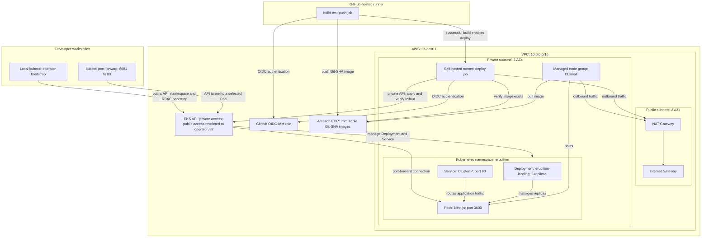

# Erudition Landing Page on Amazon EKS

A cost-conscious, infrastructure-as-code project that runs the **Erudition**
Next.js landing page on **Amazon EKS**. The container image is built and
published by **GitHub Actions** to **Amazon ECR** using short-lived GitHub OIDC
credentials, and all AWS infrastructure is provisioned with **Terraform**.

Only the landing page runs on EKS. There is a single **development** environment
(`eks-terraform/envs/dev`); no staging or production environment exists in this
repository.

This README demonstrates applied work in containerization, Kubernetes workload
design, GitHub Actions CI/CD, Terraform module architecture, AWS identity and
access management (GitHub OIDC and EKS access entries), and deliberate cost
control.

## 1. Project overview

The deployed application is the Erudition landing page, a Next.js app built with
`output: "standalone"` and served by Next.js's own Node server (`node server.js`)
on container port **3000**. There is no separate web server (such as Nginx) in
front of it.

The landing page runs as a two-replica Kubernetes `Deployment` behind a
`ClusterIP` Service, scheduled onto a small managed node group in **private**
subnets. There is **no public load balancer, Ingress, or custom domain** — the
page is reached locally through `kubectl port-forward`.

CI/CD responsibilities are split deliberately:

- **Build and publish:** The GitHub-hosted build-test-push job builds
  the application, smoke-tests the Docker image, authenticates to AWS
  using GitHub OIDC, and pushes an immutable Git-SHA tag to ECR.

- **Automated deployment:** After a successful build, the deploy job
  runs on a self-hosted runner inside the VPC. It authenticates using
  GitHub OIDC, deploys the exact image to EKS through the private API
  endpoint, and waits for rollout completion. Operator bootstrap is
  required before the first run.

**Validation status:** Live automated deployment through GitHub Actions was
verified successfully on October 8, 2026. Both the build/push and EKS deployment
jobs completed successfully.

## 2. Architecture and request flow



Request flow (viewing the page):

1. The operator runs
   `kubectl -n erudition port-forward svc/erudition-landing 8081:80`.
2. kubectl uses the Service selector to select a Pod and maps
   Service port 80 to the Pod's target port 3000.
3. Traffic from localhost:8081 travels through the Kubernetes API
   port-forward connection directly to that selected Pod.
4. The Pod serves the Next.js landing page. This tunnel does not
   pass through the Service's ClusterIP or load-balance across Pods.

Management relationships (distinct from traffic routing):

- The **Deployment manages** the two pod replicas (create, replace, roll out).
- The **node group hosts** the pods (provides the EC2 compute they run on).
- The Service does not manage or host pods; it only load-balances traffic to
  the pods matching its selector.

Deployment flow (publishing a new image):

1. A qualifying push to main affecting eks-application/**, k8s/**,
   or the workflow file—or a manual workflow_dispatch—starts the workflow.
2. The GitHub-hosted build-test-push job authenticates through GitHub
   OIDC, builds and smoke-tests the image, and publishes its Git-SHA
   tag to ECR.
3. After the build succeeds, the self-hosted deploy job inside the VPC
   authenticates through GitHub OIDC and connects to the EKS private
   API endpoint.
4. For a normal deployment, the job checks that the target SHA matches
   main HEAD, verifies the image exists, renders the Deployment image,
   applies the Deployment and Service, and waits for rollout completion.

Module dependency direction: `network → eks`; `ecr` is independent;
`cicd` consumes the ECR repository ARN, EKS cluster ARN, and EKS
cluster name. Its access entry maps the GitHub Actions role to the
deployer group; the operator bootstrap script applies the namespace
Role and RoleBinding.

## 3. Technology stack

| Layer | Technology |
|-------|-----------|
| Application | Next.js 15 (standalone output), React 19, TypeScript, Node.js 20 |
| Container | Docker (multi-stage `node:20-alpine`, non-root runtime) |
| Registry | Amazon ECR (private, immutable tags, lifecycle policy) |
| Orchestration | Amazon EKS (Kubernetes `1.35`), managed node group on EC2 (`t3.small`) |
| Infrastructure as code | Terraform `~> 1.16.0`, AWS provider `~> 6.67.0` |
| Remote state | S3 bucket (versioned, encrypted) with S3-native state locking |
| CI/CD | GitHub Actions: GitHub-hosted build/push job and self-hosted EKS deploy job; AWS authentication through GitHub OIDC |

## 4. Repository structure

```text
eks-application/         # Next.js landing page + Dockerfile; see its README
k8s/                     # Namespace, Deployment, Service, and deployer RBAC
scripts/                 # Operator RBAC bootstrap script
.github/
  workflows/             # Build/test/push + automated EKS deployment
  actionlint.yaml        # Custom self-hosted runner label for validation
eks-terraform/
  bootstrap/             # Remote-state S3 bucket; uses local state
  envs/dev/              # Dev root composing the Terraform modules
    runner.tf            # EC2 runner, SSM IAM role, and network rules
  modules/               # network, ecr, eks, cicd; see module READMEs
  archive/               # Legacy ECS modules; not used by the dev root
```

### Detailed documentation

| Topic | Doc |
|-------|-----|
| Remote-state bootstrap + backend | [`eks-terraform/bootstrap/README.md`](eks-terraform/bootstrap/README.md) |
| Network module (VPC, subnets, NAT, endpoints) | [`eks-terraform/modules/network/README.md`](eks-terraform/modules/network/README.md) |
| ECR module (repository, lifecycle) | [`eks-terraform/modules/ecr/README.md`](eks-terraform/modules/ecr/README.md) |
| EKS module (cluster, nodes, IAM, access) | [`eks-terraform/modules/eks/README.md`](eks-terraform/modules/eks/README.md) |
| CI/CD module (GitHub OIDC + IAM role) | [`eks-terraform/modules/cicd/README.md`](eks-terraform/modules/cicd/README.md) |
| Application | [`eks-application/README.md`](eks-application/README.md) |

## 5. Infrastructure and Kubernetes configuration

### Terraform modules

The dev root (`eks-terraform/envs/dev`) composes four reusable modules:

- **network** — VPC (`10.0.0.0/16`), two public and two private subnets across
  two AZs, an Internet Gateway, route tables, and an **optional** NAT Gateway.
  NAT is gated by `enable_nat_gateway` (set to `true` in the dev tfvars) and
  provisions a single NAT Gateway plus its Elastic IP, giving private nodes
  outbound egress. An optional S3 gateway endpoint is gated by
  `enable_vpc_endpoints` (currently `false`).
- **ecr** — one private repository, `erudition-eks-dev-landing`
  (`${app_name}-${environment}-${suffix}`). Tags are **immutable**,
  `scan_on_push` is enabled, encryption at rest is AES256 (AWS-managed), and
  `force_delete = false`. A lifecycle policy keeps the most recent
  `ecr_max_tagged_images` (10) tagged images and expires untagged images after
  `ecr_untagged_image_expiry_days` (7).
- **eks** — the control plane (`erudition-eks-dev-eks`, Kubernetes `1.35`), a
  managed node group (`erudition-eks-dev-ng`, `t3.small`, desired 1 / min 1 /
  max 2) in the private subnets, separate least-privilege cluster and node IAM
  roles, and an EKS access entry granting the operator principal cluster-admin.
  The API endpoint has **both private and public access**, with the public
  endpoint restricted to `admin_public_cidr` (a single `/32`). Control-plane
  logging is enabled for `api`, `audit`, and `authenticator`.
- **cicd** — the GitHub OIDC identity provider, repository-and-branch-scoped
  IAM role (`erudition-eks-dev-github-actions`), and EKS access entry
  mapping that role to the derived deployer group. Kubernetes permissions
  are granted separately by the custom namespace Role/RoleBinding,
  applied by the operator using `./scripts/bootstrap-rbac.sh`.

The dev root also provisions the self-hosted runner through
`eks-terraform/envs/dev/runner.tf`: a private `t3.small` EC2 instance,
an encrypted 20 GB gp3 root volume, an SSM-only instance role/profile,
a runner security group, outbound access, and TCP 443 access to the
EKS cluster security group. IMDSv2 is required. The instance has no
public IP and uses the existing NAT Gateway for outbound connectivity.

Resource names derive from a `name_prefix` of `${app_name}-${environment}`
(`erudition-eks-dev`). Account-specific identifiers are passed between modules
via outputs and inputs rather than hardcoded.

### Kubernetes manifests (`k8s/`)

The operator first creates the namespace using `k8s/namespace.yaml`,
then applies RBAC using `./scripts/bootstrap-rbac.sh`. The script
requires the namespace to already exist. The automated deploy job
applies the Deployment and Service. Terraform does not manage these
Kubernetes objects.

- **`namespace.yaml`** — dedicated `erudition` namespace, created
  by the operator.
- **`rbac-deployer.yaml`** — namespace-scoped Role and RoleBinding.
  The operator bootstrap script substitutes the deployer-group
  placeholder before applying it.
- **`deployment.yaml`** — `erudition-landing`, 2 replicas, RollingUpdate
  (`maxSurge: 1`, `maxUnavailable: 0`), container port 3000. Hardening:
  non-root uid/gid 1001, `readOnlyRootFilesystem: true`, writable
  `emptyDir` mounts for `/tmp` and `.next/cache`,
  `allowPrivilegeEscalation: false`, and all Linux capabilities dropped.
  Resource requests are `100m` CPU / `128Mi` memory; limits are
  `500m` CPU / `256Mi` memory. Startup, readiness, and liveness probes
  target `/` on the container port. A soft topology spread constraint
  prefers spreading replicas across nodes. The automated deploy job
  replaces `IMAGE_PLACEHOLDER` with `<ecr_repository_url>:<git-sha>`
  in a temporary manifest before applying it.
- **`service.yaml`** — `erudition-landing`, type `ClusterIP`, port 80
  to target port `http` (3000).

## 6. GitHub Actions CI/CD workflow

Workflow: `.github/workflows/build-and-push.yml`. Two jobs run from a push to
`main` (or a manual `workflow_dispatch`):

**Job `build-test-push`** (GitHub-hosted `ubuntu-latest`, unchanged behavior):

- **Permissions:** `id-token: write`, `contents: read` (per job).
- **Stages (any failure stops the pipeline):** checkout -> set up Node 20 ->
  `npm ci` -> `npm run lint` -> `npm run build` -> `docker build` -> smoke test
  (run the container, poll `curl http://localhost:3000/`) -> inspect the OIDC
  identity -> configure AWS credentials via OIDC -> ECR login -> push the image
  tagged with the Git commit SHA (reused if the immutable tag already exists).

**Job `deploy`** (self-hosted runner inside the VPC; `needs: build-test-push`):

- Runs **only** from `main`, on `push` or `workflow_dispatch`
  (`if: github.ref == 'refs/heads/main' && (push || workflow_dispatch)`). Pull
  requests never trigger the workflow and never reach this job.
- Authenticates to AWS via **GitHub OIDC** (`role-to-assume` = the `cicd` role);
  the runner's instance profile holds no deploy permissions.
- **Stale-deploy guard (normal deploys):** resolves the current `main` HEAD with
  `git ls-remote` and aborts unless the target SHA matches HEAD, so a queued
  older commit cannot roll out over a newer `main`.
- Verifies the image tag exists in ECR, runs `aws eks update-kubeconfig`,
  substitutes the exact `:<git-sha>` image into `k8s/deployment.yaml`, applies
  the Deployment and the ClusterIP Service into the `erudition` namespace
  (never the namespace itself), stamps an `app.kubernetes.io/version` provenance
  annotation, and waits for `kubectl rollout status --timeout=300s`. A failed or
  stalled rollout fails the workflow.

### Concurrency and ordering

The workflow uses a concurrency group (`deploy-erudition-eks-dev`) with
**`cancel-in-progress: false`**, so an in-flight deploy is never cancelled
mid-apply. GitHub Actions does **not** guarantee that pending runs execute in
FIFO order, and when several runs queue on one group GitHub keeps only the most
recently queued pending run and cancels the rest — so even the newest run is not
guaranteed to complete. Correctness therefore does **not** rely on queue order:
the `main`-HEAD SHA check is the actual guard against deploying a stale commit.

#### Re-running a skipped deployment

If a legitimate deploy was skipped or cancelled by queueing (or aborted by the
HEAD guard because `main` had moved), re-run it against the current HEAD by any
of:

- pushing a commit to `main` that changes a workflow-matched path, or
- using **Re-run jobs** on the latest `main` workflow run, or
- triggering **Run workflow** (`workflow_dispatch`) on the `main` branch.

### Required repository configuration

Set under GitHub -> Settings -> Secrets and variables -> Actions:

| Name | Kind | Value |
|------|------|-------|
| `AWS_ROLE_ARN` | secret | the `github_actions_role_arn` Terraform output |
| `ECR_REPOSITORY_URL` | secret | the `ecr_repository_url` Terraform output |
| `AWS_REGION` | variable | `us-east-1` |
| `EKS_CLUSTER_NAME` | variable | the `eks_cluster_name` Terraform output |

The role ARN and ECR URL are read from `secrets.*`; `AWS_REGION` and
`EKS_CLUSTER_NAME` are read from `vars.*`.

## 7. Prerequisites and deployment instructions

### Prerequisites

- **Terraform** `~> 1.16.0`; the **AWS provider** `~> 6.67.0` is resolved on init.
- **Node.js 20** (used by CI and the `node:20-alpine` image).
- **AWS CLI v2**, **kubectl** (compatible with Kubernetes `1.35`), and **Docker**.
- An AWS account able to create VPC, EKS, ECR, IAM, and S3 resources.
- A GitHub repository matching `github_owner` / `github_repo` in your tfvars.

### AWS authentication

**Local operator.** Terraform and local `kubectl` use your own AWS credentials
from the environment; nothing is hardcoded. The bootstrap config uses a named
profile (`var.aws_profile`, default `charltonecs`); the dev root provider sets
only `region`. Your IAM user or role ARN must be set as `operator_principal_arn`
so the EKS module grants you cluster-admin.

```bash
export AWS_PROFILE=your-profile
aws sts get-caller-identity   *# confirm the AWS account and active identity*
```

**GitHub Actions.** The `cicd` module creates the GitHub OIDC provider
and an IAM role whose trust is scoped to the configured repository and
branch. IAM permissions allow ECR authentication, push/pull scoped to
the application repository, and `eks:DescribeCluster` scoped to the
cluster ARN.

The CI/CD module takes `github_owner_id` and `github_repo_id` in addition
to the owner, repository, and branch names. The dev module call passes
owner ID `158232901` and repository ID `1402120083`. For this repository,
the trusted subject is:

```text
repo:charltonmc2024@158232901/eks-github-actions@1402120083:ref:refs/heads/main
```

The audience remains `sts.amazonaws.com`. Match the actual `sub` printed
by the workflow's **Inspect OIDC identity** step; other repositories may
use a different subject format.

Kubernetes deployment authorization is configured separately: an EKS
access entry maps the role to the deployer group, and a custom
namespace-scoped Role/RoleBinding grants the required permissions in
`erudition`. The operator applies the RBAC configuration once using
`./scripts/bootstrap-rbac.sh`. Both workflow jobs use the role through
GitHub OIDC.

### Setup: bootstrap, backend, init, plan

Full details are in the [bootstrap README](eks-terraform/bootstrap/README.md).
Run everything **from the repository root**; the dev root is addressed with
`terraform -chdir=eks-terraform/envs/dev` so no `cd` into the environment is
needed. The one exception is the remote-state **bootstrap**, which is a separate
local-state config with its own profile.

```bash
# 1. Create the remote-state S3 bucket (once per account/env). The bootstrap is
#    a standalone local-state config, so it is addressed with -chdir too.
terraform -chdir=eks-terraform/bootstrap init
AWS_PROFILE=<your-profile> terraform -chdir=eks-terraform/bootstrap apply
#   -> output: state_bucket_name = "eruditiontx-app-eks-dev-tfstate-<account_id>"

# 2. Point the dev backend at that bucket (files live under eks-terraform/).
cp eks-terraform/backend.config.example eks-terraform/backend.config
#   edit eks-terraform/backend.config: set bucket = the output above (gitignored)

# 3. Provide dev variables (gitignored).
cp eks-terraform/terraform.tfvars.example eks-terraform/envs/dev/terraform.tfvars
#   edit it: owner, admin_public_cidr, operator_principal_arn, github_* ...

# 4. Initialize the dev root against the remote backend.
terraform -chdir=eks-terraform/envs/dev init \
  -backend-config=../../backend.config

# 5. Format, validate, and review a SAVED plan (stop here; apply intentionally).
terraform -chdir=eks-terraform fmt -check -recursive
terraform -chdir=eks-terraform/envs/dev validate
terraform -chdir=eks-terraform/envs/dev plan -out=dev.tfplan
terraform -chdir=eks-terraform/envs/dev show dev.tfplan   *# review before applying*
```

The dev state key is `eks-dev/terraform.tfstate`; the backend bucket, key, and
region are supplied at init via `-backend-config`. A successful plan is not
authorization to apply — review the saved `dev.tfplan`, then apply **that exact
plan** in the first-run sequence below. (`*.tfplan` is gitignored.)

### Build and publish the image

GitHub Actions builds, smoke-tests, and publishes the image to ECR as
`<ecr_repository_url>:<git-sha>` on a qualifying push to `main` (or via
`workflow_dispatch`).

To pull and run a published image locally, authenticate Docker to the private
ECR registry, then pull the exact commit-SHA tag. Replace `<account_id>` and
`<git-sha>` with real values:

```bash
export AWS_REGION=us-east-1
REPO="<account_id>.dkr.ecr.$AWS_REGION.amazonaws.com/erudition-eks-dev-landing"

aws ecr get-login-password --region "$AWS_REGION" \
  | docker login --username AWS --password-stdin "${REPO%/*}"

docker pull "$REPO:<git-sha>"
docker run --rm -p 3000:3000 "$REPO:<git-sha>"
# open http://localhost:3000
```

Pulling an image locally requires an AWS identity with
`ecr:GetAuthorizationToken` and repository read permissions.
The local commands use the operator's AWS credentials.
The GitHub Actions role is used separately by both the
build/push and automated deployment jobs through GitHub OIDC.

### First-run bootstrap sequence (operator)

Deployment is automated, but a one-time operator bootstrap is required before the
first run. These steps provision and authorize; they are not run by CI.

1. **Provision infrastructure.** From the repository root, using
   `terraform -chdir=eks-terraform/envs/dev` throughout. This creates network,
   ECR, EKS, the `cicd` IAM role + EKS access entry, and the runner EC2 resources. Review the saved plan,
   then apply **that exact plan**:
   ```bash
   terraform -chdir=eks-terraform/envs/dev init -backend-config=../../backend.config
   terraform -chdir=eks-terraform/envs/dev validate
   terraform -chdir=eks-terraform/envs/dev plan -out=dev.tfplan
   terraform -chdir=eks-terraform/envs/dev show dev.tfplan   *# review before applying*
   terraform -chdir=eks-terraform/envs/dev apply dev.tfplan  *# applies the reviewed plan*
   ```
2. **Create the application namespace with operator access.** As the
   cluster-admin operator:
   ```bash
   aws eks update-kubeconfig --name "$(terraform -chdir=eks-terraform/envs/dev output -raw eks_cluster_name)" --region us-east-1
   kubectl apply -f k8s/namespace.yaml
   ```
3. **Authorize the GitHub Actions role (least-privilege RBAC).** The Terraform
   access entry maps the role to the Kubernetes group
   `terraform -chdir=eks-terraform/envs/dev output -raw eks_deployer_group`
   (e.g. `erudition-eks-dev-erudition-deployers`). Run the operator bootstrap
   script **from the repository root** — it reads that output, substitutes it
   into a temporary copy of the RoleBinding, fails if the output is empty or the
   substitution is incomplete, and applies the Role + RoleBinding:
   ```bash
   ./scripts/bootstrap-rbac.sh
   ```
   This grants only `get/list/watch/create/update/patch` on
   `deployments`/`replicasets`/`pods`/`services` in `erudition` — no `secrets`,
   no cluster-wide access. The committed `k8s/rbac-deployer.yaml` holds a
   `__EKS_DEPLOYER_GROUP__` placeholder; do not `kubectl apply` it directly — the
   script fills in the group. Namespace creation (step 2) and this RBAC bootstrap
   are operator steps, never run by GitHub Actions. (See the
   [cicd module README](eks-terraform/modules/cicd/README.md).)
4. **Configure GitHub secrets/variables and the self-hosted runner.**
   - Secrets/variables: `AWS_ROLE_ARN`, `ECR_REPOSITORY_URL` (secrets);
     `AWS_REGION`, `EKS_CLUSTER_NAME` (variables) — see section 6.
   - Terraform provisions the private runner instance. Find it with:

     ```bash
     terraform -chdir=eks-terraform/envs/dev output -raw runner_instance_id
     ```

   - In AWS Console (us-east-1), select the instance under **EC2 → Instances**,
     then **Connect → Session Manager**. Its instance profile has
     `AmazonSSMManagedInstanceCore`; deployment permissions come from OIDC.
   - Wait for bootstrap to finish (`sudo cloud-init status --wait`). Check
     `git --version` and `aws --version`. Install AWS CLI v2 if absent and
     install a checksum-verified `kubectl` compatible with Kubernetes 1.35
     into `/usr/local/bin`. The deploy job needs no Docker installation.
   - Prepare the directory and switch to the runner user:

     ```bash
     sudo mkdir -p /home/ec2-user/actions-runner
     sudo chown ec2-user:ec2-user /home/ec2-user/actions-runner
     sudo su - ec2-user
     cd /home/ec2-user/actions-runner
     ```

   - In GitHub, open **Settings → Actions → Runners → New self-hosted runner**,
     choose **Linux / x64**, and run the displayed download, checksum, and
     extraction commands in the EC2 terminal. Skip creating another directory.
   - Register the runner from that directory:

     ```bash
     ./config.sh \
       --url https://github.com/charltonmc2024/eks-github-actions \
       --name erudition-eks-dev-runner \
       --labels erudition-eks-dev \
       --work _work
     ```

     Enter the short-lived registration token from GitHub when prompted.
     Accept the default runner group. Keep tokens out of source, Terraform
     configuration/state, and shared logs. `svc.sh` appears after configuration.
   - Install and start the service:

     ```bash
     sudo ./svc.sh install ec2-user
     sudo ./svc.sh start
     sudo ./svc.sh status
     ```

     Confirm the repository runner is **Idle** or **Active** and has the
     `self-hosted`, `linux`, and `erudition-eks-dev` labels. Labels select a
     runner; they are not an authorization boundary. Restrict repository and
     workflow write access. The workflow deploys only from `main` and has no
     `pull_request` trigger.

5. **Run the workflow and verify the rollout.** Push to `main` (or run the
   workflow manually on `main`); then verify (section 8).

### Deploying and rolling back

- **Normal deploy:** push to `main` (paths under `eks-application/**`, `k8s/**`,
  or the workflow file) or run the workflow manually on `main`. The deploy job
  rolls out the current commit's image after the HEAD-match guard passes.
- **Roll back to a previous image (by SHA, no old code executed):** run the
  workflow via **Run workflow** on `main` with inputs `deploy_sha=<older-sha>`
  and `rollback=true`. The job validates `deploy_sha` is a hex Git SHA, confirms
  that image tag exists in ECR, and changes only the Deployment image with
  `kubectl set image` — it does not check out or run the old commit's code on the
  runner. The HEAD-match guard is skipped for rollbacks by design (manual only).
  The target image must still exist in ECR (the lifecycle policy keeps the last
  N tagged images).

## 8. Application access and verification

There is **no public URL or load balancer**. Nothing in this repository
configures DNS, an ALB/Ingress, or a public Service. Reach the page through a
port-forward tunnel:

```bash
kubectl -n erudition port-forward svc/erudition-landing 8081:80
# Open http://localhost:8081
```

Verify the workload:

```bash
kubectl -n erudition get pods -o wide  *# expect two Running Pods, each READY 1/1*
kubectl -n erudition get deploy,svc
kubectl -n erudition logs deploy/erudition-landing
```

> Any OS-level forwarding on the operator's workstation (for example a Windows
> `netsh portproxy` rule or a hosts-file entry used to reach the port-forwarded
> page) lives outside this repository and cannot be verified from it.

## 9. Security considerations

Implemented controls:

- **No stored AWS keys in CI.** GitHub Actions authenticates with GitHub OIDC
  federation. The role's trust policy restricts the token subject to the
  configured repository, and to a specific branch when `github_branch` is set
  (`main` in the dev tfvars).
- **Scoped CI/CD authorization.** IAM permissions allow ECR
  authentication, repository-scoped push/pull, and cluster-scoped
  `eks:DescribeCluster`, without `AdministratorAccess`. Kubernetes
  authorization uses an EKS access-entry group mapping and custom
  RBAC granting only `get/list/watch/create/update/patch` on
  Deployments, ReplicaSets, Pods, and Services in `erudition`.
  The Role grants no Secrets access or cluster-wide permissions.
- **Separate EKS IAM roles.** Distinct cluster and node roles, each with only
  the AWS-managed policies EKS requires.
- **EKS authorization via access entries.** The cluster uses `authentication_mode
  = "API"`; the operator principal is granted cluster-admin through an access
  entry plus the `AmazonEKSClusterAdminPolicy` association (an access entry
  alone grants no Kubernetes permissions).
- **Restricted API endpoint.** The public EKS endpoint is limited to a single
  `/32` (`admin_public_cidr`); it is never widened to `0.0.0.0/0`.
- **Private workloads.** Nodes run in private subnets with no public IPs; the
  pods are reachable only in-cluster (ClusterIP) and via port-forward.
- **Hardened pods.** Non-root user, read-only root filesystem, dropped Linux
  capabilities, no privilege escalation, and the `RuntimeDefault` seccomp
  profile.
- **Image controls.** Private ECR repository, immutable tags, `scan_on_push`,
  AES256 encryption at rest, and a lifecycle policy.
- **State protection.** The remote-state S3 bucket is versioned, encrypted, and
  blocks all public access; S3-native locking is enabled.

No credentials, tokens, or secrets are stored in this repository. `*.tfvars`,
`backend.config`, and state files are gitignored.

## 10. Cost considerations and cleanup

Resources that continue to bill while they exist:

- **EKS control plane** — hourly, for as long as the cluster exists.
- **NAT Gateway** — hourly plus per-GB processing when provisioned
  with `enable_nat_gateway = true`.
- **EC2 worker nodes** — one `t3.small` by default. A pod rollout
  surge does not automatically increase the node count.
- **Self-hosted runner** — additional EC2 compute while running,
  plus EBS storage while its volume exists.
- **ECR storage** — managed through the image lifecycle policy.

The pricing figures in the project steering docs are reference values;
verify current regional pricing before quoting any number.

### Cleanup

Cancel queued workflows and stop the runner service before cleanup.
Remove its registration under GitHub **Settings → Actions → Runners**.
The dev Terraform destroy removes the runner EC2 instance, its root EBS
volume (`delete_on_termination = true`), instance profile, IAM role and
policy attachment, runner security group, and the added network rules.
Do not terminate this Terraform-managed instance separately.

```bash
# Optional; destroy removes the cluster anyway. Delete the app objects only
# (not rbac-deployer.yaml, which holds an unsubstituted placeholder):
kubectl delete -f k8s/deployment.yaml -f k8s/service.yaml || true

# The ECR repository has force_delete = false, so empty it before destroy:
REPO_NAME=$(terraform -chdir=eks-terraform/envs/dev output -raw ecr_repository_url); REPO_NAME="${REPO_NAME##*/}"
aws ecr list-images --repository-name "$REPO_NAME" --query 'imageIds[*]' --output json > /tmp/ids.json
if [ "$(python3 -c 'import json; print(len(json.load(open("/tmp/ids.json"))))')" -gt 0 ]; then
  aws ecr batch-delete-image --repository-name "$REPO_NAME" --image-ids file:///tmp/ids.json
fi

terraform -chdir=eks-terraform/envs/dev destroy   *# run from the repository root*
```

Resources that remain after `terraform destroy`:

- The **bootstrap remote-state S3 bucket** (`force_destroy = false`) persists by
  design, since destroying the dev root relies on that state. Remove it manually
  only when no environment depends on remote state.
- The **GitHub OIDC identity provider** persists if it was pre-existing and
  `create_oidc_provider` was set to `false` (only one provider per issuer URL is
  allowed per account).

## 11. Current limitations and potential improvements

Current limitations (by design in this environment):

- **Deployment requires a self-hosted runner.** The deploy job runs on a
  self-hosted runner inside the VPC because the restricted public EKS endpoint
  is unreachable from GitHub-hosted runners. Terraform provisions the runner
  infrastructure; tool installation and GitHub registration remain operator
  steps and must be repeated after runner replacement (see section 7).
- **No automated tests.** `package.json` defines `dev`, `build`, `start`, and
  `lint` only — there is no `test` script, and CI runs no application tests. The
  only automated check of the running image is the Docker smoke test.
- **Single environment.** Only `eks-terraform/envs/dev` exists; there is no
  staging or production.
- **Limited node-failure resilience.** With `node_desired_size = 1`, both
  replicas co-locate on one node, so a node failure takes the page down until a
  replacement node joins. This is a cost trade-off, not high availability.
- **No public ingress.** Access is through `kubectl port-forward`; there is no
  load balancer, Ingress, or DNS.

Potential improvements (not implemented):

- Add application tests and wire them into CI as a required stage.
- Spread replicas across AZs by raising `node_desired_size` to 2 for improved
  node-failure resilience.
- Introduce a public entry point (Ingress/ALB with TLS) if external access is
  ever required.
- Evaluate VPC endpoints as an alternative to the NAT Gateway for AWS-service
  egress.

## Application notes

The app is Next.js with `output: "standalone"`; the image runs `node server.js`
as a non-root user on port 3000. The single `src/app/api/support/route.ts` route
sends email via `formsubmit.co`; Twilio SMS is optional and skipped when its
environment variables are absent. See
[`eks-application/README.md`](eks-application/README.md).
