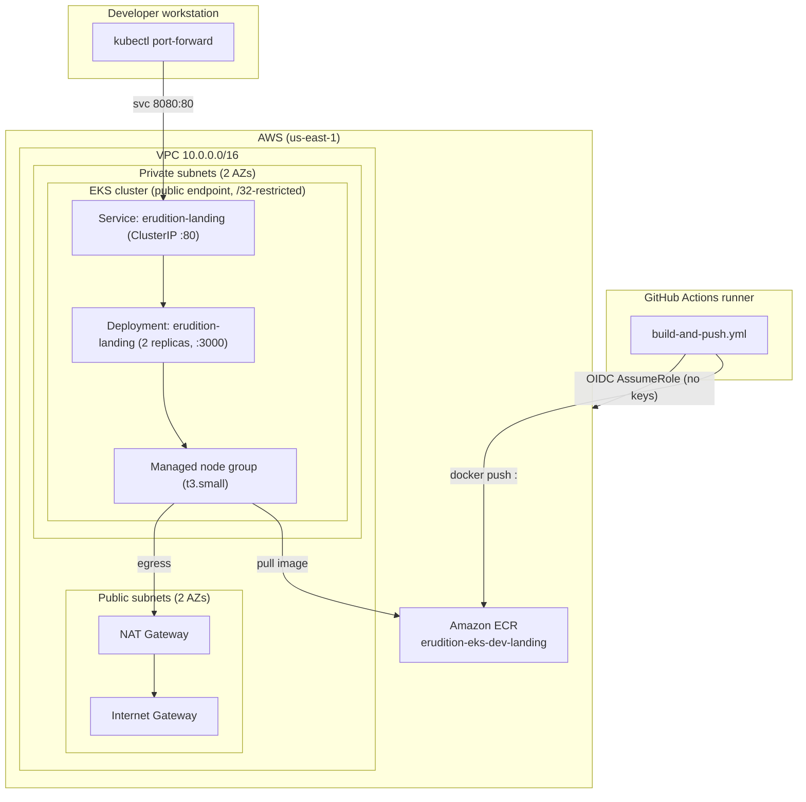

# Erudition Landing Page on Amazon EKS

A beginner-friendly, cost-conscious learning project that runs the existing
**Erudition** Next.js landing page on **Amazon EKS**, builds and ships the image
with **GitHub Actions** + **Amazon ECR**, and provisions AWS infrastructure with
**Terraform**.

Only the landing page runs on EKS. There is a single **development** environment
(`eks-terraform/envs/dev`); no staging or production.

## Architecture

The landing page runs as a 2-replica `Deployment` behind a `ClusterIP` Service
on a small managed node group in **private** subnets. There is **no public load
balancer, Ingress, or custom domain** — you reach the page with `kubectl
port-forward`. CI authenticates with GitHub **OIDC** (no stored keys), builds and
smoke-tests the image, and pushes it to ECR tagged with the Git commit SHA.
**Deployment to the cluster is done locally** because the EKS public endpoint is
restricted to the operator's IP, which GitHub-hosted runners cannot reach.



Dependency direction: `network → eks`; `ecr` is independent; `cicd` consumes the
ECR repository ARN and the EKS cluster ARN.

### Application

The deployed app is the **Erudition landing page, a Next.js application**
(`output: "standalone"`). It is served by Next.js's own Node server
(`node server.js`) listening on **container port 3000** — there is no separate
web server such as Nginx in front of it. The container image is built from
`eks-application/Dockerfile` (multi-stage `node:20-alpine`, runs as a non-root
user).

## Repository layout

```text
eks-application/      # Next.js landing page (standalone) + Dockerfile  -> see its README
k8s/                  # Kubernetes manifests (namespace, deployment, service)
.github/workflows/    # build-and-push.yml (CI: build, test, push to ECR)
eks-terraform/
  bootstrap/          # One-time remote-state S3 bucket (local state)   -> see its README
  envs/dev/           # Dev deployment root (composes the modules)
  modules/            # network, ecr, eks, cicd                         -> see each module README
  archive/            # Legacy (ECS) modules kept for reference only
```

### Detailed documentation

| Topic | Doc |
|-------|-----|
| Remote-state bootstrap + backend | [`eks-terraform/bootstrap/README.md`](eks-terraform/bootstrap/README.md) |
| Network module (VPC, subnets, NAT, endpoints) | [`eks-terraform/modules/network/README.md`](eks-terraform/modules/network/README.md) |
| ECR module (repository, lifecycle) | [`eks-terraform/modules/ecr/README.md`](eks-terraform/modules/ecr/README.md) |
| EKS module (cluster, nodes, IAM, access) | [`eks-terraform/modules/eks/README.md`](eks-terraform/modules/eks/README.md) |
| CI/CD module (GitHub OIDC + IAM role) | [`eks-terraform/modules/cicd/README.md`](eks-terraform/modules/cicd/README.md) |
| Application | [`eks-application/README.md`](eks-application/README.md) |

## Prerequisites

- **Terraform** `~> 1.16.0`, **AWS provider** `~> 6.67.0` (resolved on init)
- **Node.js 20** (CI and the `node:20-alpine` image)
- **AWS CLI v2**, **kubectl** (compatible with Kubernetes `1.35`), **Docker**
- An AWS account able to create VPC/EKS/ECR/IAM/S3 resources
- A GitHub repo matching `github_owner`/`github_repo` in your tfvars

## AWS authentication

**Local operator (you).** Terraform and local `kubectl` use your own AWS
credentials from the environment — nothing is hardcoded. The bootstrap config
uses a named profile (`var.aws_profile`, default `charltonecs`); the dev root
provider sets only `region`. Your IAM user/role ARN must be set as
`operator_principal_arn` so the EKS module grants you cluster-admin.

```bash
export AWS_PROFILE=your-profile
aws sts get-caller-identity   # confirm account + principal (must be a user/role, not an assumed-role session)
```

**GitHub Actions (OIDC, no keys).** The `cicd` module creates the GitHub OIDC
provider and an IAM role whose trust is scoped to your repo (and branch, if set).
The role is least-privilege: ECR auth + push/pull on the one repo, and
`eks:DescribeCluster`. See the
[cicd module README](eks-terraform/modules/cicd/README.md).

## Setup (bootstrap, backend, plan)

Full details in the [bootstrap README](eks-terraform/bootstrap/README.md).

```bash
# 1. Create the remote-state S3 bucket (once per account/env)
cd eks-terraform/bootstrap
terraform init && terraform apply
#   -> output: state_bucket_name = "eruditiontx-app-eks-dev-tfstate-<account_id>"

# 2. Point the dev backend at that bucket
cd ..
cp backend.config.example backend.config   # set bucket = the output above (gitignored)

# 3. Init + configure the dev root
cd envs/dev
terraform init -backend-config=../../backend.config
cp ../../terraform.tfvars.example terraform.tfvars   # set owner, admin_public_cidr,
                                                     # operator_principal_arn, github_* (gitignored)

# 4. Validate and review a plan (stop here; apply intentionally)
terraform fmt -check -recursive
terraform validate
terraform plan
```

The dev state key is `eks-dev/terraform.tfstate`; the backend bucket/key/region
are supplied at init via `-backend-config`.

## CI/CD workflow

`.github/workflows/build-and-push.yml` (job `build-test-push`).

- **Triggers:** push to `main` touching `eks-application/**` or the workflow
  file; `workflow_dispatch`.
- **Stages (any failure stops the job):** checkout → Node 20 → `npm ci` →
  `npm run lint` → `npm run build` → `docker build` → smoke test
  (`curl http://localhost:3000/`) → inspect OIDC identity → configure AWS via
  OIDC → ECR login → push image tagged with the Git commit SHA (reused if the
  immutable tag already exists). The workflow **stops after the ECR push**.
- **Deployment is NOT automated.** GitHub Actions builds, validates, and
  publishes the image to ECR. Rolling it out to EKS is a **manual** step you
  run locally using that image's commit-SHA tag (see below). CI never calls
  `kubectl`.
- **Required repo configuration** (Settings → Secrets and variables → Actions),
  matching how the file reads them:

  | Name | Kind | Value |
  |------|------|-------|
  | `AWS_ROLE_ARN` | **secret** | `module.cicd.github_actions_role_arn` |
  | `ECR_REPOSITORY_URL` | **secret** | `module.ecr.ecr_repository_url` |
  | `AWS_REGION` | **variable** | `us-east-1` |

  The ARN and ECR URL are not inherently sensitive, but the file reads them from
  `secrets.*`, so set them as secrets; `AWS_REGION` is read from `vars.*`.
- **Token permissions:** `id-token: write`, `contents: read`.

## Build, push, deploy

GitHub Actions **builds, validates (smoke test), and publishes** the image to
ECR as `"<ecr_repository_url>:<git-sha>"`. **Deploying that image to EKS is a
manual step** — CI does not deploy, because the EKS public endpoint is
restricted to the operator's `/32`, which GitHub-hosted runners cannot reach.

### Pull and run the published image (any developer)

The ECR repository is **private**, so first authenticate Docker to it, then pull
the exact commit-SHA tag and run it locally. The container listens on **port
3000**. Replace `<account_id>` and `<git-sha>` with real values (the `<git-sha>`
is the full commit SHA GitHub Actions tagged the image with):

```bash
export AWS_REGION=us-east-1
REPO="<account_id>.dkr.ecr.$AWS_REGION.amazonaws.com/erudition-eks-dev-landing"

# Authenticate Docker to the private ECR registry (token is valid ~12h)
aws ecr get-login-password --region "$AWS_REGION" \
  | docker login --username AWS --password-stdin "${REPO%/*}"

# Pull and run a specific commit-SHA image, mapping the Next.js port 3000
docker pull "$REPO:<git-sha>"
docker run --rm -p 3000:3000 "$REPO:<git-sha>"
# open http://localhost:3000
```

**AWS permissions a developer needs to pull from the private repo:** an AWS
identity (IAM user/role) allowed to call `ecr:GetAuthorizationToken` (for
`docker login`) plus the read actions `ecr:BatchGetImage` and
`ecr:GetDownloadUrlForLayer` on the repository (the AWS-managed
`AmazonEC2ContainerRegistryReadOnly` policy covers all of these). Pulling does
**not** require the GitHub Actions role; that role is only for CI push.

### Deploy to EKS (manual)

Deploy locally with the same commit-SHA tag. Run from the repo root:

```bash
# Pull names from Terraform outputs; set the region explicitly.
export AWS_REGION=us-east-1   # matches aws_region in terraform.tfvars (no region output exists)
CLUSTER=$(terraform -chdir=eks-terraform/envs/dev output -raw eks_cluster_name)
REPO=$(terraform -chdir=eks-terraform/envs/dev output -raw ecr_repository_url)

aws eks update-kubeconfig --name "$CLUSTER" --region "$AWS_REGION"
kubectl apply -f k8s/
kubectl -n erudition set image deploy/erudition-landing app="$REPO:<git-sha>"
kubectl -n erudition rollout status deploy/erudition-landing
```

`deployment.yaml` ships `image: IMAGE_PLACEHOLDER` on purpose — set the real
`<ecr_repository_url>:<git-sha>` at deploy time.

## Kubernetes manifests and verification

`k8s/`: `namespace.yaml` (ns `erudition`), `deployment.yaml` (2 replicas,
port 3000, startup/readiness/liveness probes on `/`, non-root uid/gid 1001,
read-only root fs), `service.yaml` (`ClusterIP` 80 → 3000). Applied by you, not
Terraform.

```bash
kubectl -n erudition get pods -o wide          # 2/2 Running/Ready
kubectl -n erudition get deploy,svc
kubectl -n erudition logs deploy/erudition-landing
```

### Application access

There is **no public URL or load balancer**. Reach the page via port-forward:

```bash
kubectl -n erudition port-forward svc/erudition-landing 8080:80
# open http://localhost:8080
```

The `landing_page_url` Terraform output (`http://eruditionsys.com`) is an
in-code local demo label, not a provisioned endpoint — nothing here configures
DNS, an ALB/Ingress, or a public Service.

> **External setup (cannot be verified from this repository):** any Windows
> `netsh portproxy` forwarding or hosts-file entry used to reach the
> port-forwarded page lives on the operator's workstation, outside this repo.

## Troubleshooting

- **OIDC `Not authorized to perform sts:AssumeRoleWithWebIdentity`** — ensure
  `github_owner`/`github_repo`/`github_branch` match the repo+branch running the
  workflow (the "Inspect OIDC identity" step prints the claims), and that
  `AWS_ROLE_ARN` points at the `cicd` role. If the account already has a GitHub
  OIDC provider, set `create_oidc_provider = false`.
- **`NoSuchBucket` / missing state bucket on init** — run the bootstrap config
  first, copy `state_bucket_name` into `backend.config`, then
  `terraform init -backend-config=../../backend.config` (key
  `eks-dev/terraform.tfstate`).
- **Destroy fails: ECR repository not empty** — the repo is `force_delete =
  false`. Empty it first:

  ```bash
  REPO_NAME=$(terraform -chdir=eks-terraform/envs/dev output -raw ecr_repository_url); REPO_NAME="${REPO_NAME##*/}"
  aws ecr list-images --repository-name "$REPO_NAME" --query 'imageIds[*]' --output json > /tmp/ids.json
  aws ecr batch-delete-image --repository-name "$REPO_NAME" --image-ids file:///tmp/ids.json
  ```

- **kubectl times out / `Unauthorized`** — `admin_public_cidr` must be your
  current public IP `/32` (`curl -s https://checkip.amazonaws.com`), and
  `operator_principal_arn` must be your real IAM user/role ARN.
- **Image pull errors on nodes** — private nodes need egress; keep
  `enable_nat_gateway = true` (or supply VPC endpoints).

## Cleanup and ongoing costs

```bash
kubectl delete -f k8s/ || true          # optional; destroy removes the cluster anyway
# empty the ECR repository (see Troubleshooting) before destroy
cd eks-terraform/envs/dev && terraform destroy
# The bootstrap state bucket (force_destroy = false) persists by design; remove
# it manually only when no environment relies on remote state.
```

Resources that keep billing while they exist: **EKS control plane** (hourly),
**NAT Gateway** (hourly + per-GB, while enabled), **EC2 node(s)**, and **ECR
storage** (bounded by the lifecycle policy). Figures in the project steering docs
are reference values — verify current regional pricing.

## Application notes

Next.js with `output: "standalone"`; the image runs `node server.js` as non-root
on port 3000. `package.json` has `dev`/`build`/`start`/`lint` (no `test`, so CI
runs no tests). The single `src/app/api/support/route.ts` route emails via
`formsubmit.co`; Twilio SMS is optional and skipped when its env vars are absent.
See [`eks-application/README.md`](eks-application/README.md).
